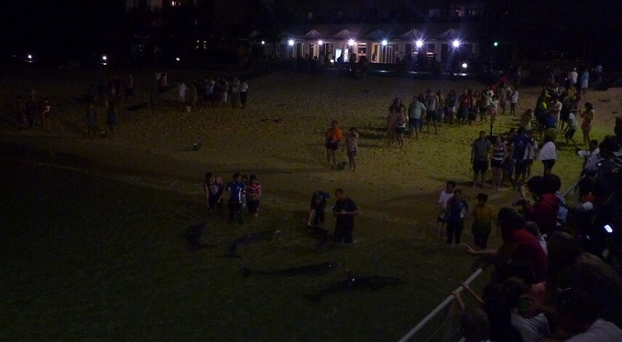
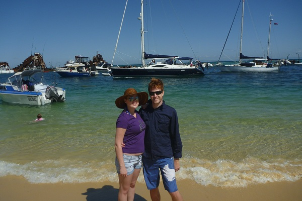
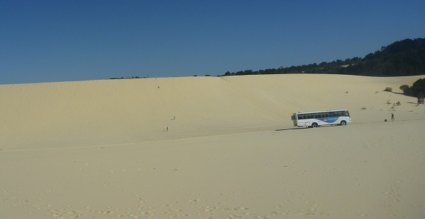
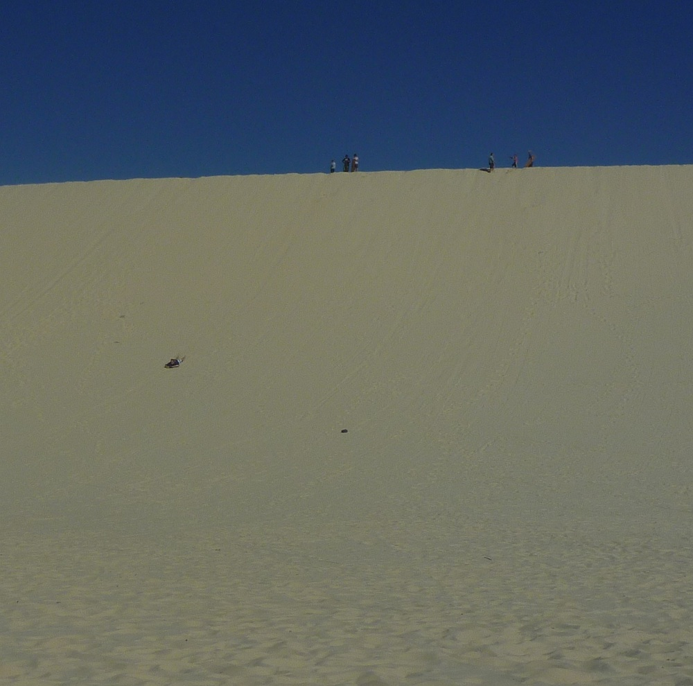
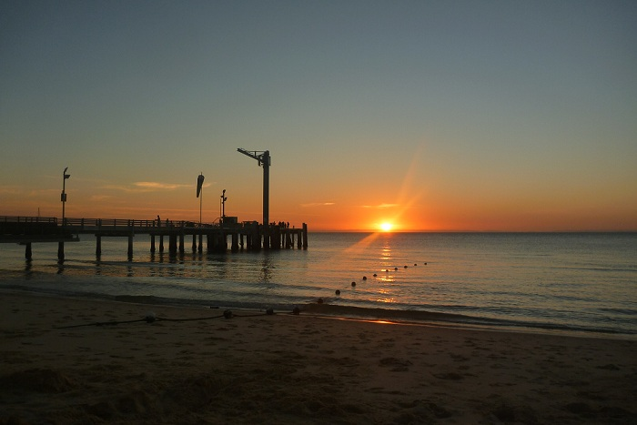

+++
title = "Tangalooma Island Resort"
date = "2012-06-19"
slug = "tangalooma-island-resort"
type = "post"

[taxonomies]
categories = [ "Travel",]
tags = [ "Queensland",]

[extra]
image = "posts/2012/tangalooma-island-resort/feeding.jpg"

+++

Mum & Dad came down for the Easter long weekend, and on the Saturday we went on a day trip to Moreton Island.

The ferry over was kind of interesting, we went down the Brisbane river and so went past the port where they load all the shipping containers as well as all the all refineries. There was a crazy amount of jellyfish in the water at the mouth of the river as well.

When we got to the resort we were pretty disappointed, since the package had advertised free use of the resort sport facilities. Turns out this does not include snorkeling gear as mum though, and what it did include has to be booked. As it was a public holiday all the things we wanted to use had already been booked out for the day.

We went for a walks up the wrecks where people snorkel. It would have been a lovely area to snorkel on any other day probably, but the area was teeming with boats. There were boats driving around where people were in snorkeling and it was pretty dangerous in general.

Part of our package included a 4x4 sand-boarding package which turned out to be a lot of fun. Doing the 4x4 tracks in a bus was a different experience as the whole bus rocks when it gets hung up on the sand. The dunes themselves were closed off to cars, but the resort had a special format so we can drive up to the dune face. We saw some people walk over from where the public track ended and it was a descent hike.

To get to the top of the dune you had to climb up (with your board) which was no mean feat. Combined with the walk to the dune it would hardly be worth your while. Mum and Rachael only could manage one go, while dad and I got in 2 before we had to leave. I would braked the hike back to the top for one more go if we had time.

The actual boarding itself was pretty awesome, you get to a pretty descent speed. The bumps at the bottom really wind you but other than that it was sort of like snow tobogganing (except face first). Some people stacked it and got a massive face full of sand.

In the afternoon we went in for a swim at the beach in front of the resort. There was tonnes of bait fish hanging around the whole time. At one point a dolphin swam past, and as the first thing we saw was a dark shape in the water about 1.5m long with a fin, Rachael shat her pants and ran out of the water. I was wary at first but realised pretty early that it was a dolphin and so stopped turning around to run and tried to get closer. I think Rachael's screaming scared her off though.

We later found out that the dolphin was called Betty and is a local to the resort. She is quite old and they described her as "retired" as she only hangs out at the resort and waits for a feed, she no longer hunts in the wild.

The dolphin feeding was really magic. The dolphins came right up to the shore after sunset and were quite playful. We got to feed them a small bait fish each. Rachael dropped her fish when the dolphin opened it's mouth and she saw that they have teeth.

There was a lot of Asian tourists there and one thing that detracted was the experience was their refusal to obey instructions. We were told at the start that it was illegal to touch the dolphins (you pass the fish to them) and the reason is so they don't catch any human diseases from us. They had resort staff their to translate for them, and it was made repeatedly clear you would be asked to leave the resort if you tried to touch them. Despite this, almost every single one of the Asian tourists attempted to pat them. None of them got kicked out but the staff had to physically hold their hands and keep pulling them back so they didn't do it. A couple got through and touched it but didn't really get in trouble. One guy attempted it repeatedly.

The day started out kind of annoying, but ultimately it turned out to be a great experience and I highly recommend both the sand-boarding and dolphin feeding for a day trip.