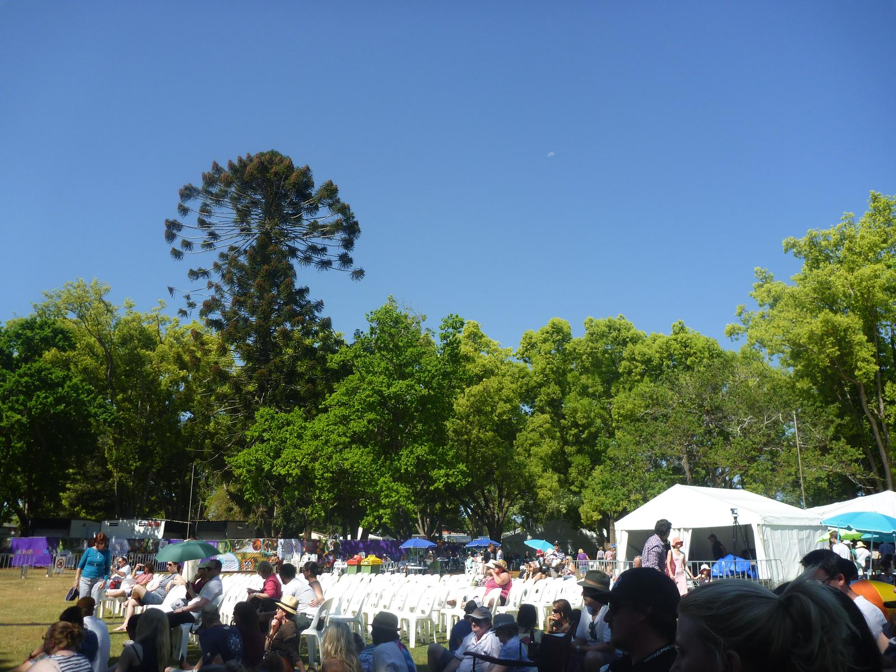
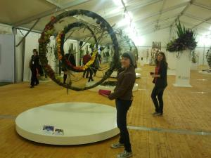
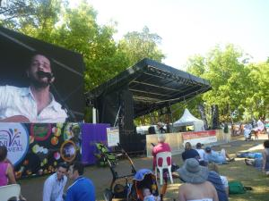

---
categories:
- Misc
type: post
date: '2012-09-29'
featured_image: posts/2012/tcof-festival/grounds.jpg
slug: tcof-festival
tags:
- Flowers
- Food
- TCOF
- Toowoomba
- Wine
title: TCOF Flower Food and Wine Festival
---

Last weekend was the start of the Toowoomba Carnival of Flowers. We bought 3-day tickets to the Flower, Food and Wine Festival so we could check out all the bands.

Friday night was our first glimpse of the festival. It was sort of like a show with various art and flower displays, but nothing overly exciting. Other than that there was stalls selling garden stuff, and food stalls. One thing that was a very good set up was the wine stalls though. You could go around and taste the wine at each stall, and then buy a bottle if you wanted to drink while you watched the bands.

The first night the bands were Owl Eyes and Bluejuice. Owl Eyes sounded great, but I didn't particularly get into any of their originals. Bluejuice were really good, but not as lively as when I saw them in Rocky.

Second night Ross Wilson (Daddy Cool) played, which was pretty cool to see the Eagle Rock live. I think Rachael was disappointed that everyone didn't drop their pants. Mental as Anything also played, but we left before they finished their set.

On Sunday Lior played. Was a pretty great set, and he finished with 2 new songs that he had never played live before. I thought one new song (Alas) was particularly good, so I am excited for his new album. In the afternoon James Reyne (Australian Crawl) played, and was pretty good. The final act was an ABBA tribute, Bjorn Again. They didn't sound that great for the opening song but ended up sounding really good.
