While Mum and Dad were down, we went for a drive to check out the prize garden winners. It was a bit like looking at Christmas lights. The Reserve Grand Champion was by far the best garden, with a massive house and garden overlooking the range - they must be quite rich.

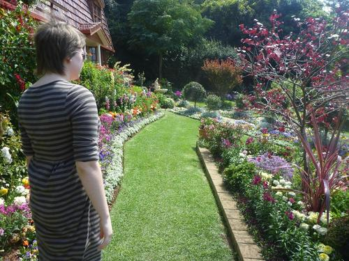

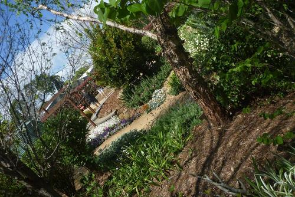

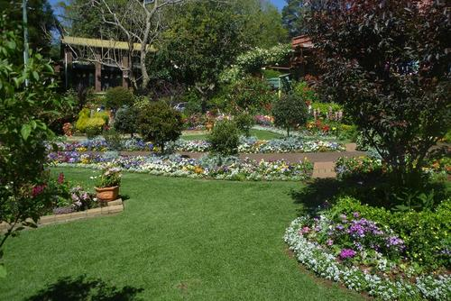

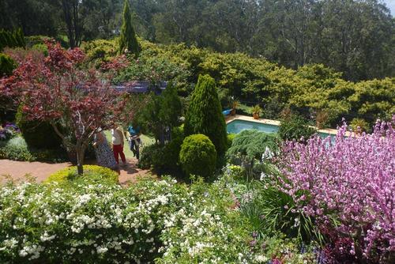

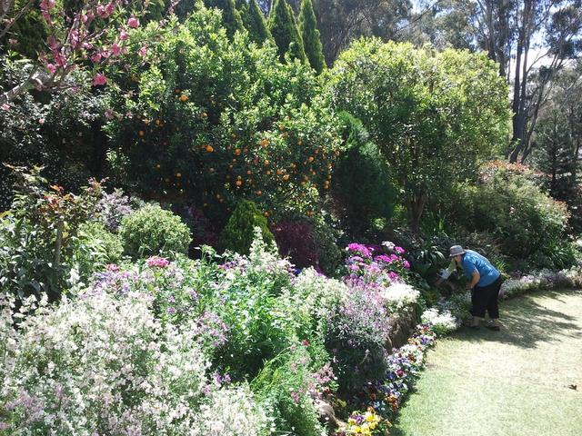

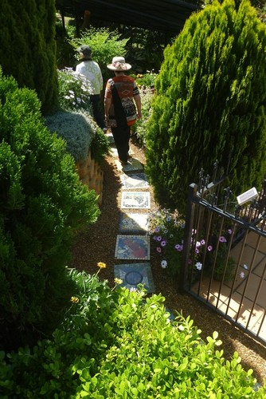

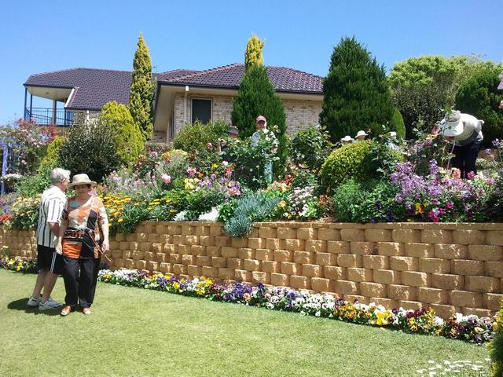

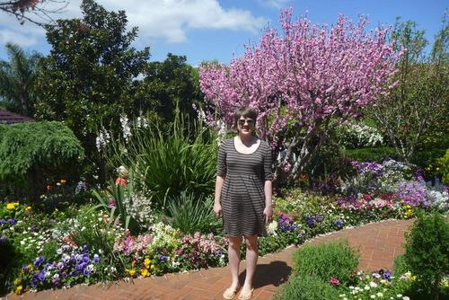

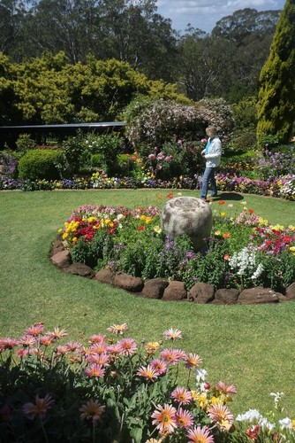

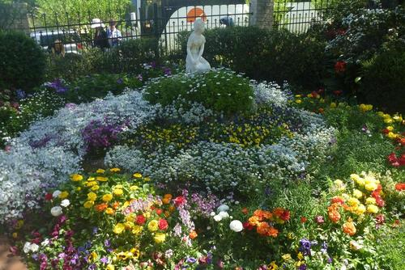

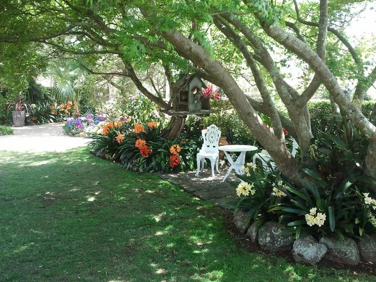

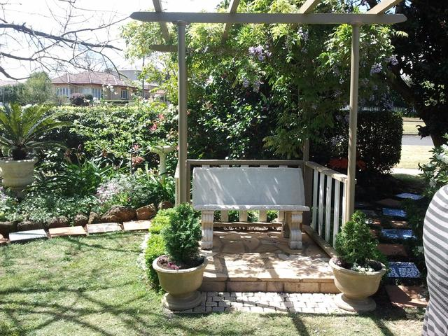

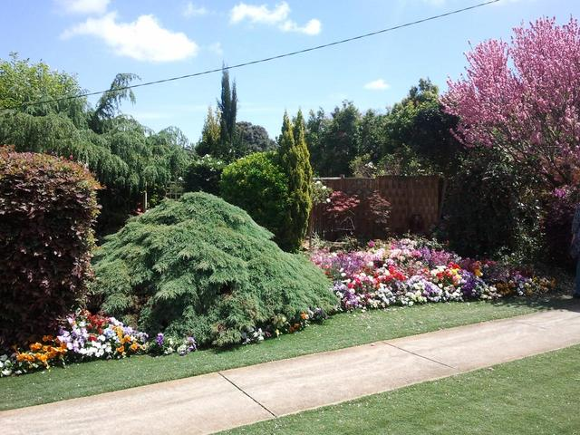

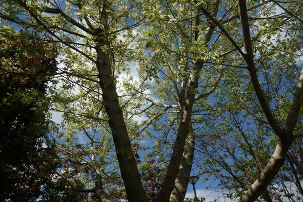

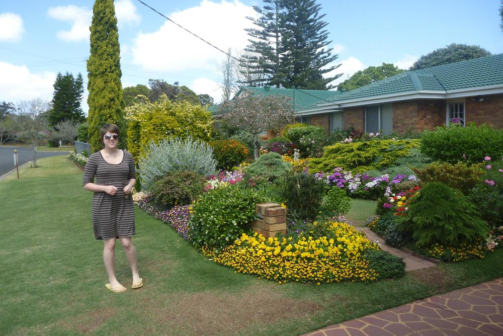

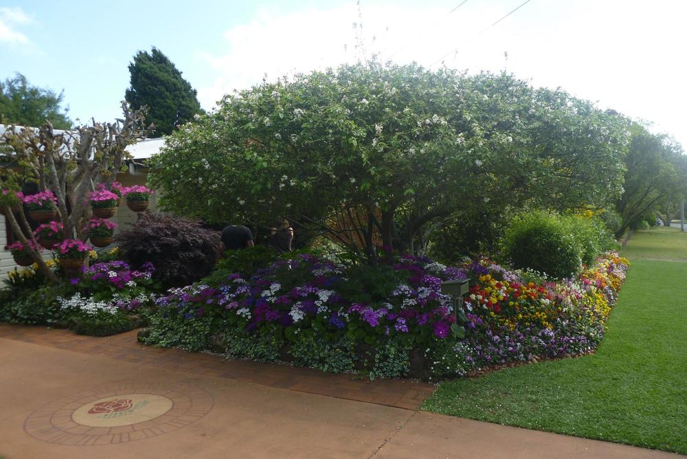

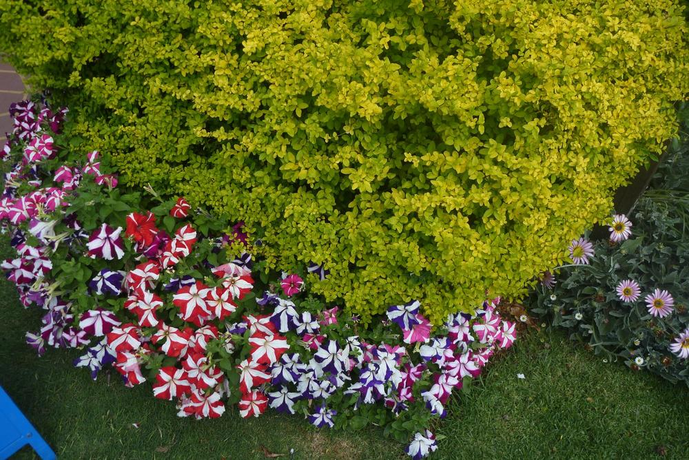

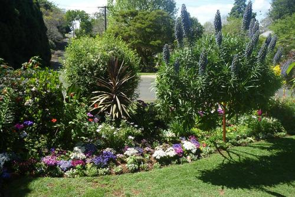
