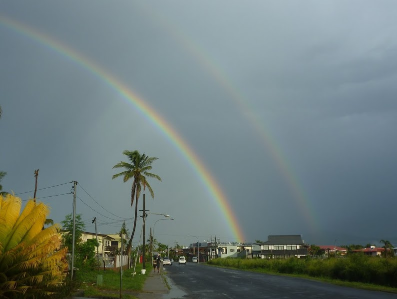

+++
categories = ['Travel']
date = '2013-02-26'
thumbnail = 'posts/2013/fiji-nadi/p1110188.jpg'
slug = 'fiji-nadi'
tags = ['Fiji']
title = 'Fiji - Nadi'
type = 'post'

+++

On the flight over to Fiji, we flew over some other islands, which were probably New Caledonia. Those islands, and the reefs of Fiji itself looked awesome from the plane. As we are landing I also noticed a pretty cool temple, which a quick Google reveals it is called the [Sri Siva Subramaniya temple](http://en.wikipedia.org/wiki/Sri_Siva_Subramaniya_temple). We later saw it on the bus/in and out of Nadi but didn't visit it for a close look.

Nadi, pronounced Nandi with a silent 'n' which the Fijian's seem to enjoy (we later ordered a dish called Kokoda which was pronounced 'Kakonda', was the town/city where we landed. Walking in the airport we were greeted by some guys on the ukelele and customs officials in Hawaiian shirts. They love their Hawaiian shirts in Fiji, but Rachael tells me they are more stylish then the one's worn in Australia.

We got a taxi to the resort, which was a crappy old car painted yellow like a New York taxi and the engine sounded terrible. Our driver stalled it 3 times in a row at one stage when we had to stop for traffic at the top of a slight hill.

My first impressions driving in was that it was a bit of a cross between Vietnam and Australia. A lot more unkempt and run-down then Australia (more like Vietnam) but fairly spacious and more ordered, with road signs that seemed to be mostly adhered to.

We were to spend the first night at Nadi Bay Hotel Resort, before heading to Pacific Harbour, and were in a dorm with a nice guy from Nottingham. Interestingly there was graves next to our dorm, which were probably old resort staff. Apparently it's okay to be buried in your own backyard in Fiji, as we saw graves at houses fairly often.

We went for a walk to look around and saw a 3 car pileup with one car lodging itself underneath the rear end of a Hilux. We didn't bother getting a taxi into town, and thought it was a fair walk to the beach (it wasn't) so just went back to the hotel and had dinner. Food prices in Fiji are about the same as in Oz, except in Fijian dollars and so relative to our currency meals were about half price.

The next day we waited for the Coral Sun bus to Pacific Harbour, and had our first experience with 'Fiji Time' as it was about 20mins late, despite saying on the booking we had to wait 15mins early. The booking was a bit of a failure in general as when we called up to double check where we were getting picked up they didn't have a record of our booking even though we could sent a confirmation email which we had printed out.

When we came back from Pacific Harbour at the end of the trip, I had a chance to download offline maps of Nadi on my phone and we realised the beach wasn't far at all. Upon going for a walk to check it out, we probably could have done without as it was covered in rubbish and not that appealing. We did have lunch at a cool Japanese restaurant the day before we left though, which _was_ worth the very short walk.