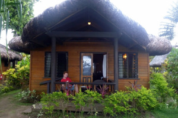
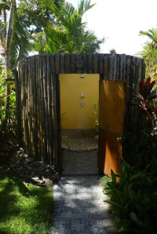

+++
title = "Fiji - Pacific Harbour"
date = "2013-03-03"
slug = "fiji-pacific-harbour"
type = "post"

[taxonomies]
categories = [ "Travel",]
tags = [ "Fiji",]

[extra]
image = "posts/2013/fiji-pacific-harbour/p1110509.jpg"

+++

On Saturday we got the bus to the Uprising Beach Resort in Pacific Harbour, where we stayed for 7 nights. We had lunch at the restaurant while we waited for check-in time and I had fish and chips (the fish was awesome) and Rachael had Kokoda (photo right) which was fish in a coconut shell with Cassava chips (sort of a cross between potato and cooking banana).

Our beachfront bure (pronounced like Boo-Ray) was quite awesome. Had really high ceilings and good air flow so was pretty cool (didn't have air-con) and had a little verandah where you could look out at the beach. We were the closest to the pool and restaurant as well so we didn't have to walk far for dinner each night.

I thought one of the coolest things was our outdoor shower. There were plants in there as well and it was cool having a shower in nature, especially at night time you could look up and see the stars. Only negative to it I could think of was it would be cold in winter being outdoors. I thought of a another negative when I had a shower later in the week during a massive thunderstorm and there was lightning around.

On Sunday we went in to the Arts Village in Pacific Harbour (about 10mins walk) to look around. There was some cool buildings and bridges, it was very touristy as there was a theatre area where they have native Fijian ceremony displays.

We had lunch there and got fish burgers, but they weren't particularly nice, as the fish wasn't as fresh as the rest of the fish we ate in Fiji. We were told there would be a bon fire at the resort that night, but it rained so it was cancelled. Rachael was super excited for this bon fire each night but it would always rain in the afternoon and the wood would get wet. Finally on our last night it was dry, but at about 9:30 there was no signs of anything happening so we went back to the bure and went to bed, only to find it burned on the beach the next morning. Rachael was pretty annoyed. They must have lit it fairly late though.

Monday [we went into Suva](fiji-suva) and then I got sick that afternoon. Tuesday we didn't get up to much, as I was still feeling a bit average, although we did go for a kayak in the afternoon just off the beach.

Wednesday we went for a snorkel in the ocean out the front of our resort, it was just a short boat ride and I think it was [this reef](http://goo.gl/maps/5UPlc). The weather Tuesday had been brilliant, but it was overcast and rainy Wednesday morning when we went for the snorkel, which was a bit of a bummer as it made it harder to see. The coral was still super bright though, with a fair few baby fish swimming around. Rachael was worried about sharks eating us, but we didn't even see baby sharks let alone the big "friendly" sharks of Fiji. You can go shark feeding in Fiji without a cage, because apparently all the sharks in Fiji are "friendly sharks" even though they are Bull and Tiger sharks that you feed.

Rachael had the fish of the day Tuesday night and it tasted amazing, and for lunch on Wednesday I tried some freshly caught Walu fish which was equally amazing. Frozen stuff from the supermarket really doesn't compare to freshly caught fish.

Thursday we had planned to do a village visit and drink some Kava, but there wasn't enough people so we booked white water rafting for Friday instead as that was the only tour that seemed good for the price. Thursday we didn't get up to much, although we did play Volleyball with the locals and some of the resort staff in the afternoon. It was pretty fun until a storm started with really close lightning, and the beach volleyball court turned into a water polo court. The thunder during the storm was really impressive, it sounded different to back home. I think it was reverberating between Beqa Island and the main land because it was really drawn out.

For lunch on Thursday we went for a walk up the road to a local looking restaurant we had seen on the bus to Suva. I got the duck curry special which was super spicy and full of bones but tasted great. It reminded of the chicken curry that Jayantha (a guy from work from Sri Lanka) made for us, which tasted incredible but was difficult to eat on account of all the random bones and whole pieces of herbs and the abundance of chilli powder. Despite tasting much better, I prefer the convenience of a normal Indian curry sans bones.

After [the rafting on Friday](fiji-rafting-upper-navua-river), I got sick again. But this time Rachael got sick as well, so after a terrible nights sleep we were more than happy to check out Saturday morning and get the bus back to Nandi and head home.