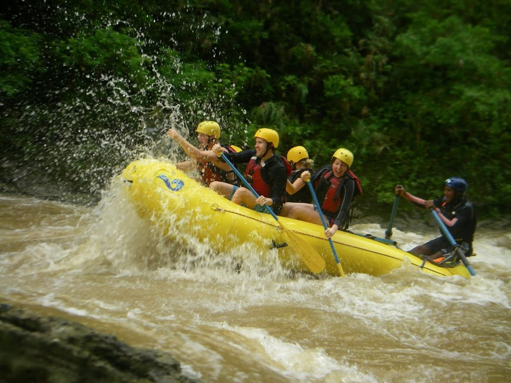
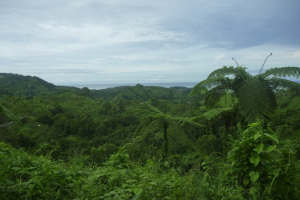
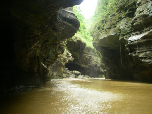

Easily the highlight of the trip was white-water rafting down the "Grand Canyon of Fiji". That is what the posters called it, but two American's we met who had been there said it didn't even compare. It was still magnificent though.

We got picked up from the hotel in a 4x4 again and taken to a nearby resort, The Pearl, same as we did for snorkelling. It's kind of dodgy really, both cars were full of junk in the back and the seat belts in the back seat were stuck under the seat so you couldn't use them. It was only a short drive so didn't really matter but was expecting more for the money we paid.

 

From there we got a bus and after a drive on the highway, headed off-road on some beautiful tracks into the rainforest. After a briefing about entering a national park and how we couldn't leave anything behind (including poo - they told us they had special bags if we needed) and putting on our life jackets, we went for a short hike to the rafts. The really annoying thing about not leaving anything behind while in the conservation area, was at the end of the day as we were driving back, the staff had no problem throwing their rubbish out the window of the car (we saw them special times) once they were out of the conservation area.

The actual rapids were only a class 2-3 and weren't as fun as the one's I did in Switzerland, but the scenery was stunning. Some of the canyon walls even had coral in them, from long ago when it was all under water.

The conservation area ended with a massive waterfall, which we got to stop and stand under. The water was way more powerful than I was expecting and super cold. As we were getting close to the village where we were to hop out, there [was a spot where two rivers converged](http://goo.gl/maps/BVmRD), and like in Switzerland you could clearly see the two colours and determine which water come from which stream.

Our rafting finished at the Wainadiro village, where there was the skinniest dog I had ever seen. It looked like it was about to fall over from starvation, it was pretty sad. From there we had another off-road drive back, but this time the bus got bogged when it tried to overtake the truck with the rafting gear in it. So we had a little more adventure at the end of the day waiting for them to get out the snatch strap and pull it out. Our shoes were absolutely soaked by the end of the day, and Rachael had old lady feet. Since it's constantly raining in Fiji, all our clothes were still wet when had to pack them for the plane, so our luggage was pretty smelly.
