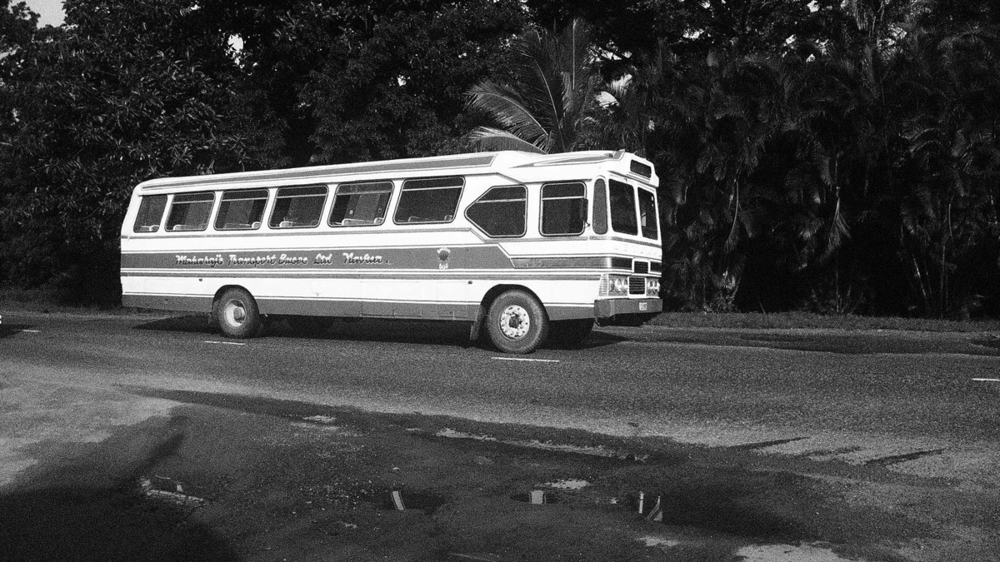
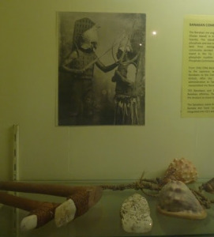

---
categories:
- Travel
date: '2013-03-03'
featured_image: posts/2013/fiji-suva/bus.jpg
slug: fiji-suva
tags:
- Fiji
- Market
- Museum
- Suva
title: Fiji - Suva
---

We got a bus into Suva on Monday morning to check out the big city. The bus in was an adventure, we got a local bus, which was only $3.30 FJD to Suva from Uprising. The bus stopped for anyone on the way that waved it down, even in narrow sections of the highway at the top of hills, or in the middle of a turn off so that it was blocking traffic from turning.

At one point we had to stop for petrol, so the bus pulled into a service station and we waited while the driver filled it up. We then had another wait at the main bus station while someone got on and counted the number of tickets sold. All up it took us over 2 hours to get to Suva, even though the return trip on the way back took about 1hour - since we paid $5 for the express bus.

Suva itself was a bit of a let down. First up we went to the museum, with various people stopping us on the way asking us where we were from and I assume trying to sell us things. The museum itself was pretty good. They had some rafts that were used to go between the island back in the day - impressive what can be made with just wood and vines. The picture to the right was pretty cool, one tribe used shark tooth swords and puffer fish helmets in combat.

One thing that was depressing was the conversion of all the locals from their local religion to Christianity. There old religion sounded much better to me, and it's sad how the Europeans just came in and converted everyone. Hinduism and Islam are also popular there though, so at least there is some diversity.

The actual town itself reminded me a bit of Vietnam, very dirty and busy streets with lots of small shops. The prices weren't as impressive as Vietnam though, things were only slightly cheaper than Australia once you calculated for the currency difference. One thing that Rachael thought was pretty cool was the markets, again they reminded me of the markets we went to in Vietnam.

After a few hours we got tired of walking around, so headed back to Pacific Harbour on the express bus, they bus even had a movie playing.