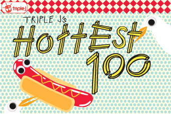

+++
title = "Hottest 100 Votes 2012"
date = "2013-01-16"
slug = "hottest-100-votes-2012"
type = "post"

[taxonomies]
categories = [ "Misc",]
tags = [ "Hottest 100",]

[extra]
image = "posts/2013/hottest-100-votes-2012/340.jpg"

+++

Triple J provided [a nice shareable link](http://triplejgadget.abc.net.au/hottest100/12/vote/share/6ae5cbac30a70165d22ab9289043ff48#) this time around for your votes. I found this year was continuing the trend of getting harder to pick 10, as I no longer have a clear idea going into voting what my favourite songs were - due to slackness on my part of listening to new music. Luckily the voting website is improved, and lets you listen to all the short-list on the fly.

List for posterity:

* Black Keys, The - Gold On The Ceiling
* C2C - Down The Road
* Birds Of Tokyo - This Fire
* Django Django - Default
* Kingswood - She's My Baby
* Mumford & Sons - I Will Wait
* Of Monsters And Men - Little Talks
* Rubens, The - My Gun
* Tame Impala - Feels Like We Only Go Backwards
* Temper Trap, The - Need Your Love