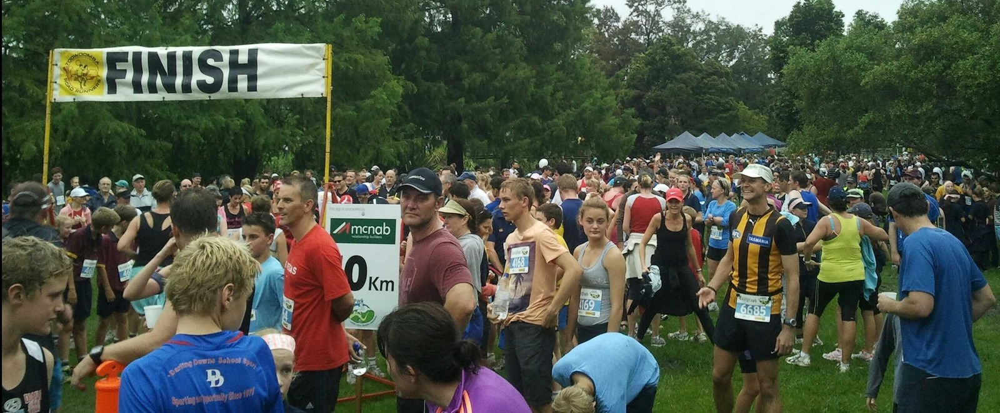
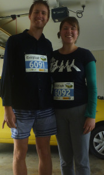

---
categories:
- Misc
date: '2013-03-03'
featured_image: posts/2013/peak2park-fun-run/2013-03-03-08-15-361.jpg
slug: peak2park-fun-run
tags:
- Fun Run
- Peak2Park
- Toowoomba
title: Peak2Park Fun Run
---

Today Rachael and I went in the Peak2Park fun run from Picnic Point to Lake Annand. The weather was pretty terrible, cold, foggy and rainy. The amount of people there was impressive though, I didn't expect so many people to turn up.

We didn't think to take a photo with our bibs on until after we got home (right). I did the 10km run in a time of [56:50](http://app.strava.com/activities/42854171#721718071) (on the clock), and Rachael did the 4km (actually 5km according to her Strava recording) in a time of [34:42](http://app.strava.com/activities/42869409#721988626) (from Strava).

I'm very impressed with Rachael's time, I saw her cross the finish line and she looked about ready to die. I did very little training but she did zero, so quite quick considering.