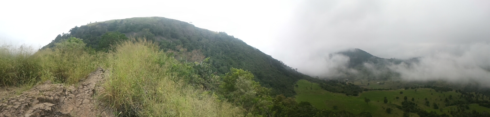
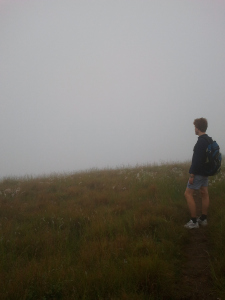

+++
categories = ['Misc']
date = '2013-03-24'
featured_image = 'posts/2013/tabletop-mountain/2013-03-24-07-22-33.jpg'
slug = 'tabletop-mountain'
tags = ['Hiking', 'Mountain', 'Tabletop', 'Toowoomba']
title = 'Tabletop Mountain'
type = 'post'

+++

So despite an unsuccessful earlier attempt when we first moved up to Toowoomba, we still hadn't climbed Tabletop Mountain. On Friday night we were out with a girl called Liz, who said that they were climbing it on Sunday morning to train for Tough Mudder at 5:30. So after lots of convincing, I convinced Rachael that we should go along. Although upon waking up and seeing the cloud of fog, she was unconvinced again.

Despite no sign of Liz when we arrived, we headed up the mountain without really being able to see where we were going, as there was fog in every direction.

It took about 50mins to hike up, and was a pretty good hike. It was fairly similar to Mt. Jim Crow terrain. Rachael didn't seem that keen to go back up again any time soon, but I think I will head up again when there is better visibility, would be better than my normal jog around the park. The fog was starting to clear on our way back, and from what little we could say I imagine the normal view would be worth the hike.

