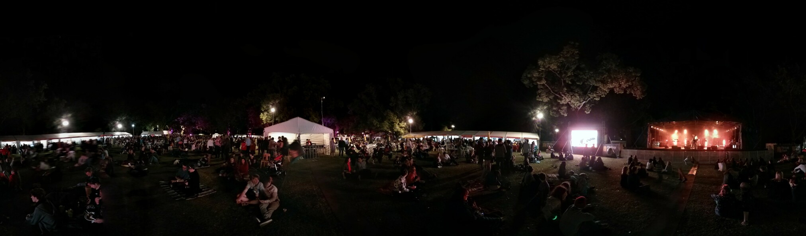
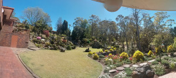

---
categories:
- Misc
type: post
date: '2013-09-23'
featured_image: posts/2013/toowoomba-carnival-of-flowers-2013/pano_20130920_192034.jpg
slug: toowoomba-carnival-of-flowers-2013
tags:
- Laurel Bank Park
- TCOF
- The Whitlams
- Toowoomba
title: Toowoomba Carnival of Flowers 2013
---

We went to the carnival of flowers again this year with the wine festival having another good line up of bands. This included The Whitlams, who I have wanted to see for ages. Unfortunately, the good line-up meant that they sold way more tickets than they were expecting and the place was packed. It was so busy you couldn't even make your way around to the food and wine stands, as to get any where you needed to squish your way through the crowd at a snail's pace to go anywhere. All the bands were quite good though, especially The Whitlams. The Sunday night was a bit less crowded and dad and I got to sample some wines. We found an awesome Strawberry wine, and talked to a guy that is working on a Lichee Cider.

On the Sunday night Dragon played, but with a different lead singer it was basically like watching a cover band. The Commitments were surprisingly good, despite not knowing many of their songs they were a super punch big band and really enjoyable.

The council gardens looked just as good as last year, but despite different patterns were mostly the same. There was some new private gardens though. Particularly cool was a garden at a house overlooking the range called "Fairy Land". The amount of work that would have gone into it is phenomenal.

