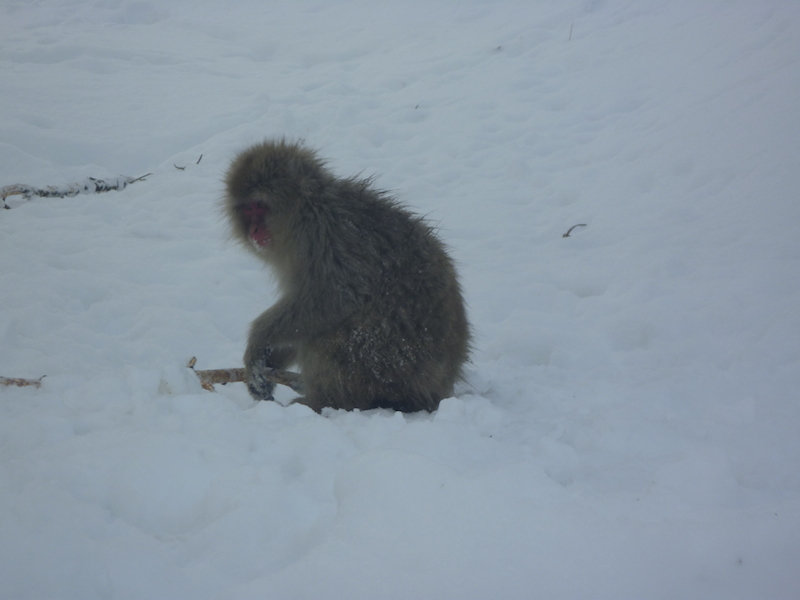
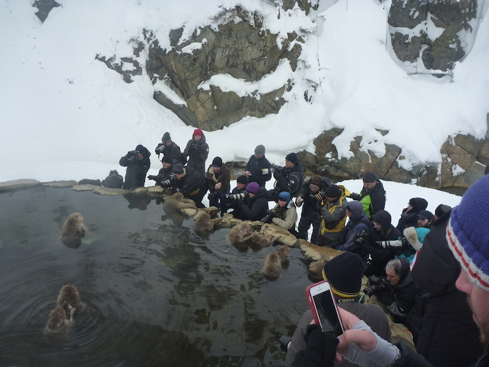
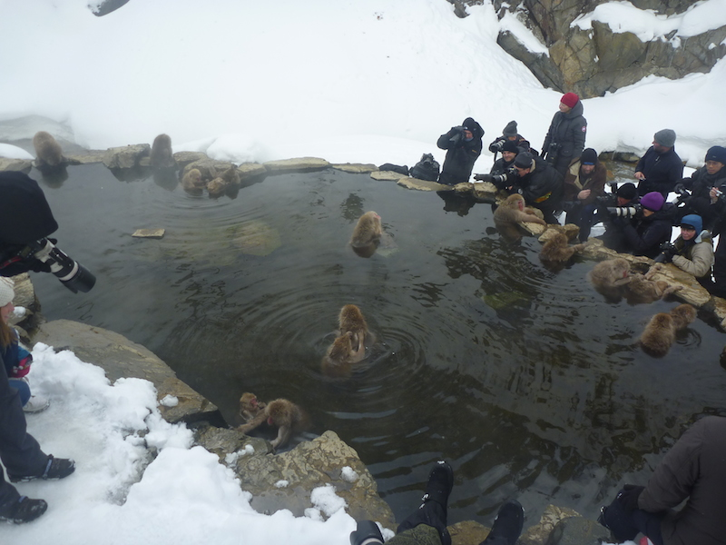
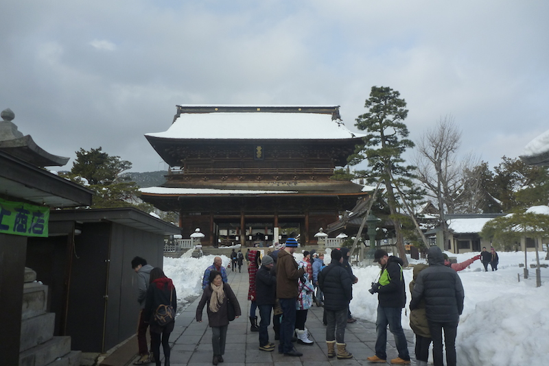

---

date: "2014-03-08 23:18:16+00:00"
slug: jigokudani-monkey-park
title: Jigokudani Monkey Park

categories: ["Travel"]
# tags: [""]
---Japan, Monkey, Nagano, Snow, Temple, Zenkoji

So our original snow monkey tour was rescheduled to the last day of our stay in Hakuba due to the heavy snow, so we were really lucky we even got to go. It's a shame because the first part of the bus tour as we were leaving our guide gave an overview of all the different ski resorts and which one was good for different things, something that would have been more useful at the start.

We got told a history of the monkey park on the way there. There was a [Onsen](http://en.wikipedia.org/wiki/Onsen) Lodge (hot springs) in the mountains and the monkey's made trails along the hot water pipes so they didn't have to walk in the snow. Eventually one of them must have fallen in or tried the water and they decided they liked spas and took over the lodge. Due to health and safety and the fact people don't like getting in a spa full of monkey poo, the lodge built a special pool further up the mountain just for the monkeys. A national park was set up with rangers to make sure that the monkeys are not fed by tourists and that they can still live naturally.

The snow monkeys were really good, although the hot pool was smaller than I expected. You couldn't easily get close to the pool because loss of photographers were camped out there hogging it for the entire time. But there was monkeys everywhere throughout the park so it wasn't too bad. There is a [live web cam](http://www.jigokudani-yaenkoen.co.jp/livecam/monkey/index.htm) pointed at the pool.

It smelt of sulphur from the hot pools which wasn't very pleasant. The monkeys basically ignore humans due to the no feeding rule, which is cool because as our guide said, it's one of the few places you can watch wild monkeys from so close in their natural habitat.
The rest of the tour was pretty slack, we would have been better of staying at the snow monkey park for longer.

Lunch was okay and then we had some free time in the village but it was mostly tourist shops with souvenirs and nothing too exciting. Mum and I did get to eat a marinated locust sample from one of the shops, which was quite tasty actually. You could only taste the sauce but it was very crunchy. The restaurant was the Masuichi-Ichimura Sake Brewery, which was an old Sake Brewery that has been downsized and converted into a restaurant. The food was probably our most authentic Japanese meal, although I didn't particularly think it tasted that great. The building itself was pretty cool.

The final part of the day was to [Zenkoji Temple](http://en.wikipedia.org/wiki/Zenk%C5%8D-ji). The temple we went to was very cool but we were split into two groups and our guide was a volunteer with limited English. He would just point at a statue say the name and then say "follow me to next statue". This would have been okay if we hasn't paid so much for the tour, so we were a bit annoyed as we didn't learn anything. The monkeys only cost $5 entry, but the tour was something like $140, so next time I would just get a hire car for the day and do it that way, as it was a bit of a waste of money. The guide from the company was quite good when we did have him, but the fact that we had paid for a tour and didn't really get one ruined the experience and I wouldn't recommend it.

The bus ride back was interesting, due to the snow the bus barely fit through some of the streets and we caused a fair bit of traffic congestion and got back to Hakuba fairly late. I probably would have preferred an extra day on the slopes.

