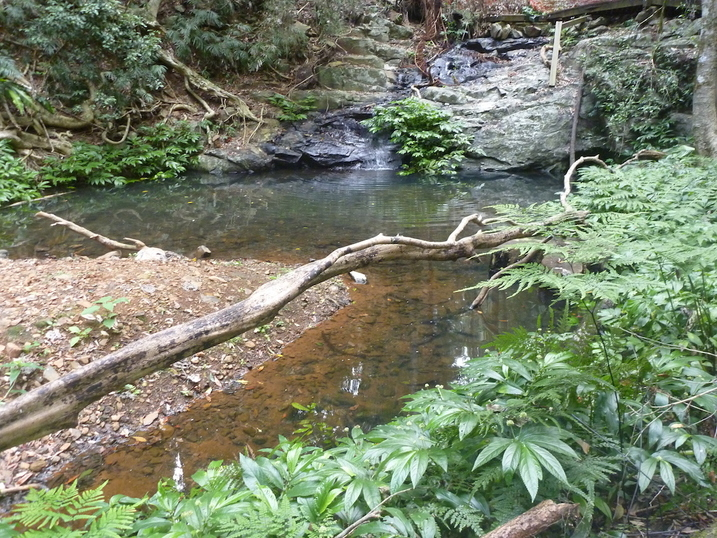
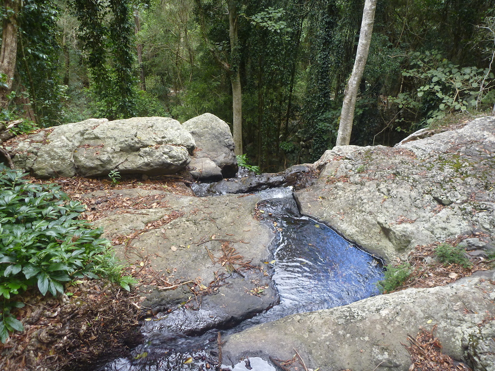
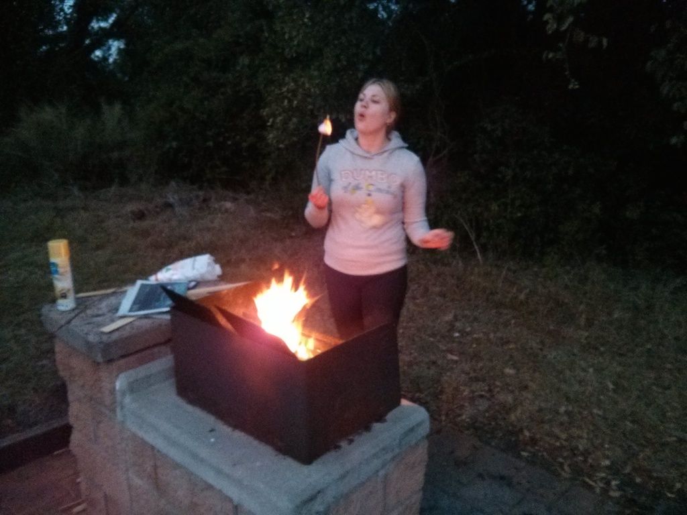
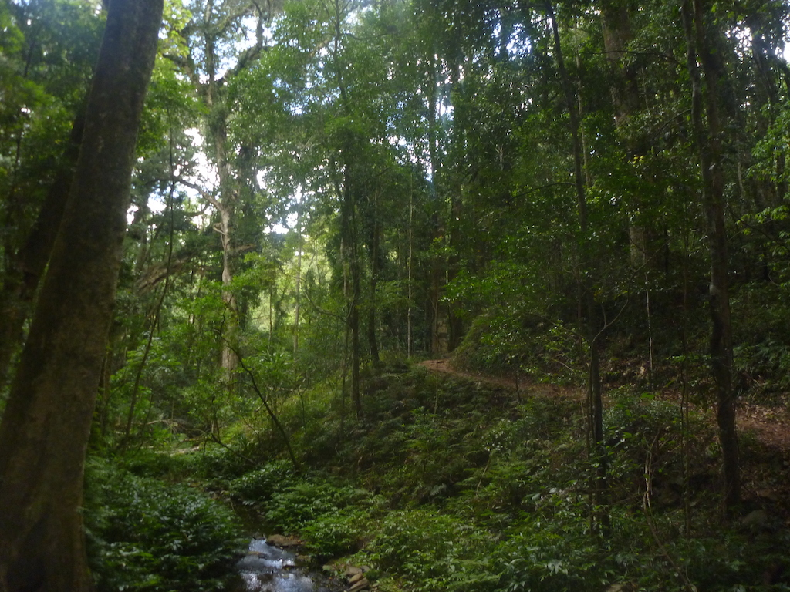

---

date: "2014-03-24 01:54:05+00:00"
slug: bunya-mountains
title: Bunya Mountains

categories: ["Travel"]
# tags: [""]
---Bunya, Camping, Queensland

Rachael had last weekend off work so we went to the Bunya Mountains to camp. The drive up was pretty good, we stopped at Acland (a ghost town) on the way, and closer to the mountains we saw an echidna on the side of the road.

We had lunch at the main "The Bunyas" restaurant which was good, but not great. There was tonnes of awesome rainforest walks from here, which is where the main campsite is. Since it was so busy, we booked the [Burtons Well Camping Area](http://www.nprsr.qld.gov.au/parks/bunya-mountains/camping.html#burtons_well_camping_area) which is a bit more out of the way, and turned out to be much nicer. Each campsite had it's own fireplace and a big heap of firewood (seemed to be woodwork offcuts) was provided.

Near the campsite there was a couple of other walks, a short one up a mountain which had excellent views at sunset. There was a longer one we did in the morning which wasn't as exciting, although we didn't do the whole track.

It was a very nice area, and there was rock wallabies everywhere. We will definitely come up here to camp again.

