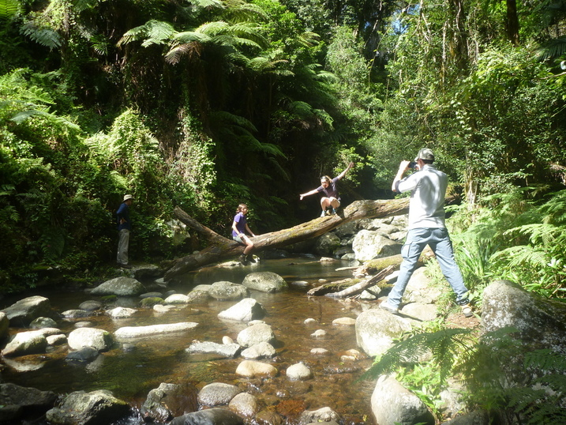
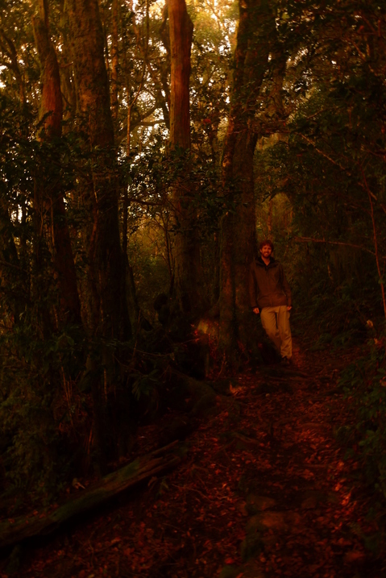
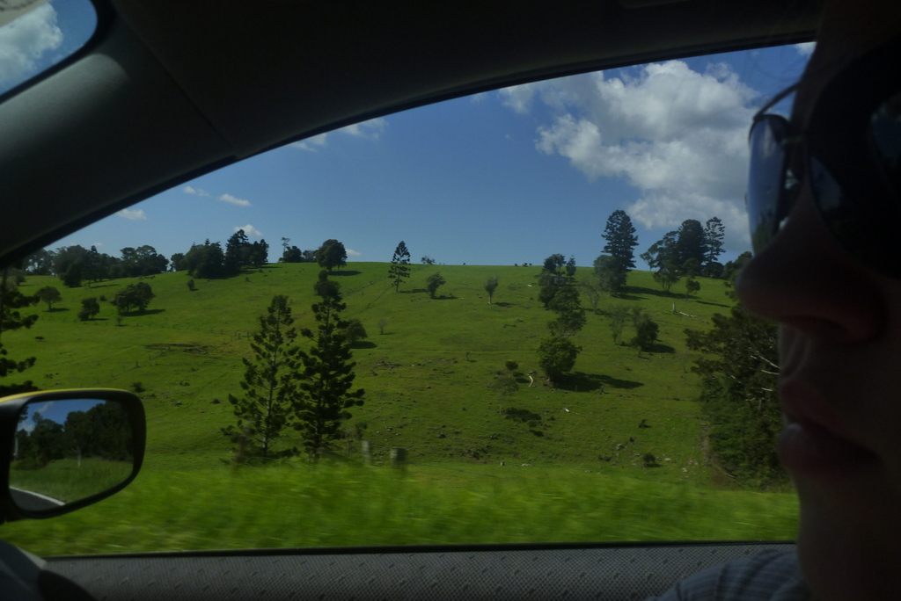
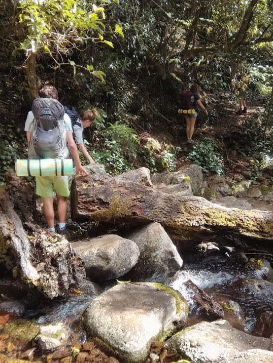
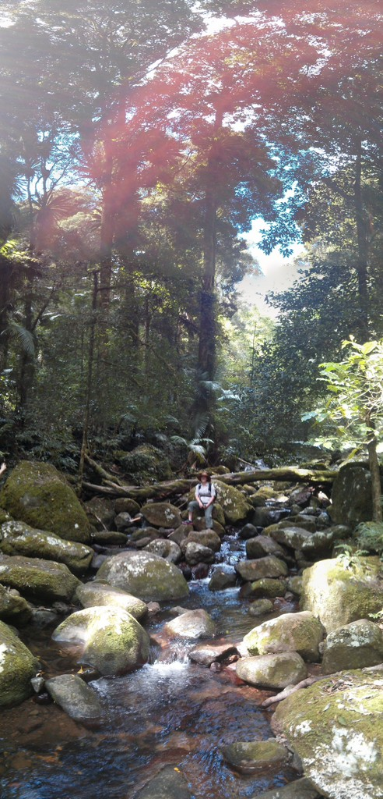

---

date: "2014-04-22 07:57:07+00:00"
slug: lamington-national-park
title: Lamington National Park

categories: ["Travel"]
# tags: [""]
---Bithongabel, Camping, Glow Worms, Hike, Lamington, National Park, O'Reilly's

Over the Easter weekend we went on a 2-day hike in Lamington National Park with our roommate and some of his friends. It was my first time camping where you have to carry everything with you, and can't just drive to the camp site. This meant we put a lot of thought into what to bring, and took a lot less gear then normal. Ultimately this led to a much less pleasant camping experience as no swag meant for a very uncomfortable sleep, and we didn't have hot food. Also hiking with all the extra weight makes things more difficult.

Having said that, this is by far the best hike I have been on as the area is absolutely stunning. On the first day we did the Toolona Creek Circuit (was like 17km or something) camping at Mt Bithongabel at a bush camp site (essentially just a clearing on the side of the track). The track weaves in and out of waterfalls and the scenery just kept getting better and better.

Towards the end of the hike, we ended up at [Wanungara Lookout](https://plus.google.com/117196152601832503917), which is right on the border of QLD/NSW and has a spectacular view of the valley that marks the border. Right at the lookout, we saw what we thought was a [Easter Bilby](https://en.wikipedia.org/wiki/Easter_Bilby) (being Easter Sunday), but upon looking it up now I am home, was probably a [Kangaroo-Rat](https://en.wikipedia.org/wiki/Kangaroo_rat).

Unfortunately, our camp site didn't have a view due to the dense trees, and the closest lookout (probably 20 mins walk) was [Toolona Lookout](https://plus.google.com/104335913242107008459/), which had great views but was also partly blocked by trees. At night we walked up to it to watch the stars and see the lights of the coastal towns and planes flying in to Gold Coast airport. The walk itself at night was spectacular as scattered along the way was various tree stumps full of glow worms. There was glow worms at our camp site as well.

As with the stars, to watch the sunrise we had to walk up to Toolona Lookout. Unfortunately the trees blocked the view of the sun, but there was beautiful views of the patches of fog in the valley below. The orange dawn light coming through the tree tops made everything look spectacular as well (photos below).

We were pretty buggered from the massive hike on the first day, so instead of doing the Albert River Circuit, we made a direct hike back to the car park which only took about 2 hours. There was a crazy amount of people there on the Monday, and even more cars driving up that we passed.

It's a magnificent area, and I'm definitely keen to come back and do some of the tracks on the Binna Burra side of the park.

