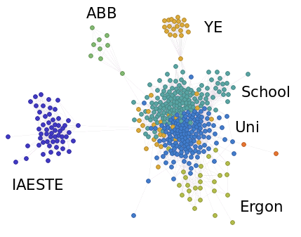
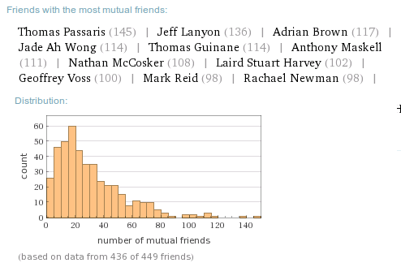

+++
categories = ['Misc']
date = '2014-08-30'
thumbnail = 'posts/2014/7-years-of-facebook-metadata/friends.png'
slug = '7-years-of-facebook-metadata'
title = '7 Years Of Facebook Metadata'
type = 'post'

+++

So amid yet more news about metadata collection by government, I decided that Facebook probably doesn't need all my old data either and it might be a good time to try and clean it up. Looking at the activity log for my account, the first bit of data is from Sep 4th 2007, which is just shy of 7 years ago.

So I thought I would try and delete my history, but Facebook doesn't have an option for that and [the scripts available](http://www.slate.com/articles/technology/future_tense/2014/01/facebook_cleansing_how_to_delete_all_of_your_account_activity.html) that do do it aren't working at the moment. Not that this means Facebook actually deletes it anyway, but it would have been a good start.

In any case, before I attempted to delete everything I first backed everything up, and used Wolfram Alpha's [Personal Analytics for Facebook](http://www.wolframalpha.com/facebook/) to make some cool graphs. I had used it ages ago but I thought it might be good to save them here prior to removing most of the data source.

By far the coolest graph is the friend relationships one. From mine you can see a couple of distinct groups of people that don't know each other, and then the uni and high school groups all intermingled, as you would expect since everyone is from Rockhampton. Then there is some joins between work friends at Ergon and uni friends, which also makes sense.

Then looking at the breakup by demographics is pretty interesting also. Nearly twice as many of my male friends are single.

Finally I thought it was interesting that Rachael was so low down in the list of mutual friend counts.
