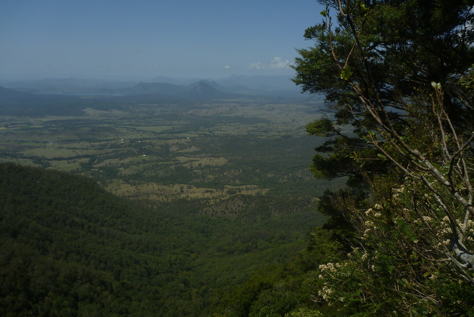
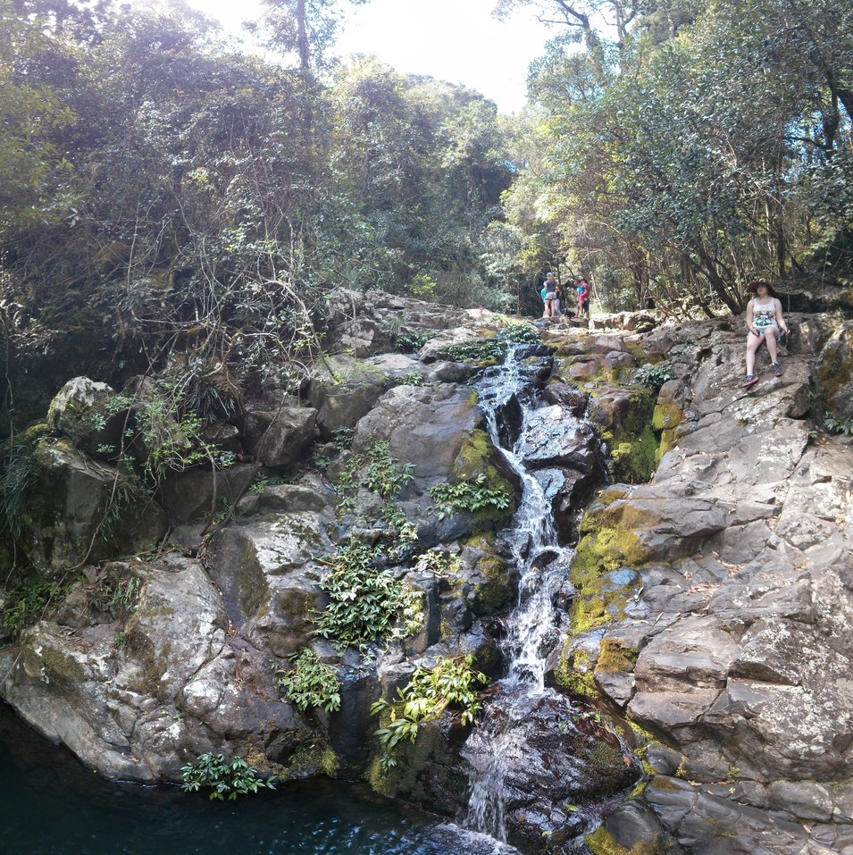
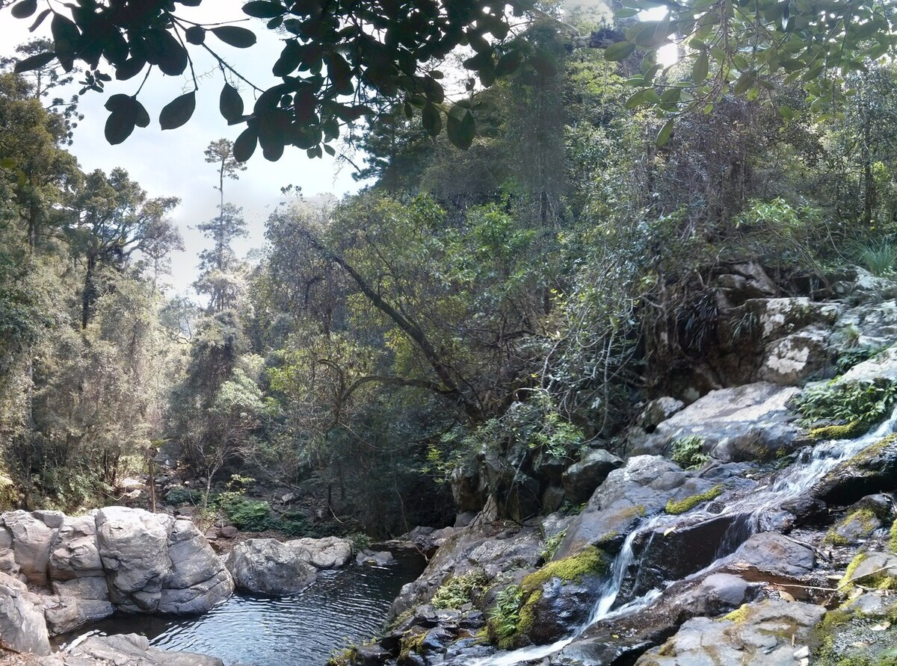
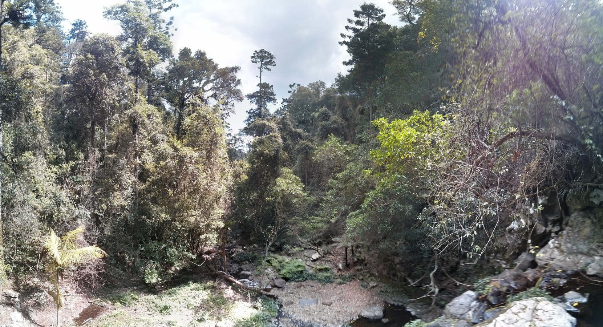
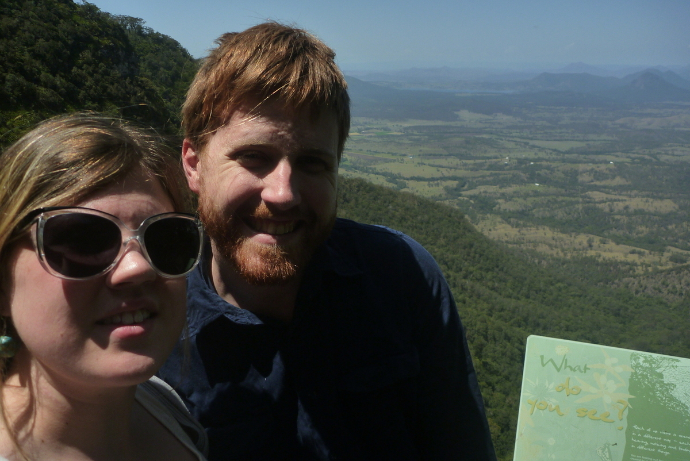
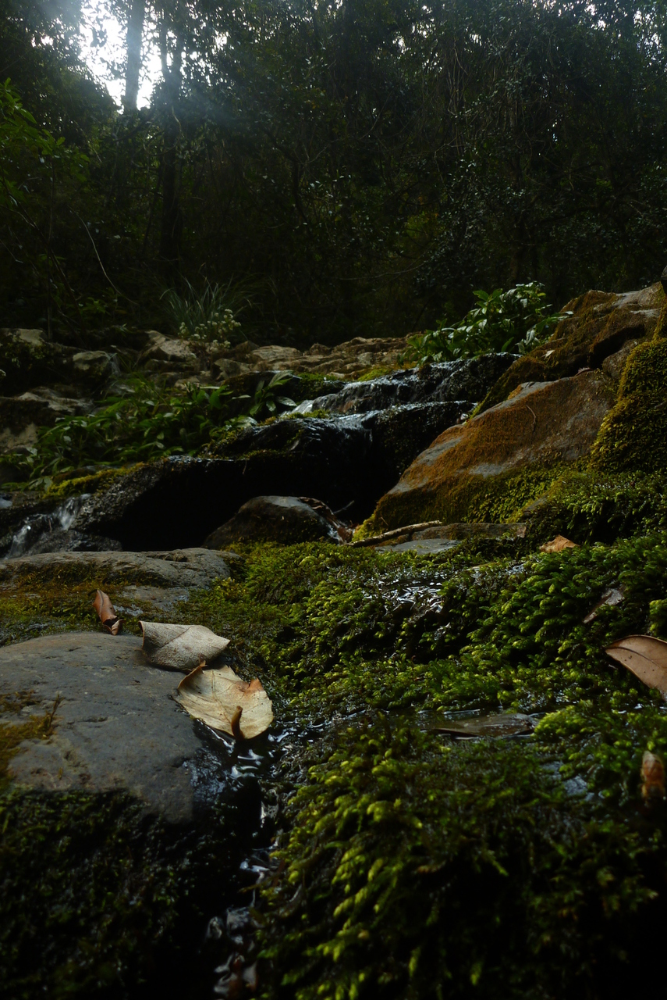
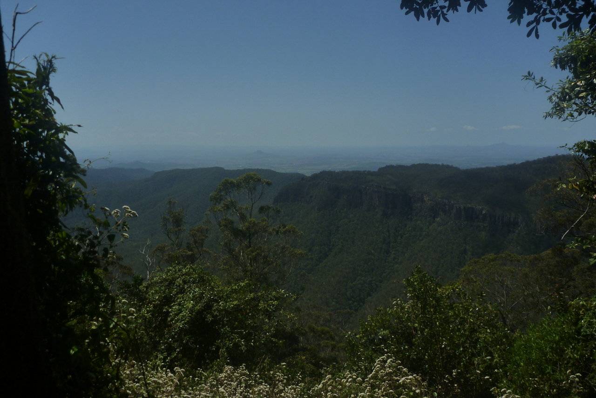
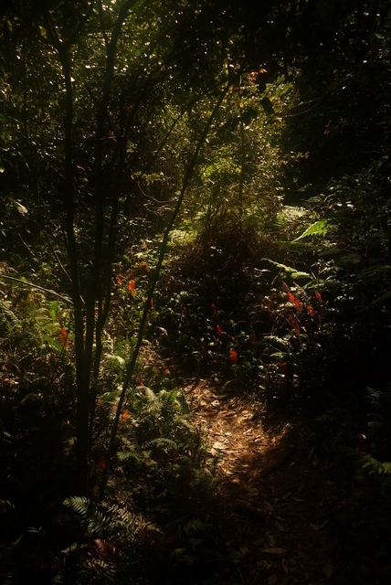
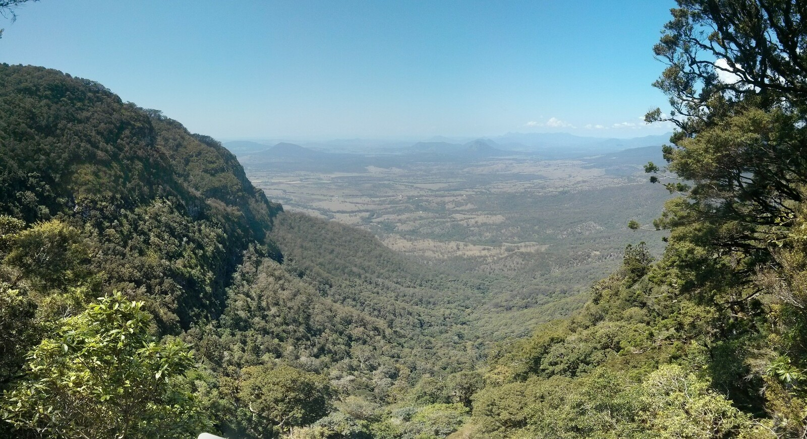

+++
categories = ['Travel']
date = '2014-10-07'
thumbnail = 'posts/2014/goomburra-state-forest/feature3.jpg'
slug = 'goomburra-state-forest'
tags = ['Queensland']
title = 'Goomburra State Forest'
type = 'post'

+++

On Sunday we went for a drive to Goomburra State Forest, which is part of the [Main Range National Park](www.nprsr.qld.gov.au/parks/main-range/about.html). There was a tonne of people camping there because of the long weekend.

There is a road right up to the top, although we had to do a creek crossing in Rachael's Yaris. From Mt Castle lookout you are supposed to be able to see Brisbane, but it was a pretty hazy day so we couldn't even see Mt Cootha. We also did the walk to Araucaria Falls.

It's part of the same world heritage area as Lamington National Park. The views weren't quite as incredible, but it's a lot closer to Toowoomba.

