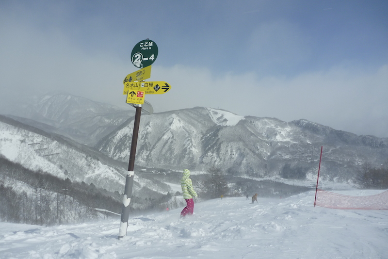

So we were finally off to Hakuba to enjoy the snow that had caused so much dramas. We got an early-ish train from Shinjuku but then had to wait for 2 hours at Shinanoomachi Station for the local train to Hakuba. When we did get to Hakuba we couldn't find any taxi's but luckily the hotel was happy to come and pick us all up when we called them. The [Hakuba High Mount Hotel](http://www.highmount.com/english-highmount/e-homepage1.htm) where we stayed was awesome like that, they had a free shuttle down and back to the Sakka lift every day as well (only a few minute drive).

By coincidence our first night in Hakuba, and my birthday, was Jackson and Bully's last night in town from their ski trip. So we met at the local pub, "The Pub" for drinks. Was a super fun night and great catching up with them. The rest of the family left reasonable early but Rachael and I stayed until quite late and then walked back up the hill in the snow. Was an excellent finish to my birthday but meant that I was super tired the next day.

Our first day on the slopes was at happo-one as this is where everyone had their lessons. I didn't do lessons, but stuck close to the green runs they were learning on to see how they were going. It wasn't a particularly good day as I was tired and trying to keep Mum and Sarah motivated as they weren't particularly enjoying themselves. Rachael and dad loved it from the start.

The second day I took Rachael and Dad up the mountain on a green run and Rachael has a bit of a tantrum when she got stuck in powder as there had been a huge snowfall that night. I tried doing a fun jump I had found the day but just ended up in waist deep powder and had to dig myself out, so we pretty much had to keep to the groomed runs. Mum and Sarah came down about lunch time and had another go but still didn't enjoy themselves as they hadn't quite got the hang of it.

Third day was super windy so some lifts were closed but we got the gondola up and did a higher green run. Rachael didn't like being close to the cliff, so had another freak out and lost confidence, which was a shame because she had improved heaps until then.

Happo-One had a [fire festival](http://www.hakubaconnect.com/event/414-happo-one-fire-festival) that night, which we went to get free hot sake (which wasn't actually hot) and see some fireworks. Unfortunately it was -11 degrees and windy so wasn't as enjoyable as we had anticipated as we were all freezing. We got to see the bonfire display and some previous olympic skiers come down the mountain, as well as some synchronised skiing which looked awesome. We got too cold and left before the fireworks though.

We were meant to have a day off to go see the snow monkeys, but yet again too much snow meant that we were trapped in Hakuba as all the roads and trains were closed, and so the tour had been cancelled. This time round things weren't as bad as we were able to move the skiing forward a day and reschedule. Having accommodation helped as well.

On the last two days we went to Iwatake and the runs were much more fun and easy for mum and Sarah to have another try. This time Sarah got the hang of it and then mostly enjoyed the last two days, although mum still didn't like skiing. Iwatake has lots more jumps and tree runs for me on the side of the green runs, so I enjoyed it way more than the first 3 days. The fact that everyone had improved and could keep up probably helped as well. The last day was particularly awesome,
as I ditched everyone else for a while and had a few runs smashing down from the top of the gondola to the bottom of the mountain.

Bully was confident that we would find Hakuba the best snow of anywhere, and I think it was a solid call. I still think Les Diablerets was slightly better, but it was definitely up there. There were plenty of other resorts we didn't try so I would definitely go back. We had heard good things about Cortina but it was a long bus drive away and we would have missed breakfast. Maybe next time.

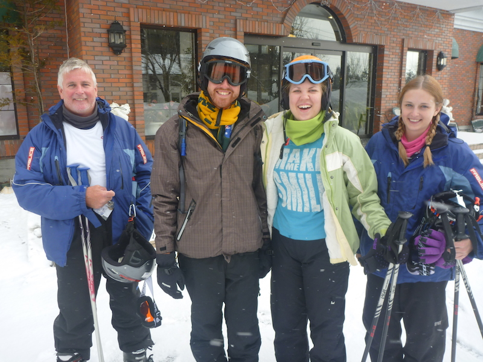

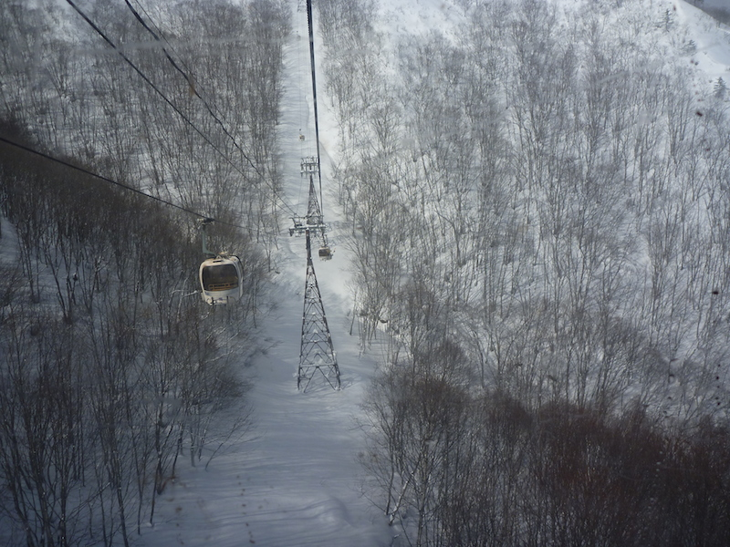

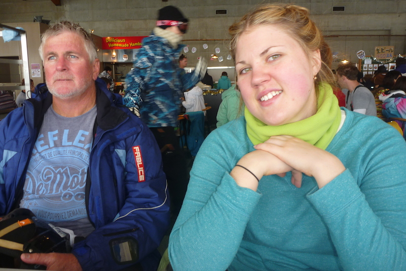

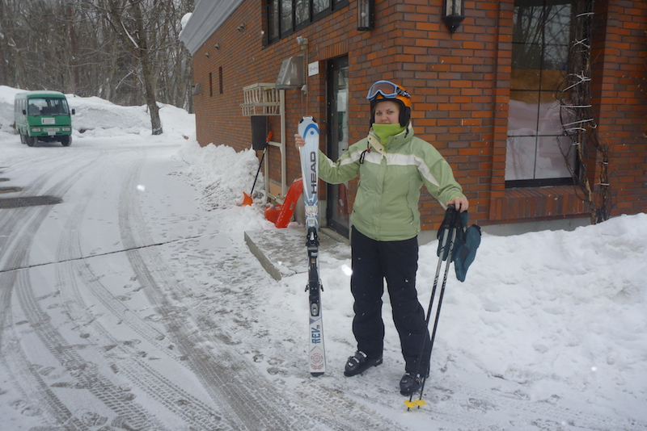

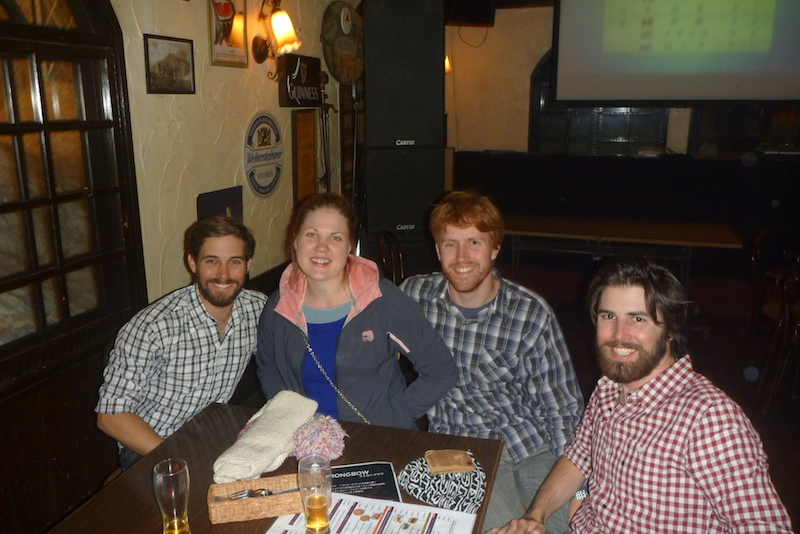

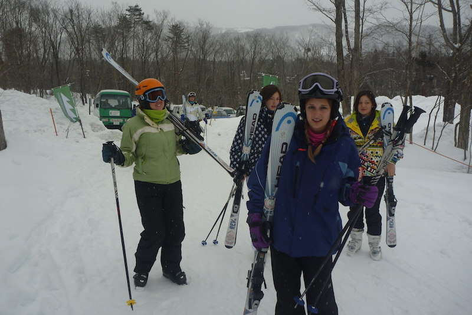

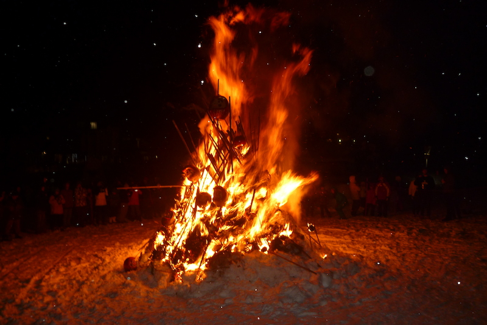

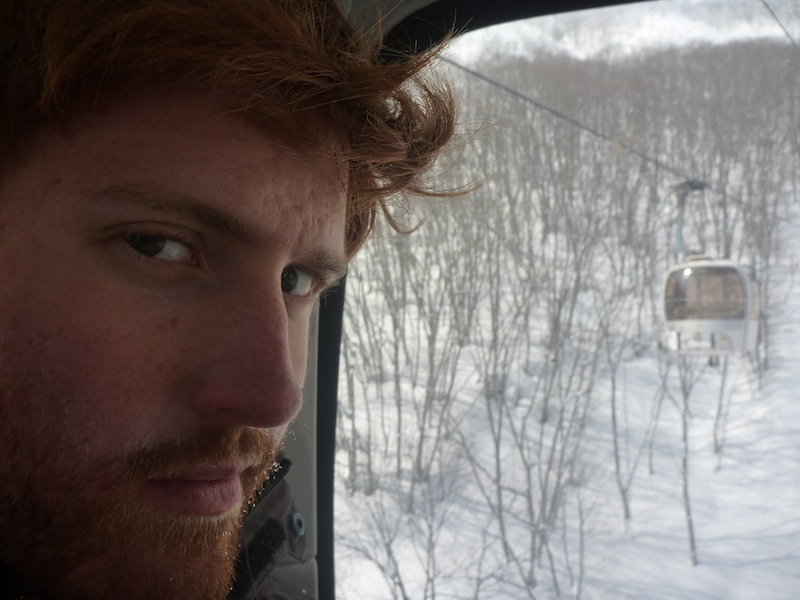

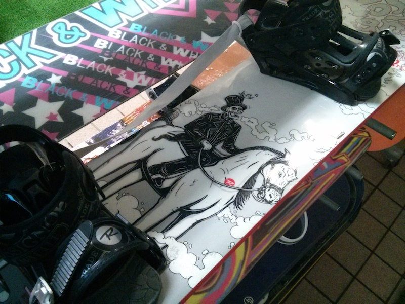

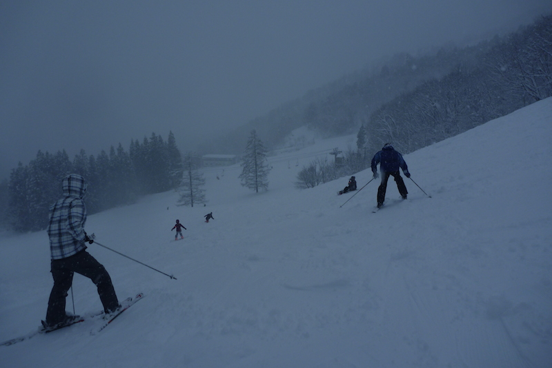

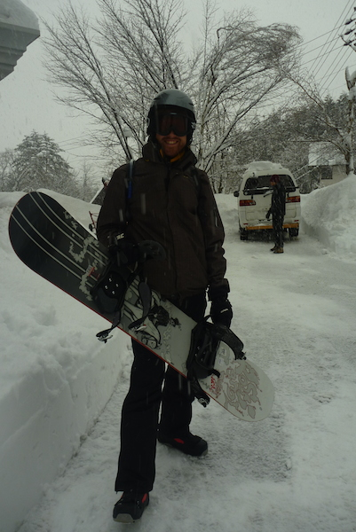

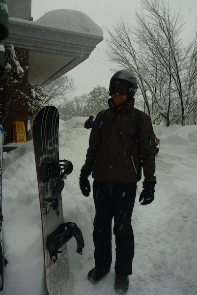

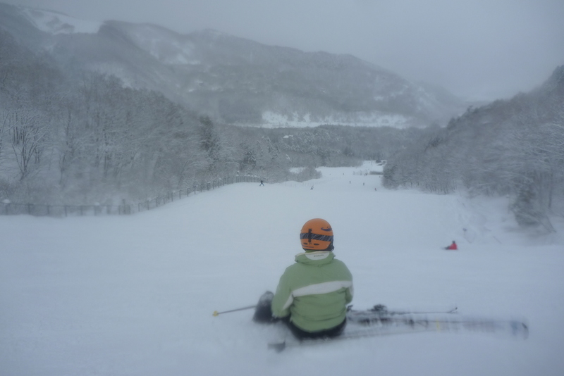

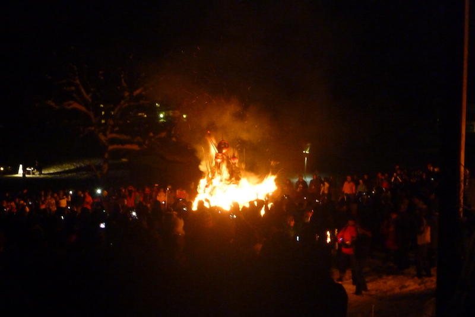

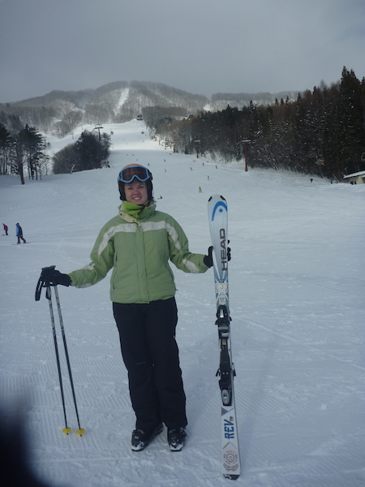

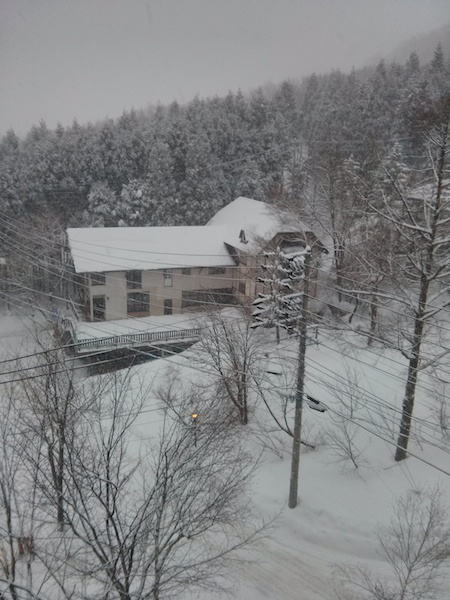
