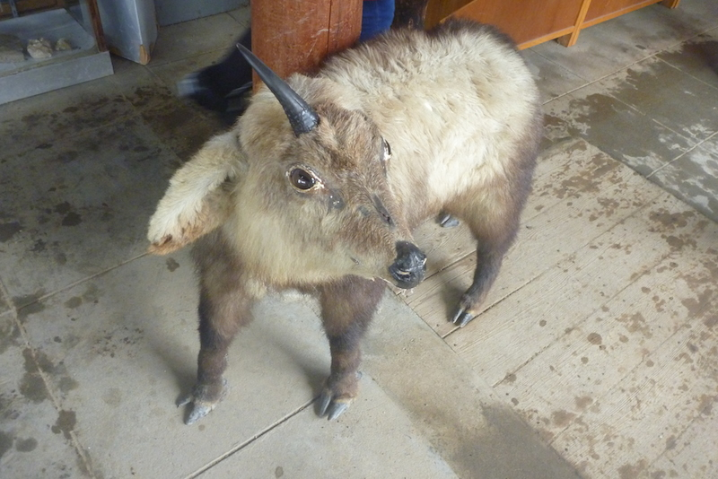

+++
categories = ['Travel']
date = '2014-03-08'
featured_image = 'posts/2014/japanese-serow/serow.jpg'
slug = 'japanese-serow'
tags = ['Bear', 'Japan', 'Serow']
title = 'Japanese Serow'
type = 'post'

+++

So when we were talking to Jackson and Bully at the pub, they told us of how they had seen a sad bear while out snowboarding in one of the further out runs. I didn't know that Japan had bears so was pretty impressed. Apparently they thought it was a goat at first, but when they got closer decided it was a sad bear. This caused Rachael to freak out a little bit that we would run into a bear and she would be mauled.

Later, when we saw the trail map for Iwatake they had indications of wild [Japanese Serow](http://en.wikipedia.org/wiki/Japanese_serow) areas, and the picture looked kind of like a goat. So we asked reception at the hotel whether Japan had any bears, and she said no that it definitely would have been a Serow.

At the snow monkeys they had a hut with stuffed animals, and the above picture is of a stuffed Serow. While not a bear, I still wish I had seen one in the wild.