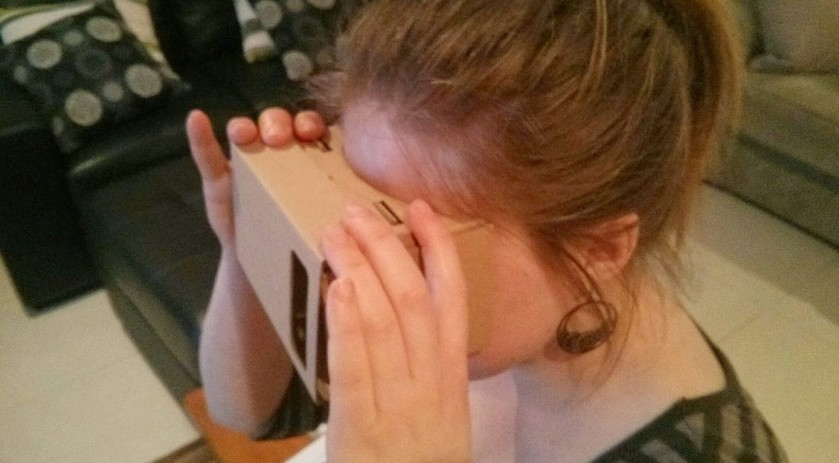

+++
categories = ['Misc']
date = '2014-10-15'
featured_image = 'posts/2014/occulus-thrift/img_20141015_185500.jpg'
slug = 'occulus-thrift'
tags = ['Google Cardboard', 'VR']
title = 'Occulus Thrift'
type = 'post'

+++

So after the MRH90 Simulator tour I was pretty keen for the [Google Cardboard](https://cardboard.withgoogle.com/) that I ordered several weeks ago [on sale](http://www.tinydeal.com/diy-google-cardboard-vr-3d-glasses-for-iphone-samsung-cellphone-p-135220.html) to show up. It ended up costing $7.50 or something for 2 of them delivered.

It showed up on Wednesday and is pretty awesome. You install [an app](https://play.google.com/store/apps/details?id=com.google.samples.apps.cardboarddemo) on your phone that uses the gyroscope to detect your head moving, and has a split screen that turns to 3d when you look through the lenses. The lenses from our cheap Chinese version aren't great so you get sore eyes after using it for a few minutes.

The actual demo apps themselves are incredibly trippy though. The coolest one was the 3D google earth which allowed you to fly around similar to a flight simulator. It's not as cool as the army one, but $4 is a lot cheaper then $70 million. I can't wait until you the prices of the Occulus Rift comes down and you can [do stuff like this](https://www.youtube.com/watch?v=-RehCTRrWM0).