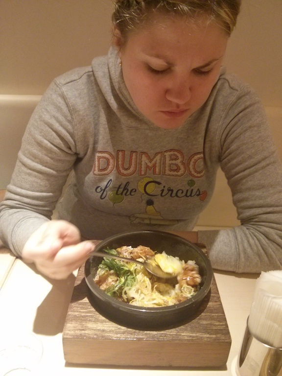
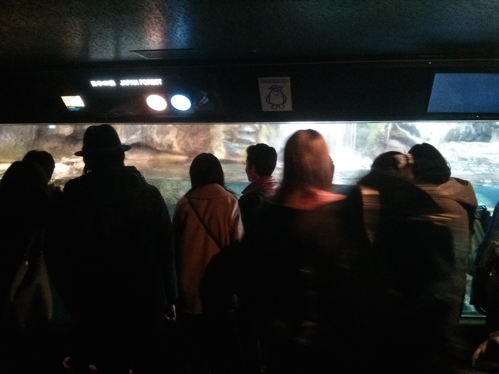
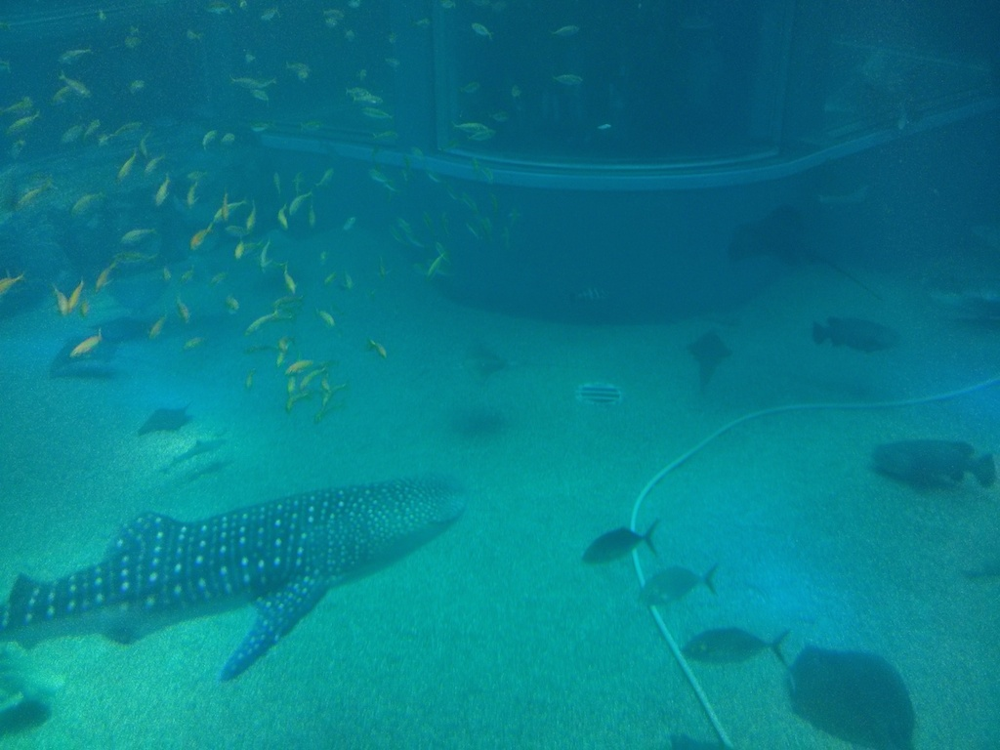
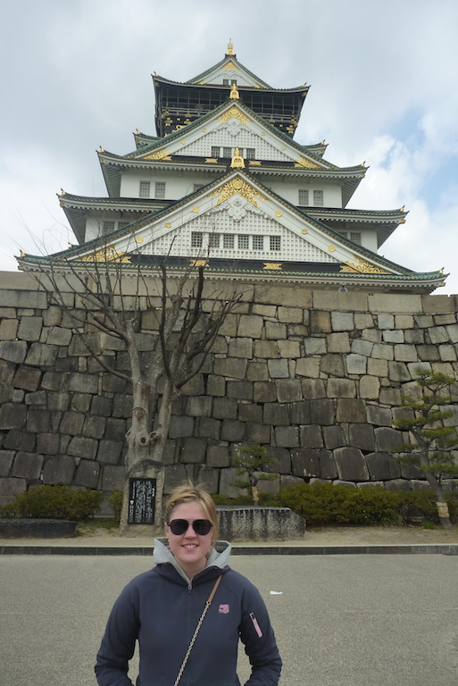
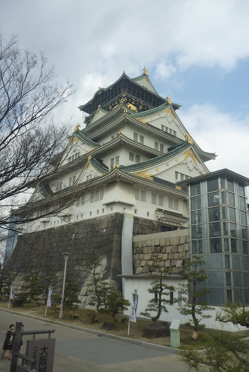
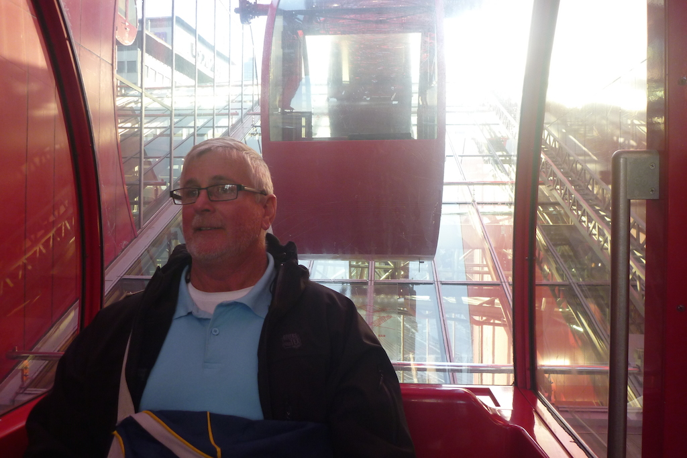
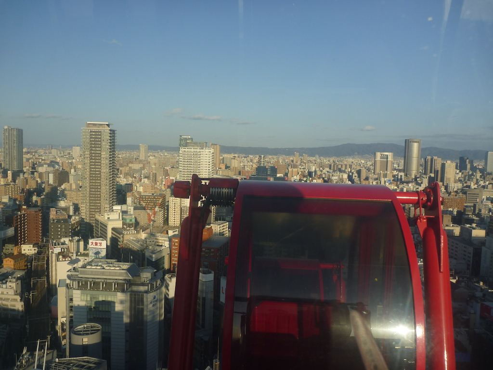
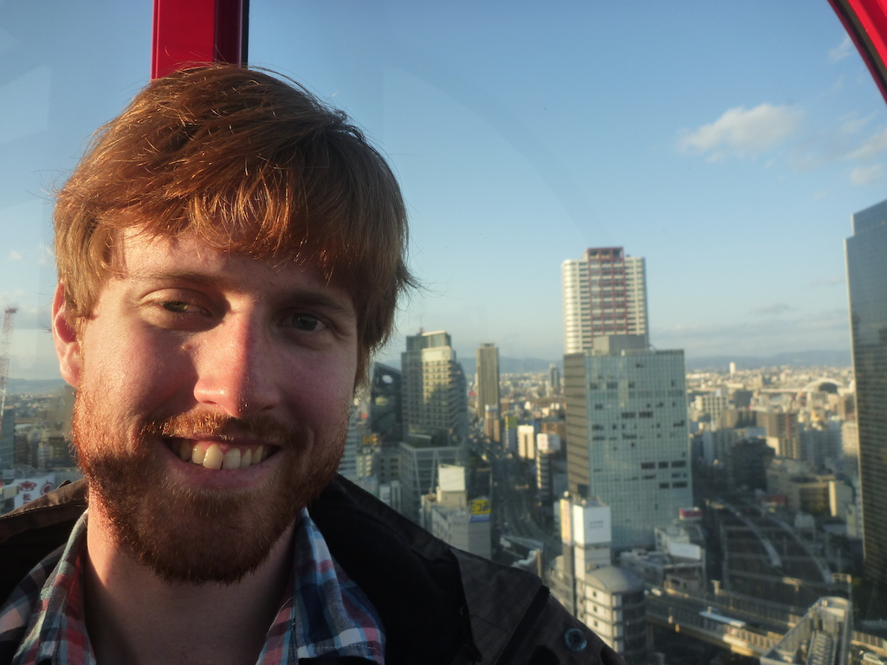
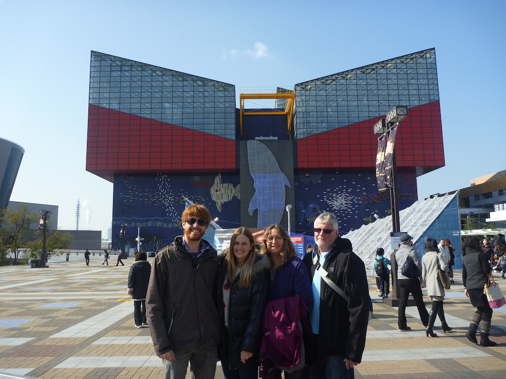
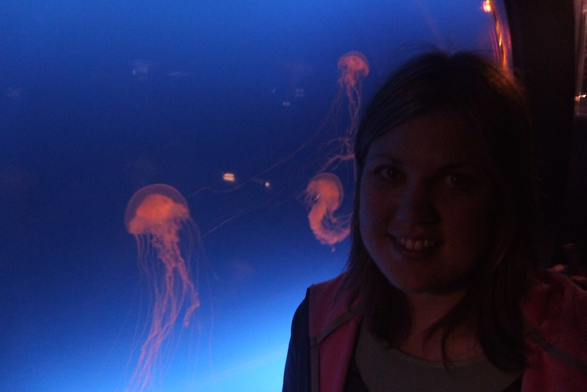

So leaving Hakuba we got the same local train back towards Matsumoto. From there we went to Nagoya where we got to catch our first Shinkansen (bullet train) to Osaka. It wasn't as fast as I was expecting (250km/h) and was much the same as the ICE train we got in Germany.

Our first day in Osaka, we went to Kyoto as told in the other post. Before heading back to the hotel we went to one of the shopping centres and on one floor they had [Pokémon Centre](http://www.pokemon.co.jp/gp/pokecen/osaka/). I thought it might have been interesting, but really it was just a store selling Pokémon Merch.

Second day we had thought about going to Hiroshima but since it was such a long train ride we decided to check out the [Osaka Peace Museum](http://www.peace-osaka.or.jp/) about the war instead. I learnt a lot about WWII that I didn't know about and the portrayal of what happened reasonably balanced. There was some pretty disturbing photos of malnourished POWs at Changi, it made the TV show seem pretty tame.

When we were finished at the museum we went to Osaka Castle in the same grounds. After doing all this boring old people stuff Sarah wanted to go back into the city to go shopping so we did that.

We went to the [HEP Five](http://en.wikipedia.org/wiki/HEP_Five) which was a mall with a Ferris Wheel in the middle of it. On the top floor there was an arcade which was very Japanese. They had all these weird photo booths which we weren't really sure what the point of them (there was lots of them). Eventually worked out they are a thing called [Pirukura](http://en.wikipedia.org/wiki/Photo_booth#Purikura) which is a photo booth that does automatic photo shopping and adds items in and such. There was heaps of dressed up girls up there using them, and it was crazy how popular something is that you can probably easily do with the webcam on your computer for free.

On the last day everyone wanted to go to the [Osaka Aquarium Kaiyukan](http://www.kaiyukan.com/language/eng/index.htm). I've been to a few aquariums recently so wasn't super excited, but it is one of the largest in the world and they had a whale shark. The whale shark was a bit of a let down though as it was quite small (about the size of some of the larger sharks they have at Sea World), although it makes sense in hindsight as the tank for a full-size one would have to be enormous.

The other bad thing about the aquarium was just how packed it was. It was hard to see anything up close just because there was so many people there all fighting to get a good view. It almost felt that there was more room in the tanks (and they were pretty small also). Having said that there was some animals I hadn't seen before, including one that I hadn't even heard of before, the [Capybara](http://en.wikipedia.org/wiki/Capybara).

After the aquarium our holiday was over, and we got a bus to the Kansai Airport to head back to Australia.

