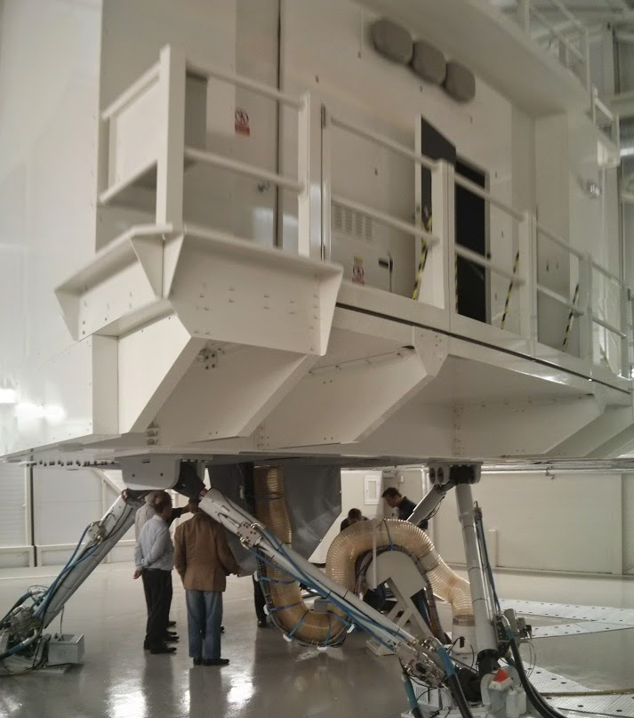
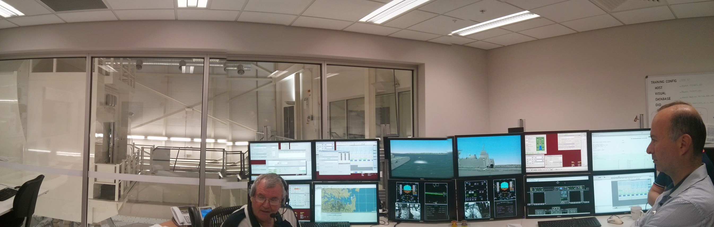

Yesterday afternoon I went to an Engineers Australia tour of the [MRH90 helicopter](https://en.wikipedia.org/wiki/NHIndustries_NH90#Australia) training simulator at Oakey Air Base.

We were allowed to take some photos, so here they are. Calculated using a 20 year life cycle, they said it costs $10,000 an hour to run. But that is cheaper than training in the real helicopters, which costs around $270,000/hour over the life of the helicopter.

The movement part of the simulator was turned off when we were allowed inside the cockpit, but even with just the projection screen running it tricked your brain into thinking it was real and that we were actually moving. It was extremely cool.

The control program software was pretty cool as well. They flew around over the top of Google Earth style imagery (with up to 0.1m accuracy), but the controller could also simulate enemy forces to attack them, change the weather conditions and cause things like the engine to fail.

They also brought out a $0.5mil helmet, that is the heads up display unit they use in the helicopters. It automatically adjusts to night vision, infra-red or darkens things depending on what you look at.

