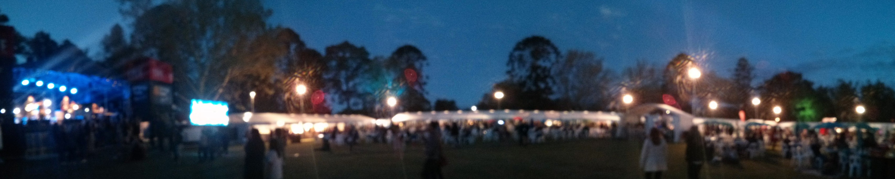
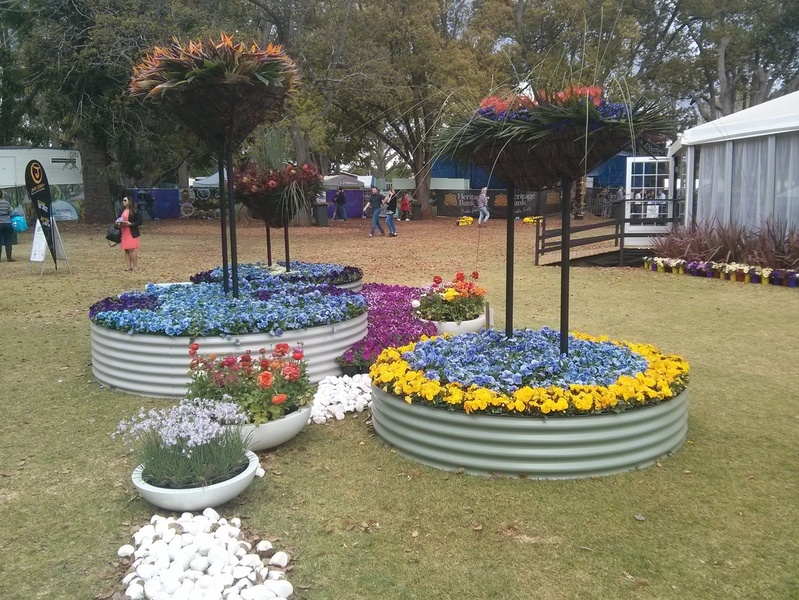
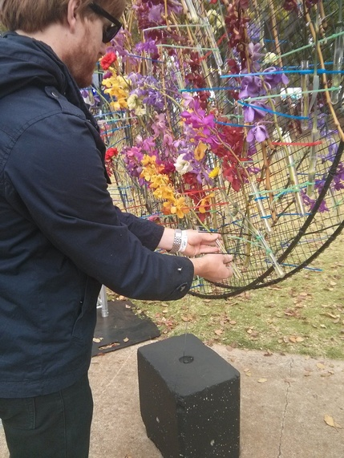
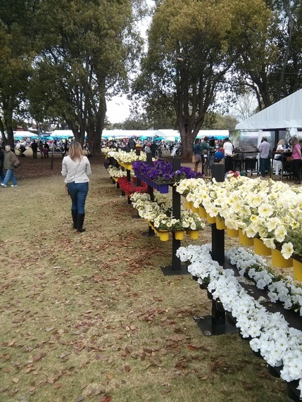
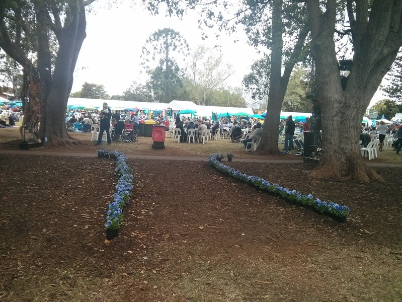
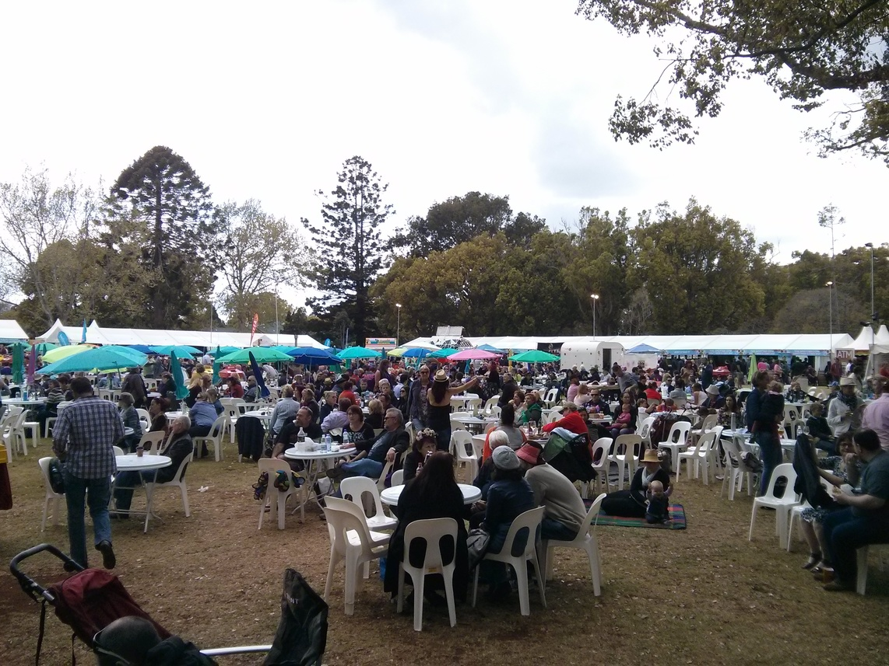
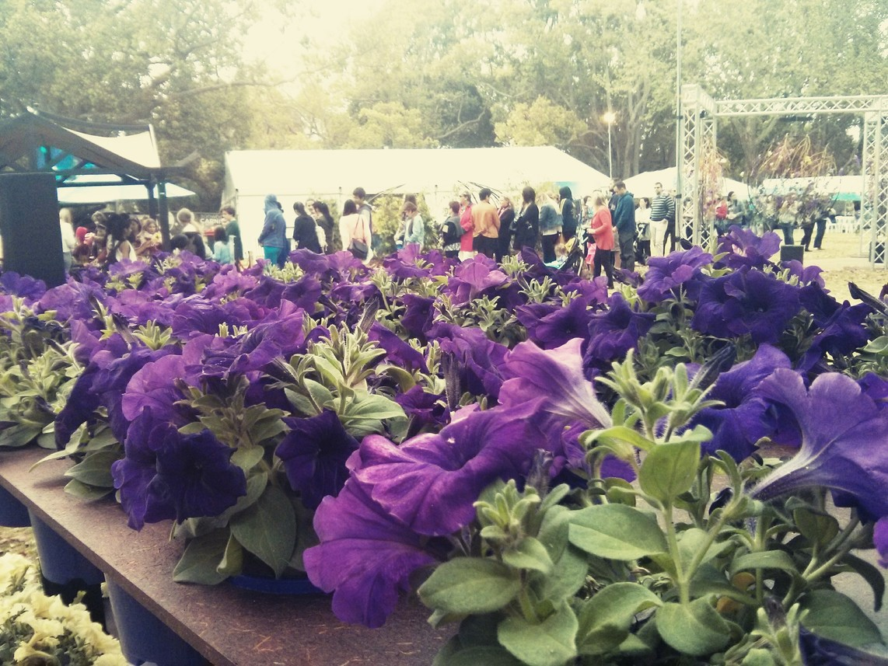
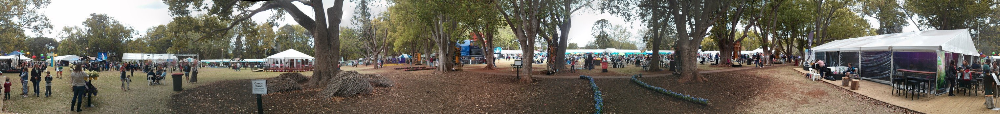

So we went to the carnival of flowers again this year, and it was a bit disappointing.

They had improved the layout this year, so we were pretty impressed on the Friday night. There was much more food to choose from this year, which was great. The bands playing weren't all that exciting though, and the wines choices weren't as good as last years. Was mostly dry wines, which Rachael and I don't like. San Cisco was to play, but it was quite cold and so we left early as we had seen them before.

Tom and Bec came from the Sunshine Coast to visit us on Saturday, but they sold out of tickets and so they couldn't get in. This basically rendered our 3-day pass useless since we didn't want to ditch them. Normally that would be fair enough, but the previous years they had no limit on the number of tickets. Last year there was way too many people their and it ruined it, so I am glad they are limiting them, but there was no indication that they would be doing so until we had already been waiting in line for 15 mins. If they had advertised that they had changed things we would have pre-booked. Not only that, Rachael and I had already paid for tickets but even if we had wanted to ditch Tom and Bec the staff said that we would need to wait in line until people left the venue to be let in. So even pre-booked tickets still did not guarantee you entrance. Given the record turnout last year on the Saturday it wasn't exactly unexpected. It was very poorly handled.

On the Sunday we headed their early to see Something for Kate play. They were really good and went some way to improve our impressions of the Saturday. We also went to a wine appreciation session which was kind of interesting. Sasquatch were also really good, although it started to rain towards their end of the set. It's always fun watching a band with a horn section. We didn't bother staying for the ABBA tribute band.

All in all, unless they have a better line up of bands for next year, or better planning in regards to the Saturday crowds, I think we will give it a miss.

