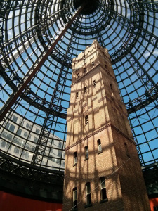
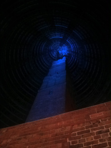
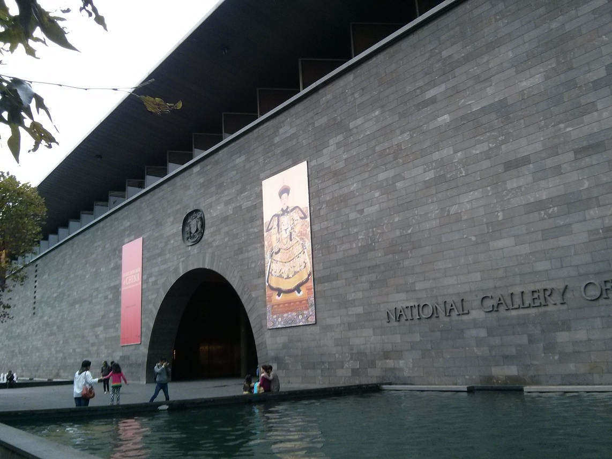
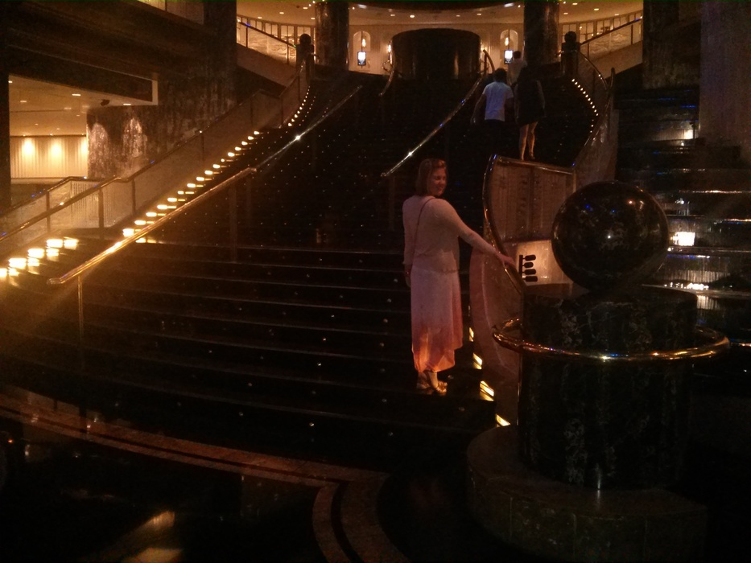
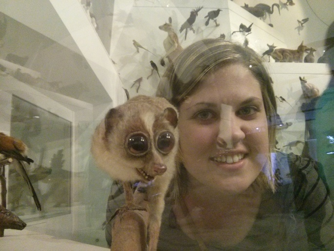
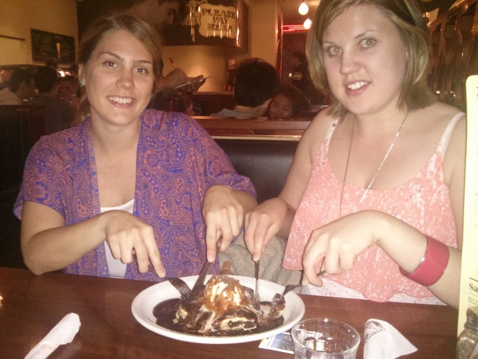

---

date: "2015-03-13 03:35:59+00:00"
slug: melbourne
title: Melbourne

categories: ["Travel"]
# tags: [""]
---Melbourne, Victoria

So Rachael's sister Lauren had a job interview in Melbourne for the London Ambulance Service (which she got), and Rachael had a free week between uni and starting her new job, so we went for a quick holiday to Victoria.

We stayed in the city at the [Space Hotel](http://www.spacehotel.com.au/), which was pretty nice for a backpackers and pretty close to everything. Melbourne has a free tram zone in the city, so all trams were free and were reasonably frequent. Was really cool to use descent public transport in Australia, although it seemed like it would have been extremely complicated if you ever needed to drive into the city for some reason. Not only do they have weird hook turns, the traffic lights are pretty insane.

Probably one of the coolest buildings was the shopping centre that incorporated the old [shot tower](http://en.wikipedia.org/wiki/Coop%27s_Shot_Tower) inside it.

There are some photos of what it looked like before the shopping centre, [here](https://i.imgur.com/6F2ZROm.jpg) and [here](https://i.imgur.com/ybV5cGq.jpg).

Below are some buildings from some other cool places, [Federation Square](http://en.wikipedia.org/wiki/Federation_Square), the [National Gallery of Victoria](http://www.ngv.vic.gov.au/visit/), and the [State Library of Victoria](http://www.slv.vic.gov.au/) (which is where they filmed this [Faker Video](https://www.youtube.com/watch?v=PFT7nG3-fSA)).

We went to the [Eureka Skydeck](http://en.wikipedia.org/wiki/Eureka_Tower#Observation_deck_.28Eureka_Skydeck_88.29), which was pretty similar to the Tokyo Government building, but double the height. There was some cool views of the fair and the fireballs that go off on the hour at the crown casino, which we also went to.

We went to the docklands for lunch one day which were pretty nice but nothing too exciting.We went to Draculas for dinner one night, which was pretty fun but not as good as people had talked it up. It was 70's themed and they did an excellent cover of Stairway to Heaven, as well as a cool Queen puppet show skit.

While Lauren was at her interview we went to the Melbourne Museum, which was really good with the highlight being a room full of taxidermy animals.

Opposite the museum is the [Exhibition Building](http://en.wikipedia.org/wiki/Royal_Exhibition_Building) which looked like it would be an incredible building similar to those in Europe, but unfortunately isn't open very often.

All and all it was a pretty cool city, although after a few days I was pretty keen to leave and not have to see any more shops.

