+++
categories = ['Travel']
date = '2015-03-16'
thumbnail = 'posts/2015/great-ocean-road/bellsbeach-resized.jpg'
slug = 'great-ocean-road'
tags = ['Victoria']
title = 'Great Ocean Road'
type = 'post'

+++

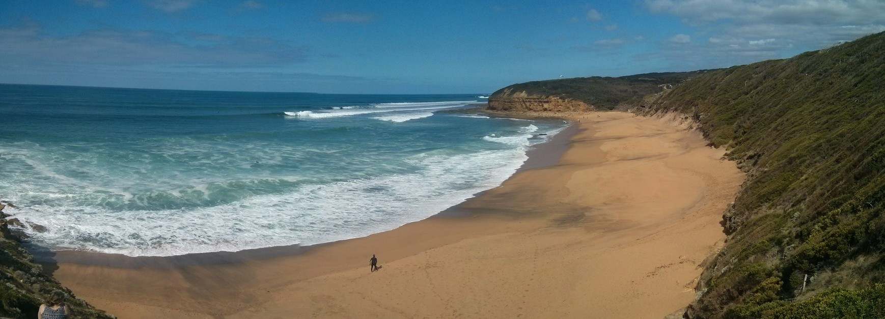

So after a few days in Melbourne we went back to the airport and picked up a hire car to drive the great ocean road. To drive directly to the 12 Apostles actually only takes 2 hours, but the scenic route is more like 6 hours.

Our first stop was to check out Bell's Beach, which is just past Geelong. As you would expect the waves looked awesome, with massive barrels coming through in clean sets. The water would have been freezing though.

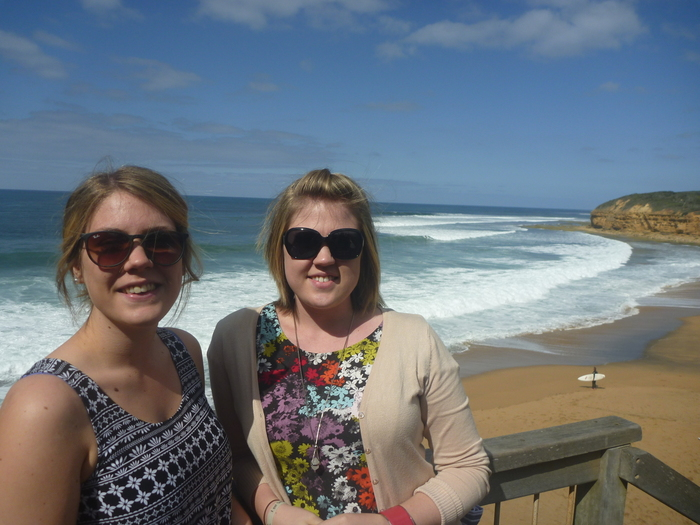

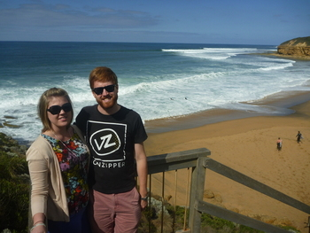

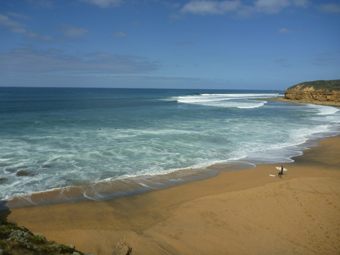

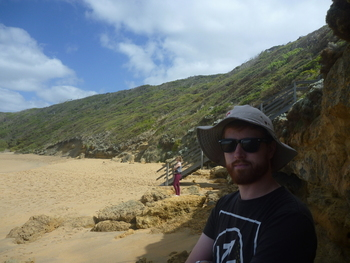

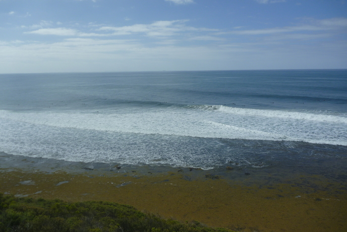

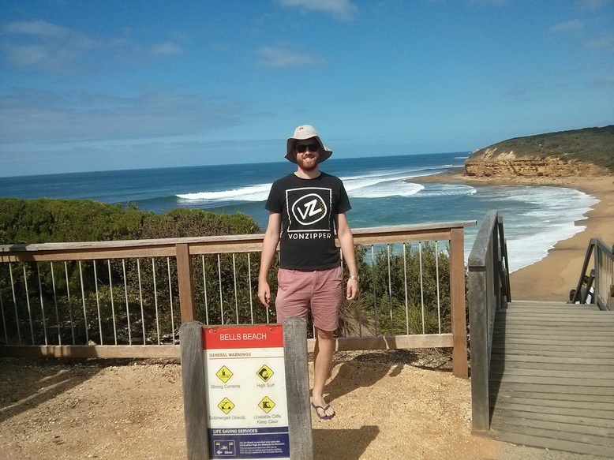

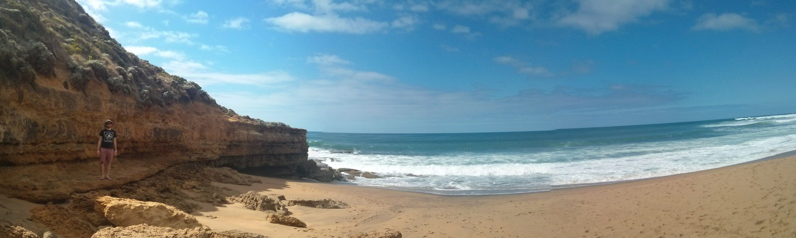

A little bit further into the drive we saw a familiar looking lighthouse so stopped for a look.

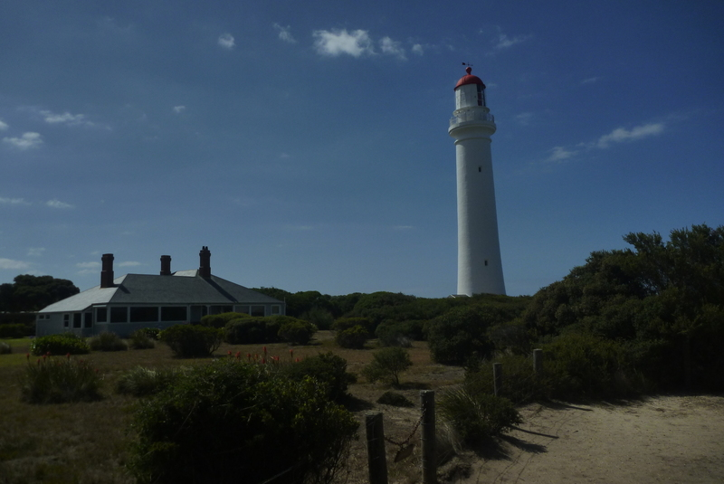

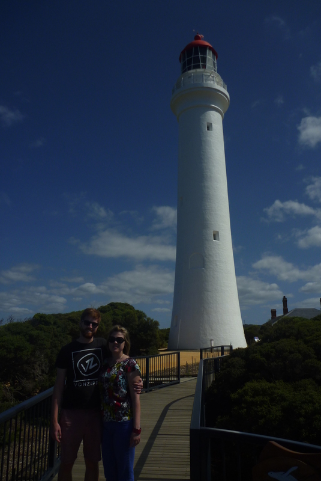

[Split Point Lighthouse](http://en.wikipedia.org/wiki/Split_Point_Lighthouse) is where they filmed 'Round the Twist.

Then a fairly big drive along the coast and through some forest, was a great drive and aptly named. Eventually we made it to Gibson's Steps and the [Twelve Apostles](http://en.wikipedia.org/wiki/The_Twelve_Apostles_%28Victoria%29).

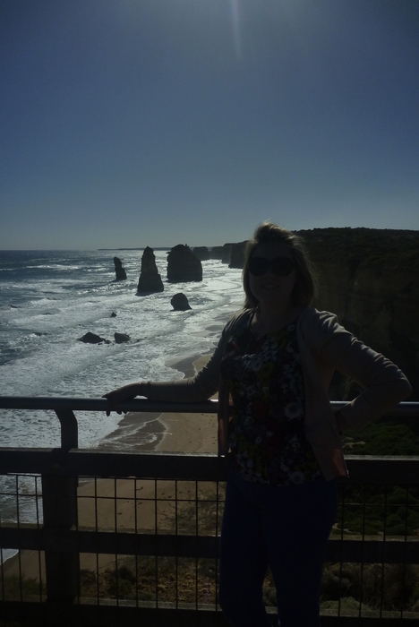

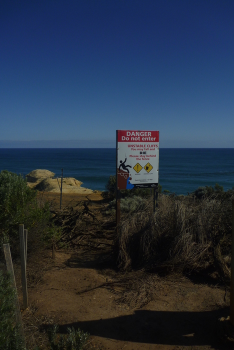

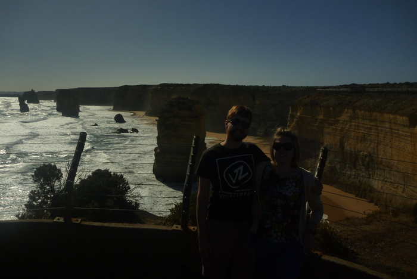

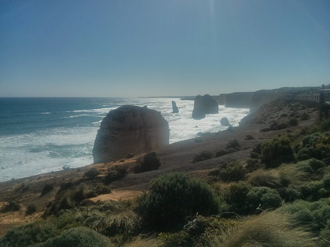

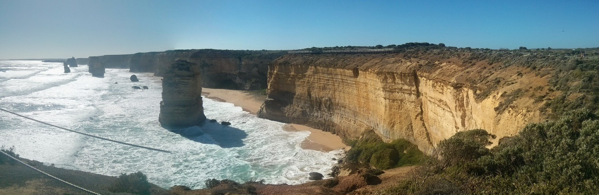

By this stage it was after 5, and despite the sun still being really fierce due to daylight savings, we thought we better head to Warrnambool and find some accommodation. So we drove past [London Bridge](http://en.wikipedia.org/wiki/London_Arch), [The Grotto](http://en.wikipedia.org/wiki/The_Grotto,_Victoria) and The Arch without stopping, but came back to them the next day. They were equally as good, if not better.

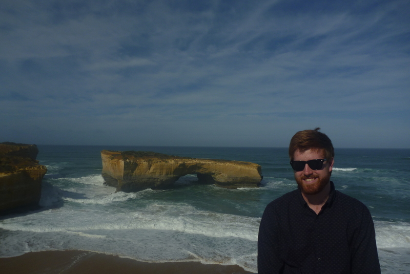

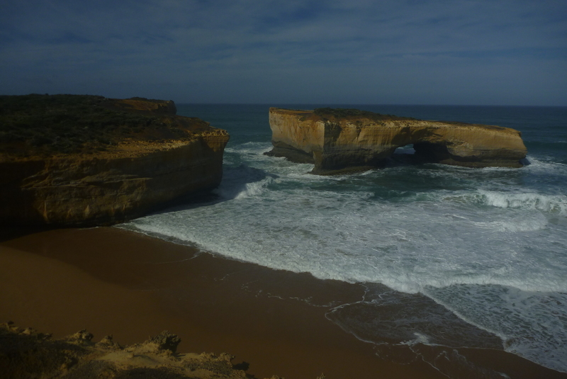

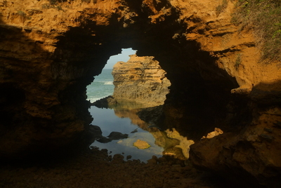

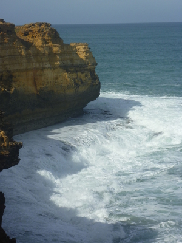

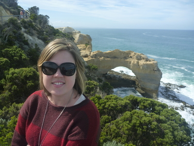

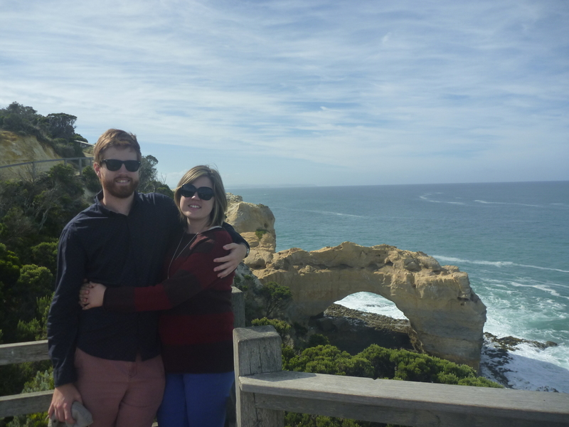

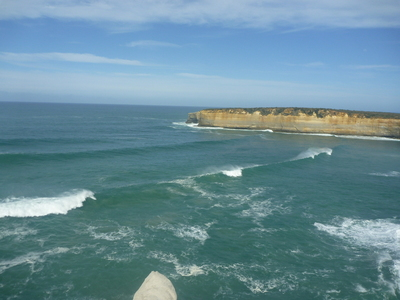

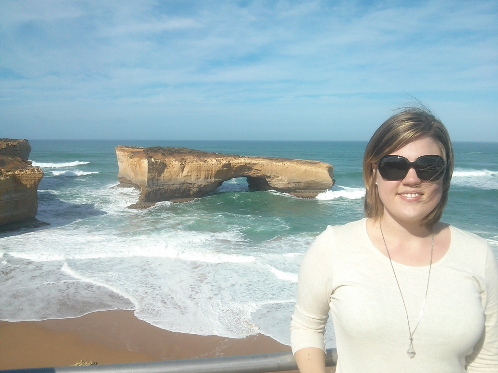

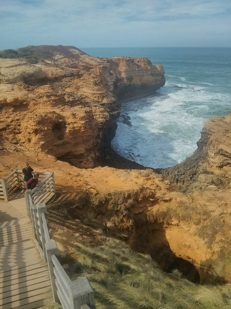

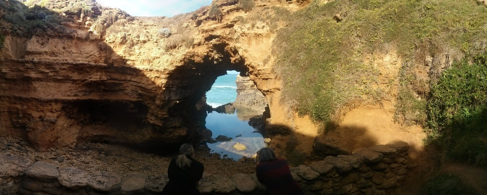

The Great Ocean road was a great drive indeed, and the highlight of the trip for me.