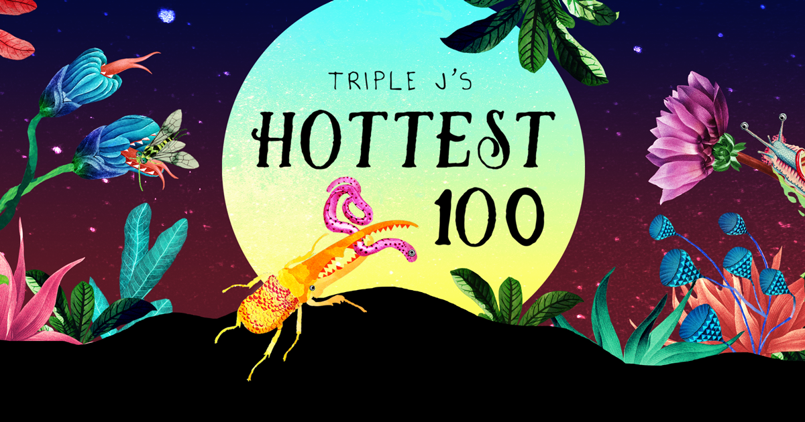

+++
categories = ['Misc']
date = '2015-01-12'
thumbnail = 'posts/2015/hottest-100-votes-2014/meta.png'
slug = 'hottest-100-votes-2014'
tags = ['Hottest 100']
title = 'Hottest 100 Votes 2014'
type = 'post'

+++

**Saskwatch - Born To Break Your Heart**
I saw Saskwatch live at the carnival of flowers, and despite being cold and raining and not knowing any of their songs, we stayed for the full set. Don't Want To Try was my favourite song, but since it wasn't released last year this is my pick. Love the horns.

**Bluejuice - I'll Go Crazy**
A great band, sad that they are calling it quits.

**The Grates - Wish I Was Alone**
Not the greatest Grates song, but we were the first in the world to hear it live at their Toowoomba show, so it gets a spot.

**Dustin Tebbutt - Bones**
Another song I saw live when they were supporting Missy Higgins. The set nearly put us to sleep, as it's not exactly upbeat music and we had had a massive day. But a great song regardless.

**Ball Park Music - Trippin' The Light Fantastic**
Their cover of Diane Young was good too.

**Chet Faker - Talk Is Cheap**

**Flight Facilities - Sunshine {Ft. Reggie Watts}**

**Asgeir - Kings and Cross**

**Hilltop Hoods - Cosby Sweater**

**The Griswalds - Beware The Dog**

Some other songs from my short list:

* Megan Washington - Who Are You_
* TV On The Radio - Happy Idiot_
* Sia - Chandelier_
* Peking Duk - Take Me Over {Ft. SAFIA}_
* King Gizzard & The Lizard Wizard - Cellophane_
* Matt Corby - What The Devil Has Made_
* Lana Del Rey - West Coast_
* Jack White - Lazeretto_
* alt-J - Every Other Freckle_
* The Holidays - Is This How You Feel? (Like A Version)_
* Foster The People - Best Friend_
* Augie March - A Dog Starved_