+++
title = "Milford Sound"
date = "2015-09-06"
slug = "milford-sound"
type = "post"

[taxonomies]
categories = [ "Travel",]
tags = [ "New Zealand",]

[extra]
image = "posts/2015/milford-sound/cover.jpg"

+++

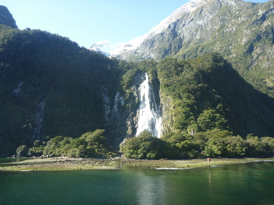

We did a day bust tour from Queenstown to Milford Sound, which is part of [Fiordland National Park](https://en.wikipedia.org/wiki/Fiordland_National_Park) and world heritage listed for a reason, as it was incredible.

Milford Sound is pretty close to Queenstown, but because of the mountains, it's big roundabout 4 hour drive. The drive to Te Anau was okay, lots of mountains and sheep but nothing too out of the ordinary to the rest of NZ. We had a long stop there at a typical tourist trap. Dad bought a shirt and they wouldn't let him buy it until he told them who our bus driver was. I would have preferred we got to spend more time in the national park or got home sooner, but that's part of being in a tour.

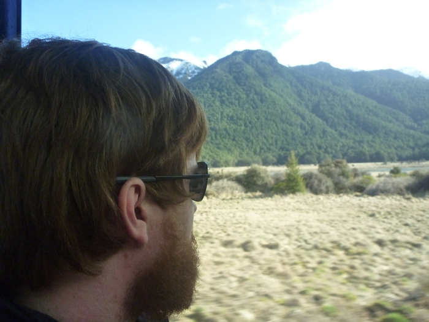

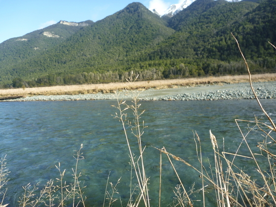

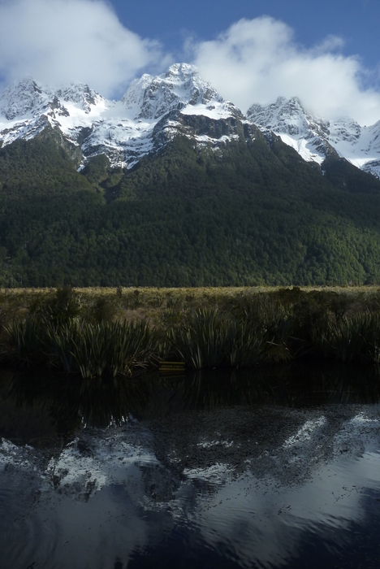

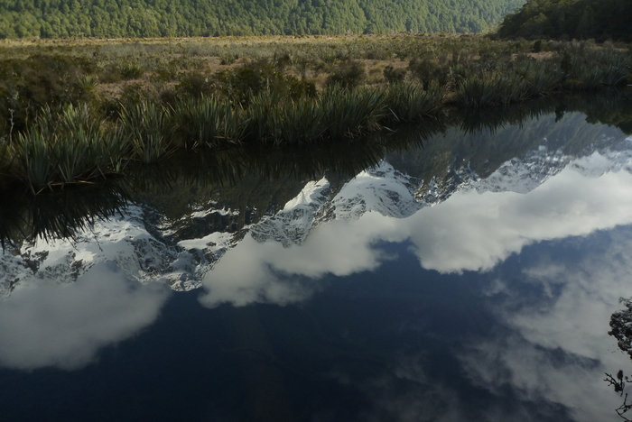

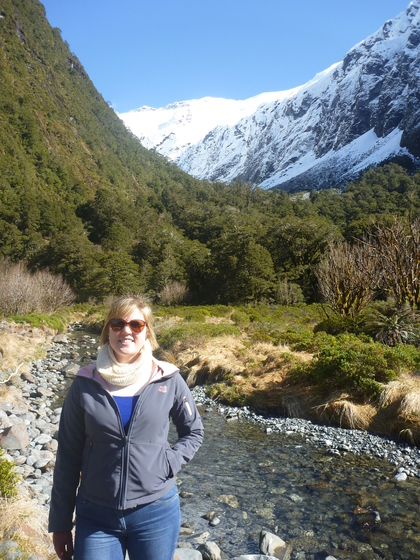

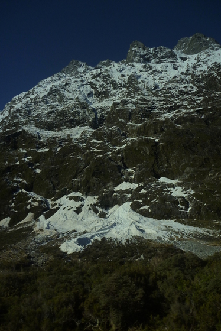

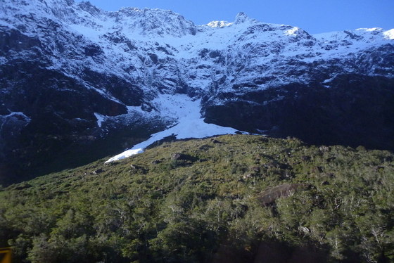

Once we got into the national park the drive was awesome. A lot of the road is quite dangerous and there was tonnes of previous landslides and avalanches that had come up to or gone onto the road previous times so there was only a few dedicated areas where you were allowed to stop. Our bus had a glass roof so that you could see the snow capped mountains towering above us, but the ground level was forest, which is a pretty weird mix. There is a tunnel under one of the mountains to get through to the Milford Sound side, and then there is a rainforest. It reminded me of Lamington National Park at the gold coast, except with snow capped mountains far overhead. It was pretty strange the mix of climates all in one place. There was a [Chasm Walk](http://www.doc.govt.nz/parks-and-recreation/places-to-go/fiordland/places/fiordland-national-park/things-to-do/tracks/the-chasm-walk/) that was pretty cool, but not as impressive as [Trümmelbachfälle](https://de.wikipedia.org/wiki/Tr%C3%BCmmelbachf%C3%A4lle) which I saw when I was in Switzerland.

Once we got to Milford Sound itself (which actually is a fjord and not a sound), we got on the boat. Apperntly it rains something like 200 days of the year, but we had perfect weather. Rachael was promised the chance of penguins, seals and dolphins on her ticket and wasn't happy to we saw all three (which we did!). It is apparently rare to see the penguins so the boat went over for a closer look and we didn't go out to sea like they normally do to make up the time.

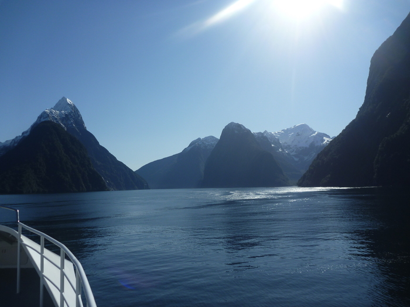

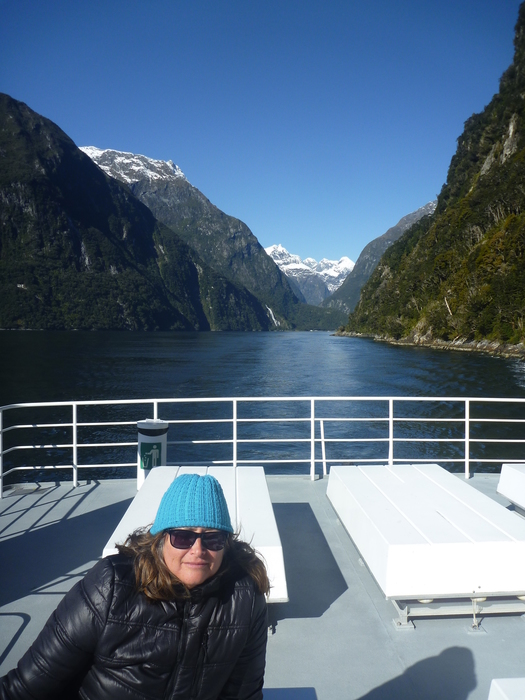

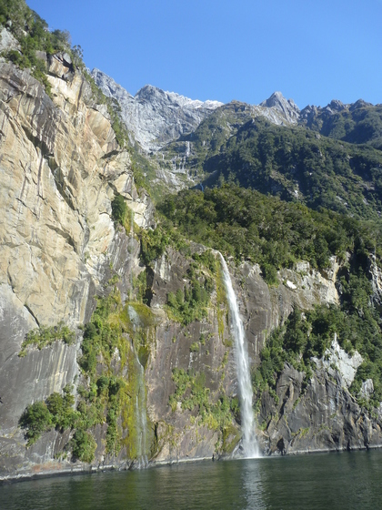

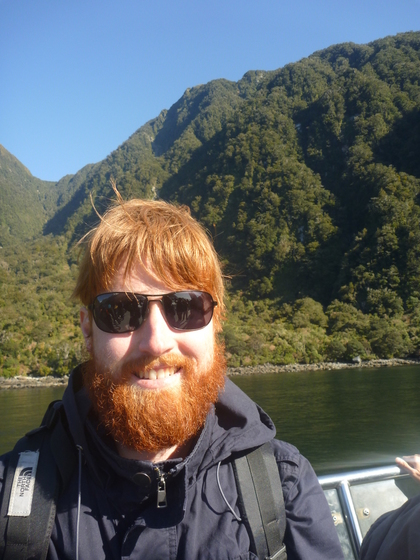

[2015-08-26 12.09.51](2015-08-26-12-09-51.jpg "Spot the penguins")

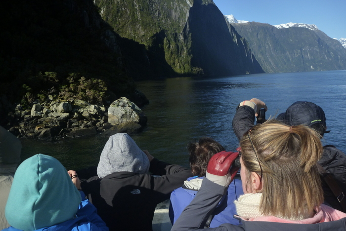

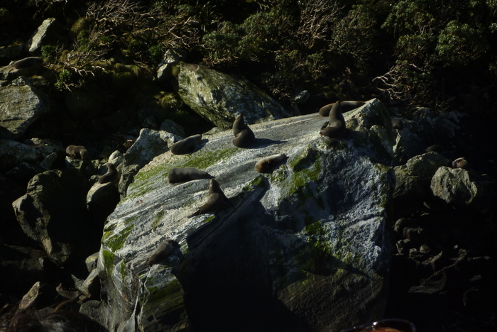

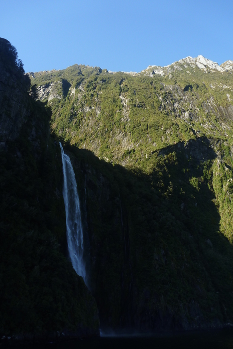

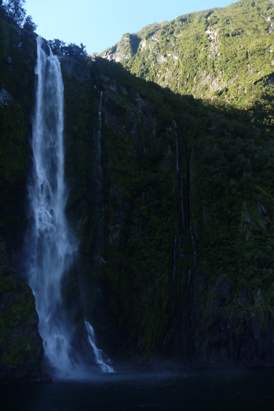

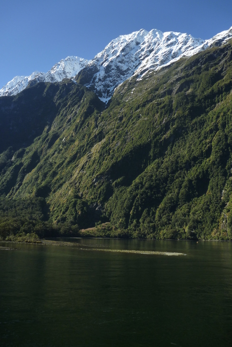

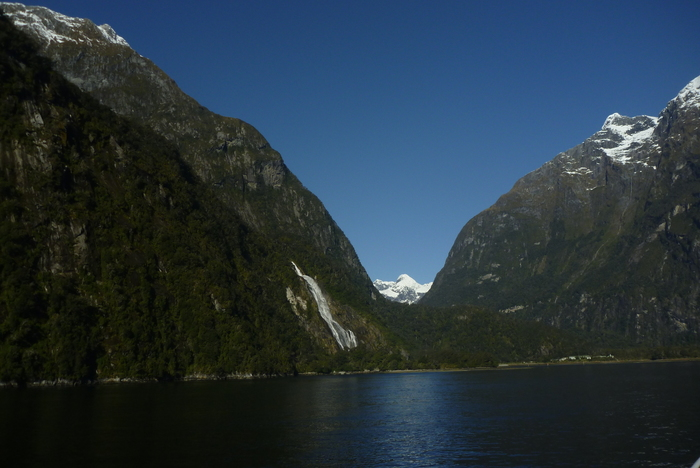

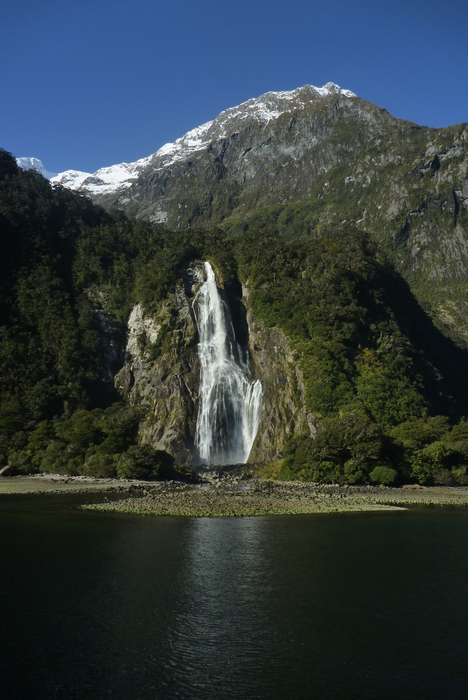

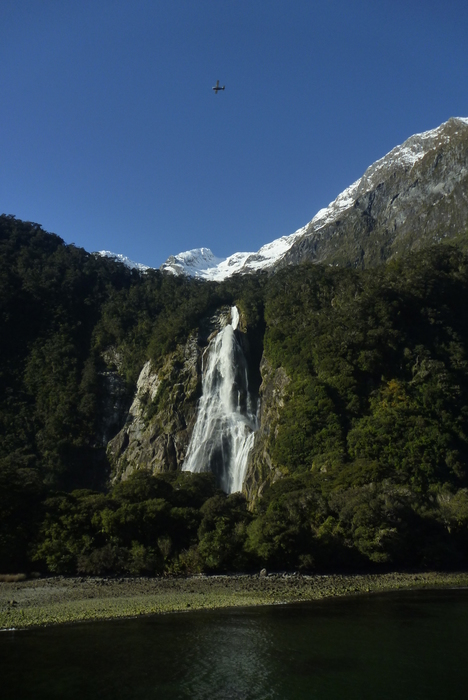

The sheer scale of the mountains coming out of the ocean is pretty hard to comprehend when you look at them. It is a pretty incredible place.

One the bus back we got to see one more sight, that of an avalanche of snow falling down the mountain in front of us while we waited to enter the tunnel under it. In the photo below it looks more like a waterfall. The sheer height and sudden fall made it look like the snow was coming down in slow motion. It was pretty spectacular to watch, you wouldn't want to be in the way (we were slightly off to the side but it didn't make it to the road anyway).

