+++
categories = ['Travel']
date = '2015-09-06'
thumbnail = 'posts/2015/queenstown/pano_20150825_160743.jpg'
slug = 'queenstown'
tags = ['New Zealand']
title = 'Queenstown'
type = 'post'

+++

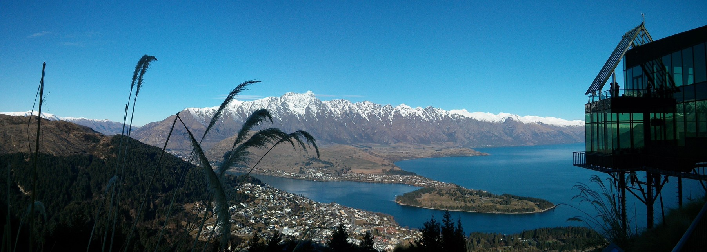

So we finally were able to go on our 2nd ski holiday now that Rachael got the bug in Japan, this time to New Zealand.

We flew into Queenstown for a night, and then mum and dad met us later in Wanaka the next day. Rachael was impressed from the get go but the first day was a bit of a miserable rainy day and not as good as last time I was there. The sun came out on the 2nd day though before we headed off to Wanaka for the main reason of our trip, snow sports!

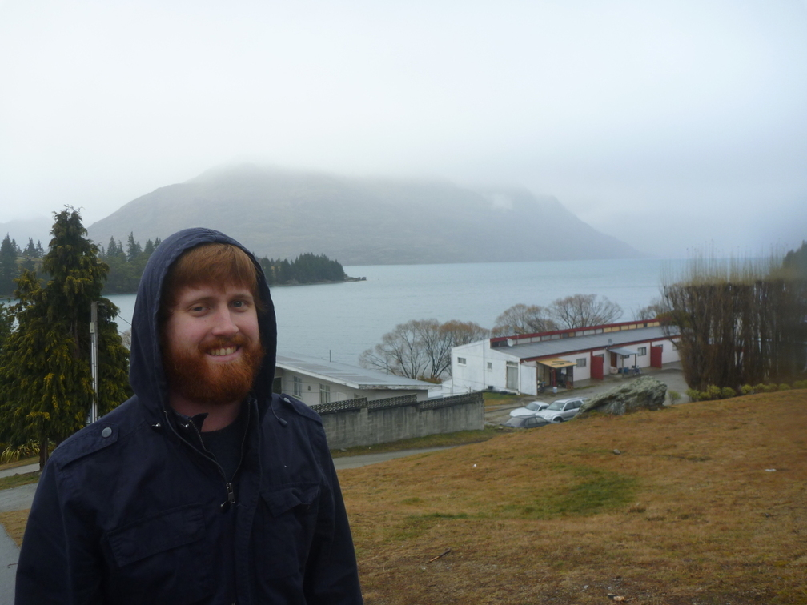

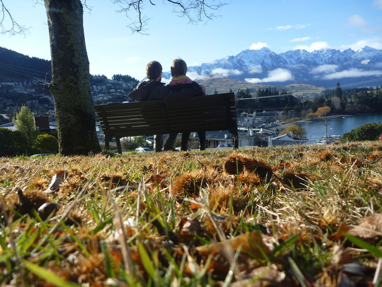

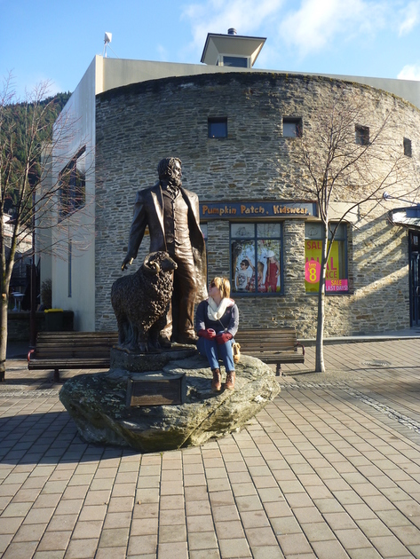

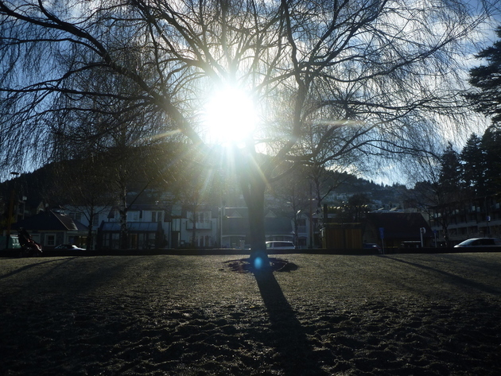

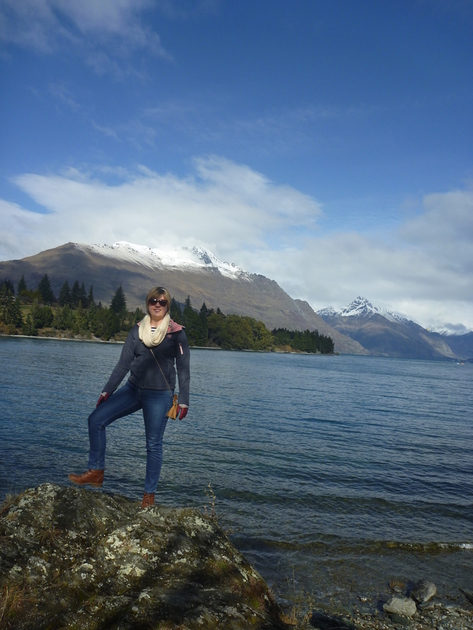

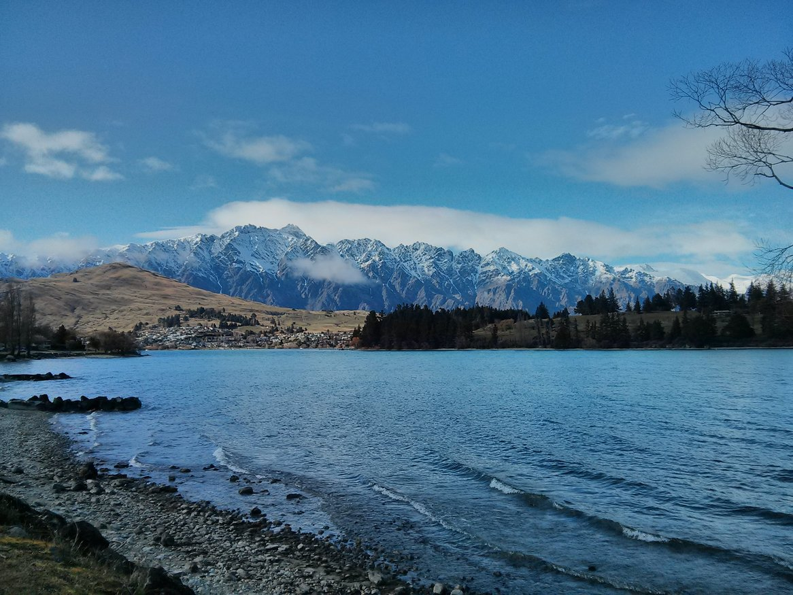

The Queenstown Gardens had a disc golf course, something I had never heard of before but sounds super fun. We also went to [Ivan Clarke Gallery](http://www.ivanclarkegallery.com/gallery_directory.html) which was free and had lots of awesome paintings of cartoon dogs.

After skiing in Wanaka, we came back to Queenstown with Mum & Dad and went up the Gondola to do some luge. We wanted to do luge the last time I went but we didn't have time. It was pretty fun and there was an awesome backdrop. We got some videos as well which I will sort through later.

We saw a goat and it's 'kid' while up there and they also had some cool jelly bean art. I made sure to revisit the Fergburger and see if it lived up to the memory, and it was just as tasty as I remembered. Rachael got the Codfather but it wasn't as good as the classic Ferg.

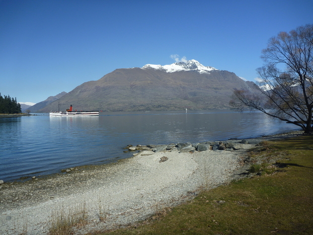

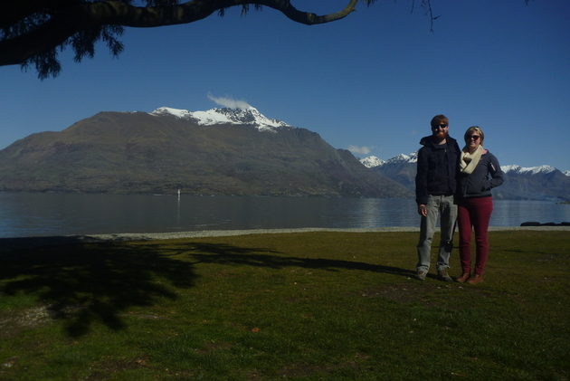

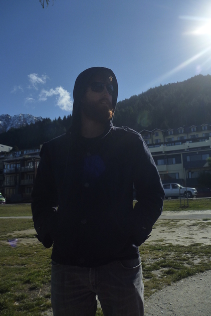

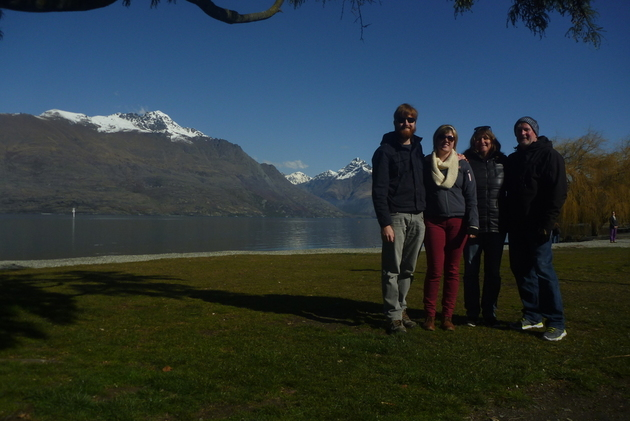

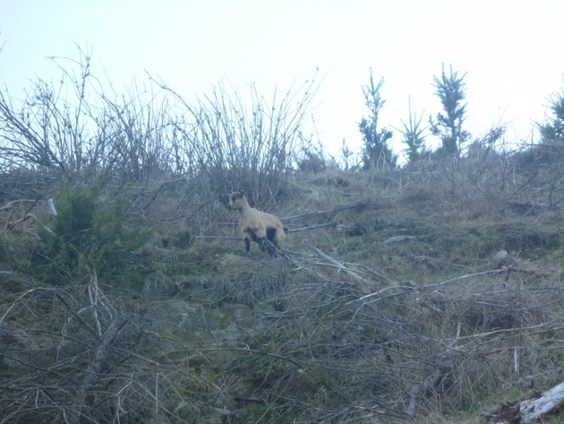

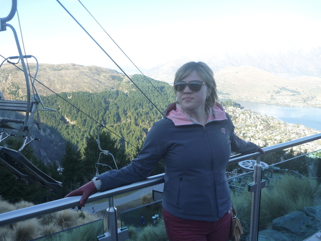

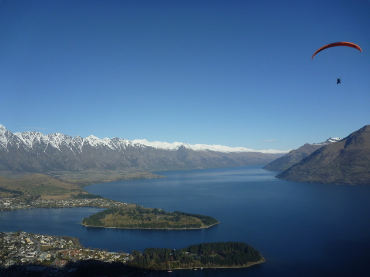

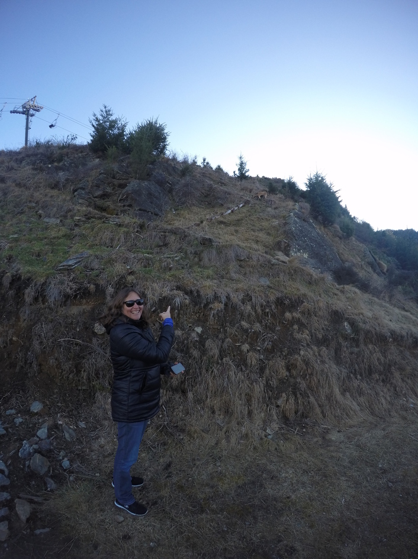

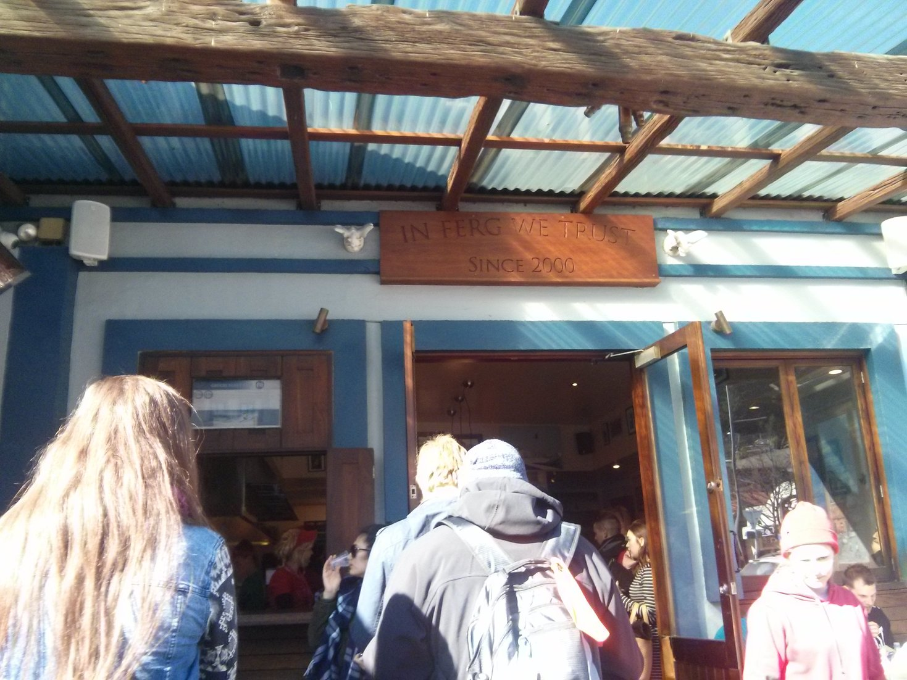

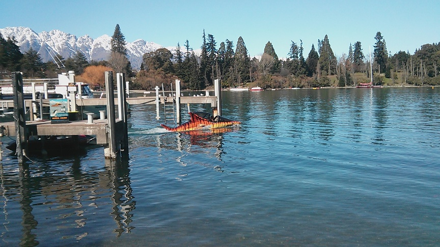

We did a day tour to Milford Sound and then picked up a rental car to drive to Christchurch.