+++
categories = ['Travel']
date = '2015-06-01'
featured_image = 'posts/2015/the-bunyas/feature.jpg'
slug = 'the-bunyas'
tags = ['Queensland', 'Bunya Mountains', 'Rainforest']
title = 'The Bunyas'
type = 'post'

+++

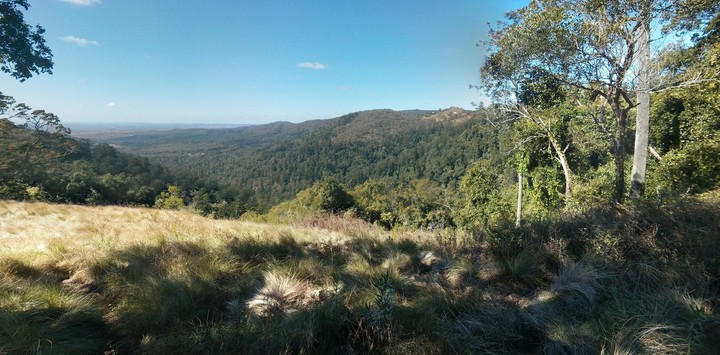

We went up to the Bunya Mountains again last weekend. Unlike [last time](bunya-mountains), we stayed in a cabin with some friends, as it was a pretty cold weekend. Here's some photos.

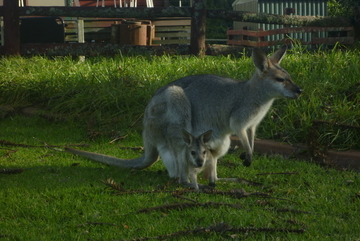

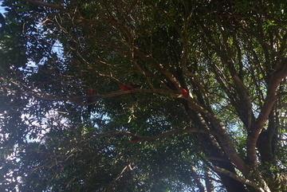

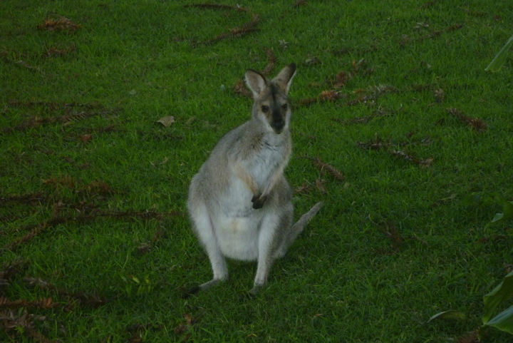

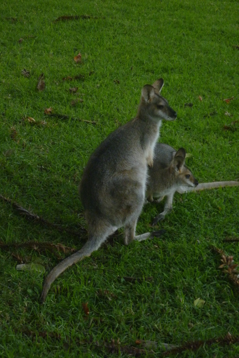

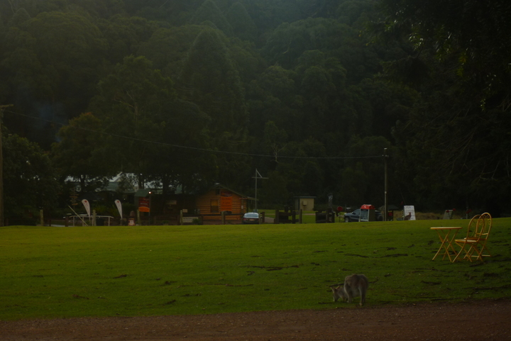

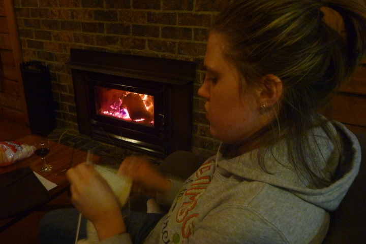

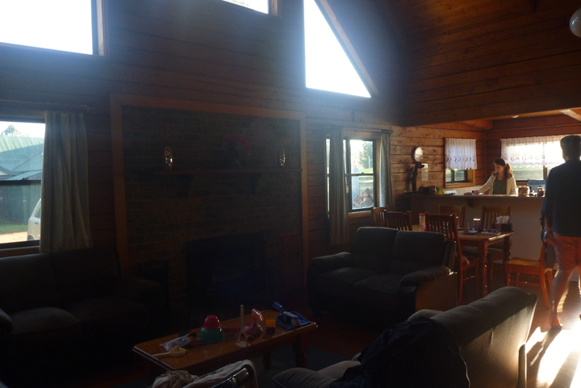

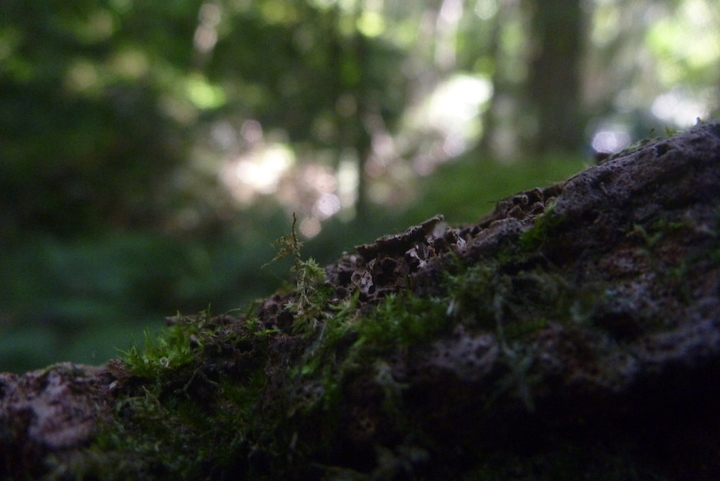

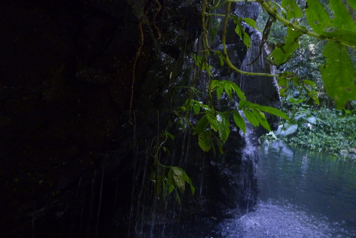

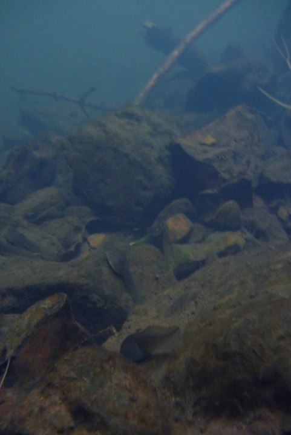

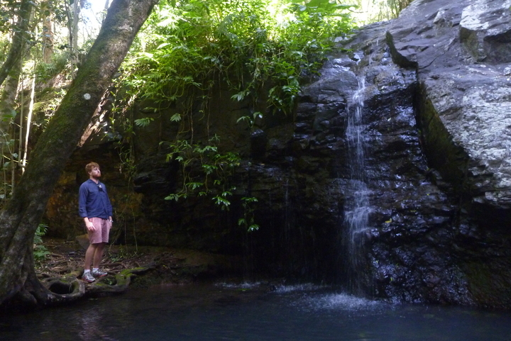

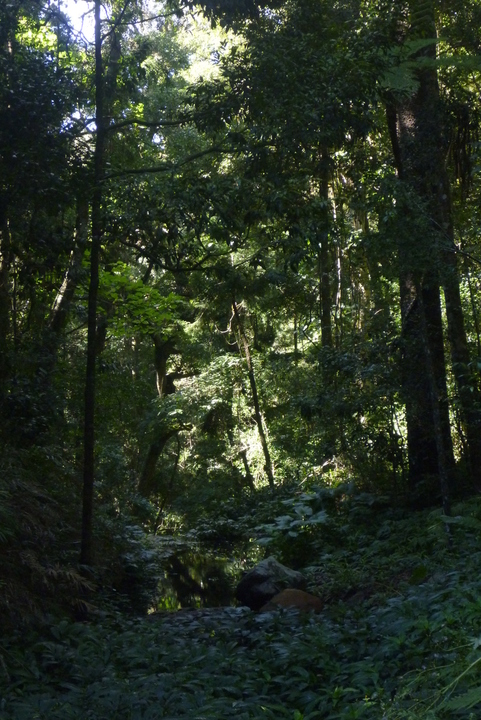

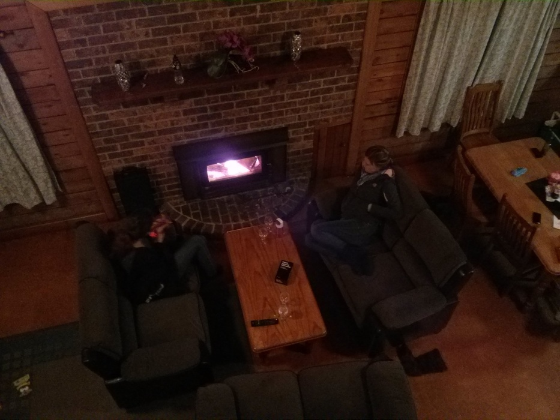

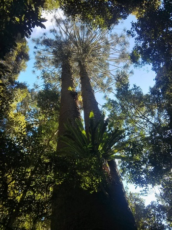

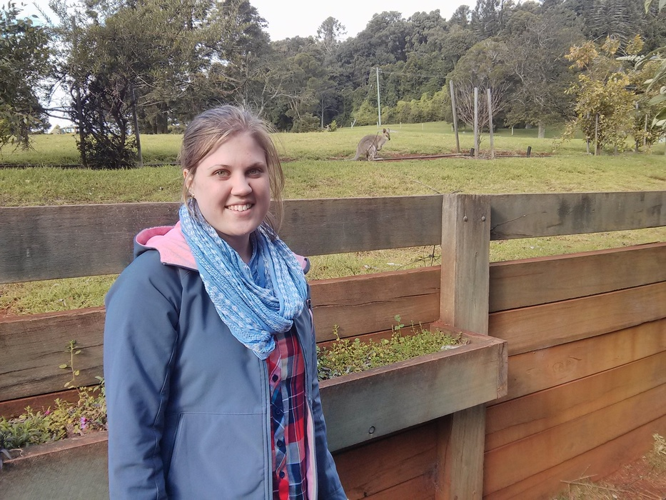

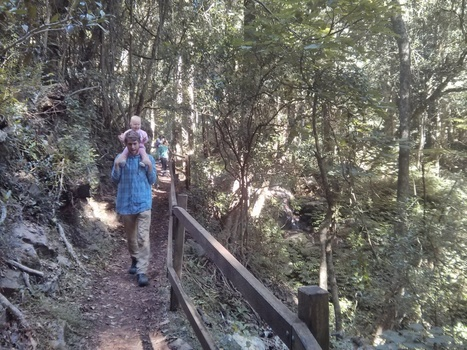

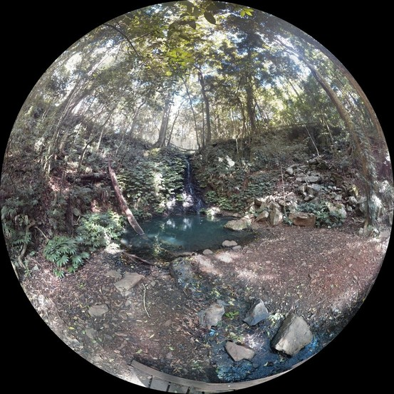

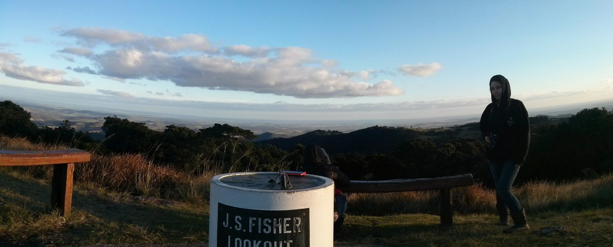

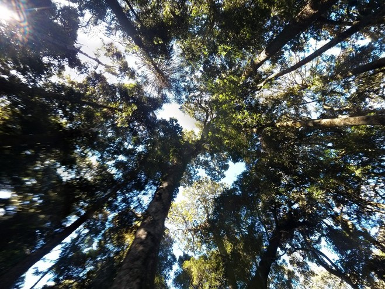

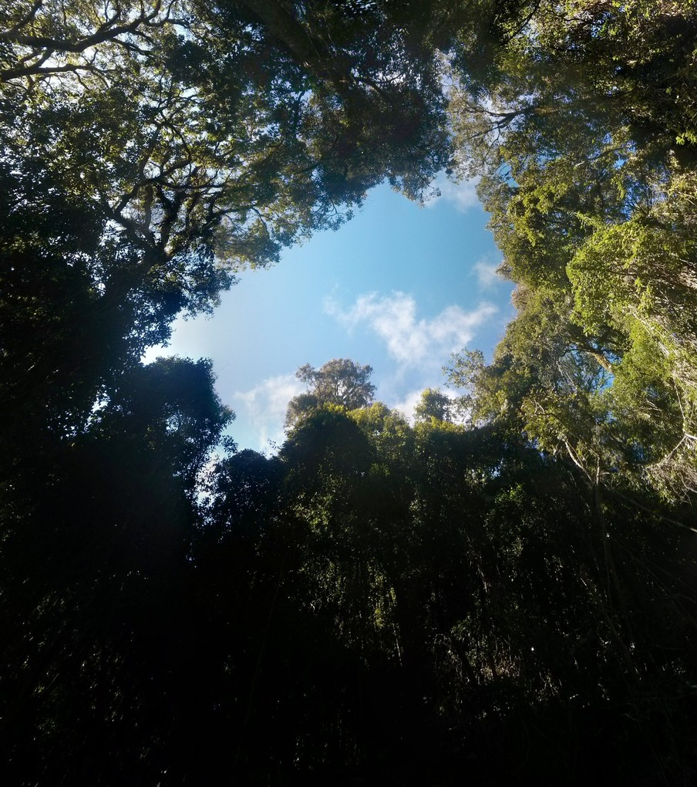