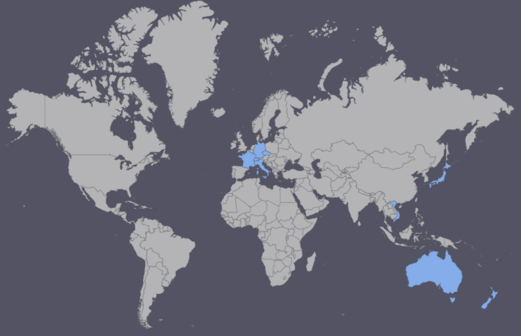

---
categories:
- Travel
type: post
date: '2016-01-31'
lastmod: '2017-03-03'
featured_image: posts/2016/countries-visited/countries_visited.png
slug: countries-visited
tags:
- Day Zero Project
title: Countries Visited
---

And one more item that was [on my 101 Things list from Switzerland](/posts/2016/101-thing-in-1001-days):

* <del>Travel to at least 15 different countries</del>.

I thought it was worth having it's own post to list them all.

1. [New Zealand](/tag/new-zealand.html)
2. [Switzerland](/tag/switzerland.html)
3. [France](/tag/france.html)
4. [Germany](/tag/germany.html)
5. [Liechtenstein](/tag/liechtenstein.html)
6. [Italy](/tag/italy.html)
7. [Vatican City](/tag/vatican-city.html)
8. [Czech Republic](/tag/czech-republic.html)
9. [Vietnam](/tag/vietnam.html)
10. [Fiji](/tag/fiji.html)
11. [Japan](/tag/japan.html)

If you count layovers <del>then I have hit the 15</del> (but I'm not).

* Thailand (Bangkok Airport)
* <del>Austria (Train Station)</del>
* China (Hong Kong Airport)
* Singapore (Airport)

**Uptype: post
date:** New countries added (now more than 15).

12. [Indonesia (Bali)](/tag/indonesia.html)
13. [United Kingdom](/tag/uk.html)
14. [Iceland](/tag/iceland.html)
15. [Sweden](/tag/sweden.html)
16. [Denmark](/tag/denmark.html)
17. [Croatia](/tag/croatia.html)
18. [Slovenia](/tag/slovenia.html)
19. [Austria](/tag/austria.html)
20. [Republic of Ireland](/tag/ireland.html)

