---
categories:
- Travel
date: '2016-05-29'
featured_image: posts/2016/double-island/featurerainbowbeach.jpg
slug: double-island
tags:
- Queensland
- Beach
- Camping
- Cooloola
- Sunshine Coast
title: Double Island
---

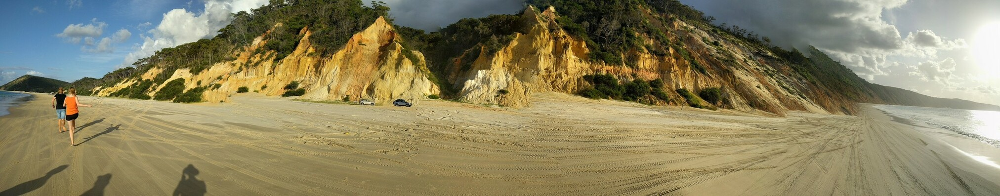

So last weekend we took our new car off-road for the first time, camping at Double Island. To make the most of the weekend, we left Friday and spent the first night at Mapleton. We've been to the Sunshine Coast Hinterland a few times already, so didn't go anywhere new, but it's still a lovely part of the world.

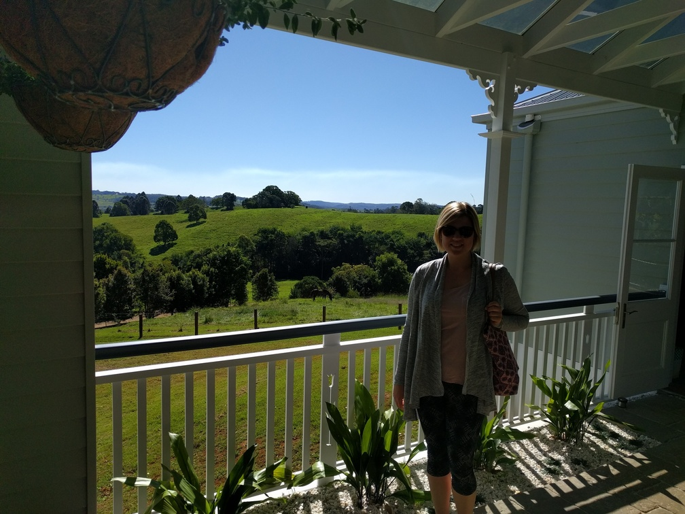

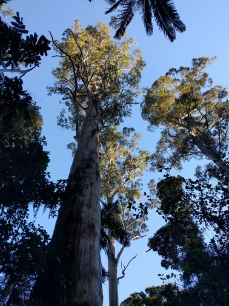

Once we met up with Tom, Bec, Sarah and Emily at Noosa, we got the ferry across to Noosa North Shore. The weather was spectacular and we drove up the beach about 40km to our camp site at the other end at Freshwater Camping Area near Rainbow Beach. Along the way we went past the cliff where Rachael did her paragliding, and stopped at a place called Red Canyon which was a an awesome canyon with red sand cliffs. There was heaps of cars on the beach but we found a camp site with nobody nearby and set up.

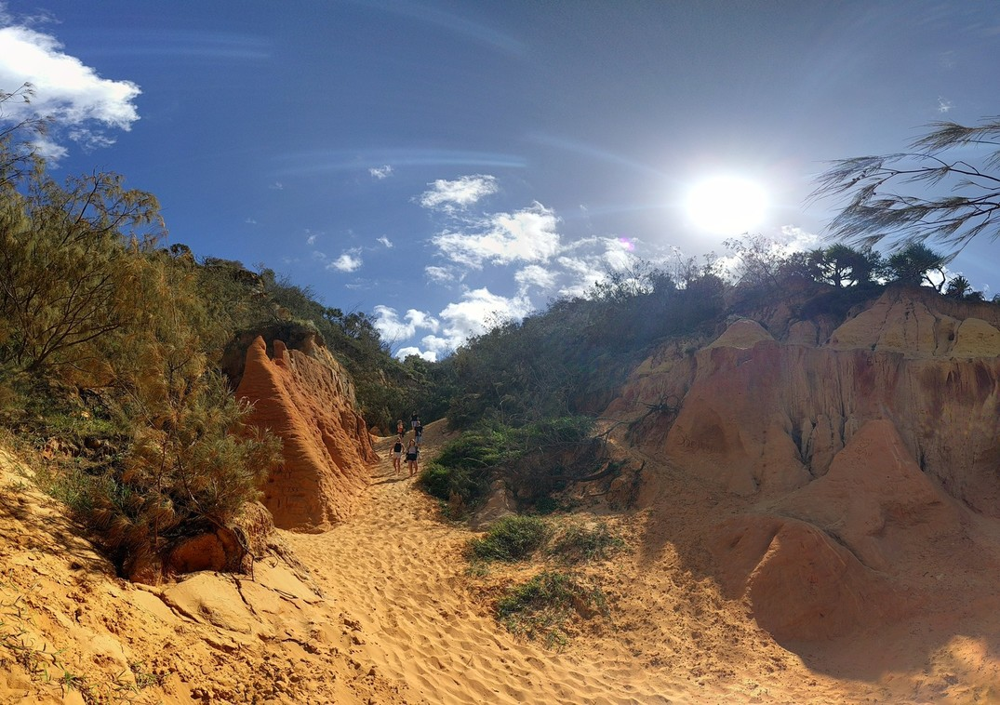

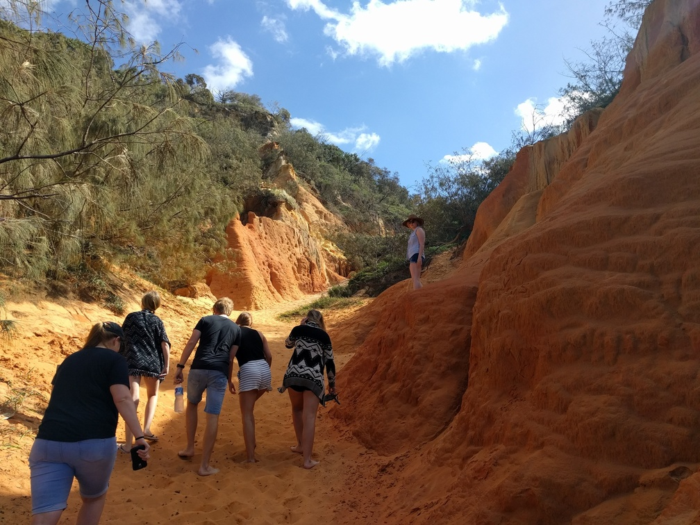

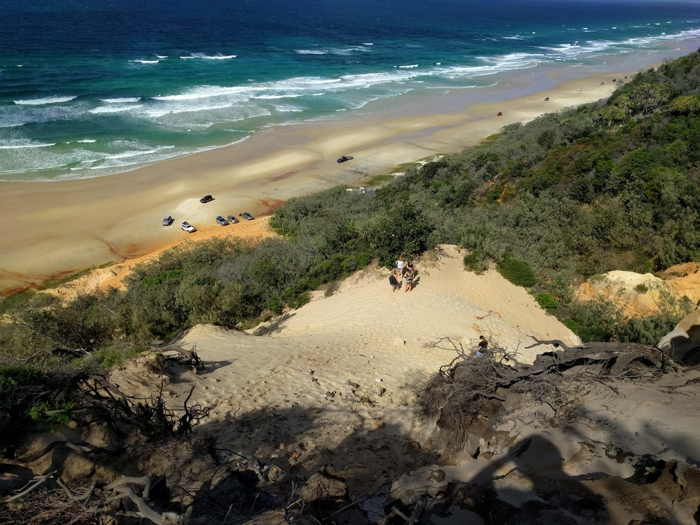

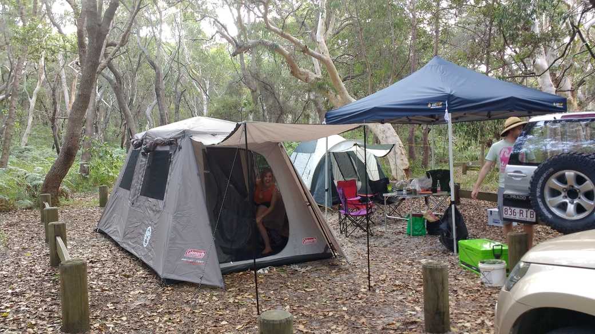

After lunch we went for a drive and tried to get to the lighthouse at the point but the sand was too soft and the tide was coming in so we went to Rainbow Beach instead. There were more sand cliffs, which were super colourful. Coming back off the beach the tide had come in more and the sand was really chopped up and I got bogged. Tom just managed to get out but didn't want to come snatch me out in case he got bogged to. Another car came to snatch us out and they also got bogged. Eventually someone with a winch arrived and pulled us out. Then they got bogged.

Eventually everyone was out and back up above the high tide mark. Rachael had a bit of a freak out because the water was getting pretty close to the car. Once we were on our way a few more people came down on the beach and got bogged also (but higher up). It rained through most of the night so not the best camping experience but the site had hot showers and flushing toilets which is pretty incredible for a national park site on the beach. There was even a pay phone.

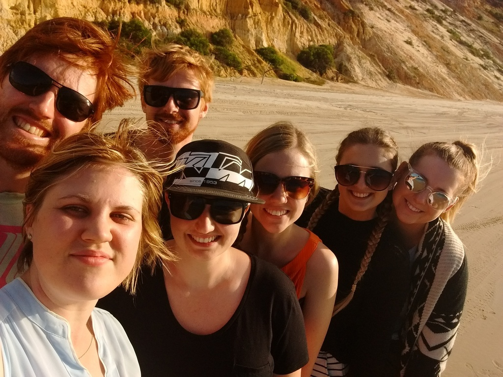

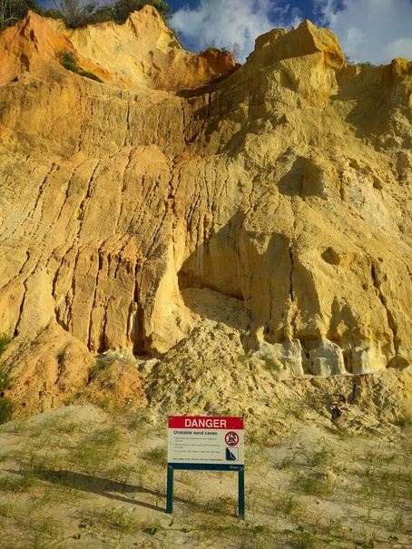

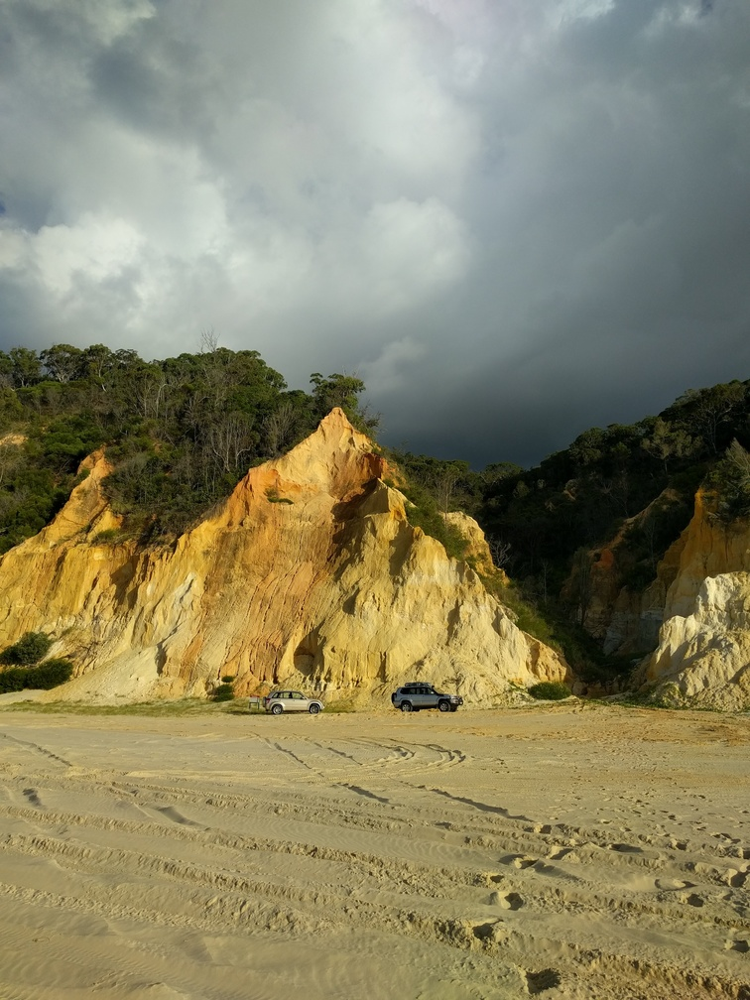

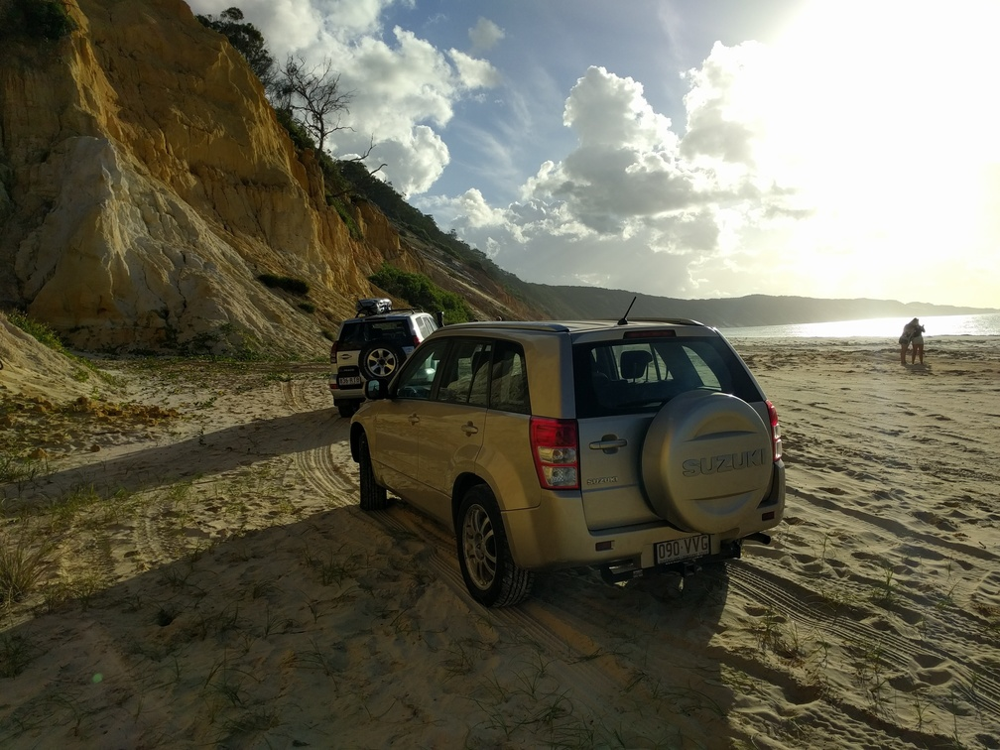

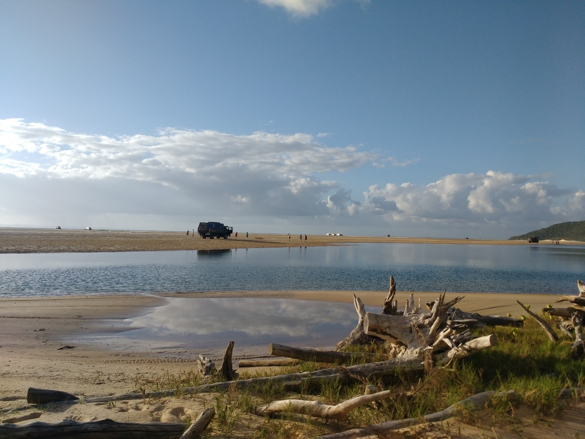

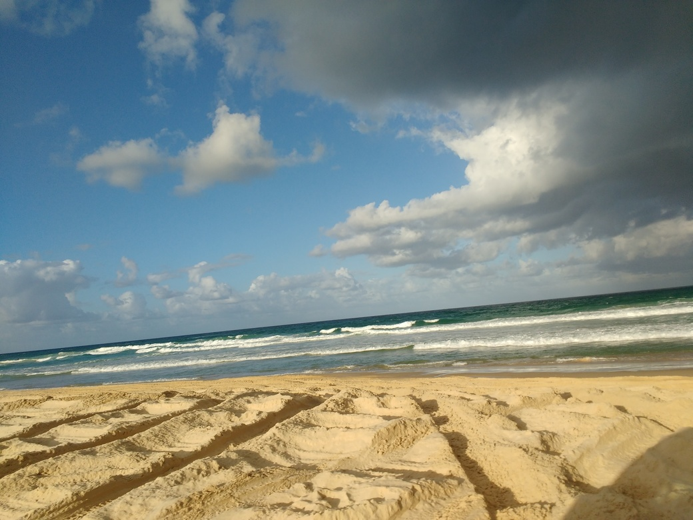

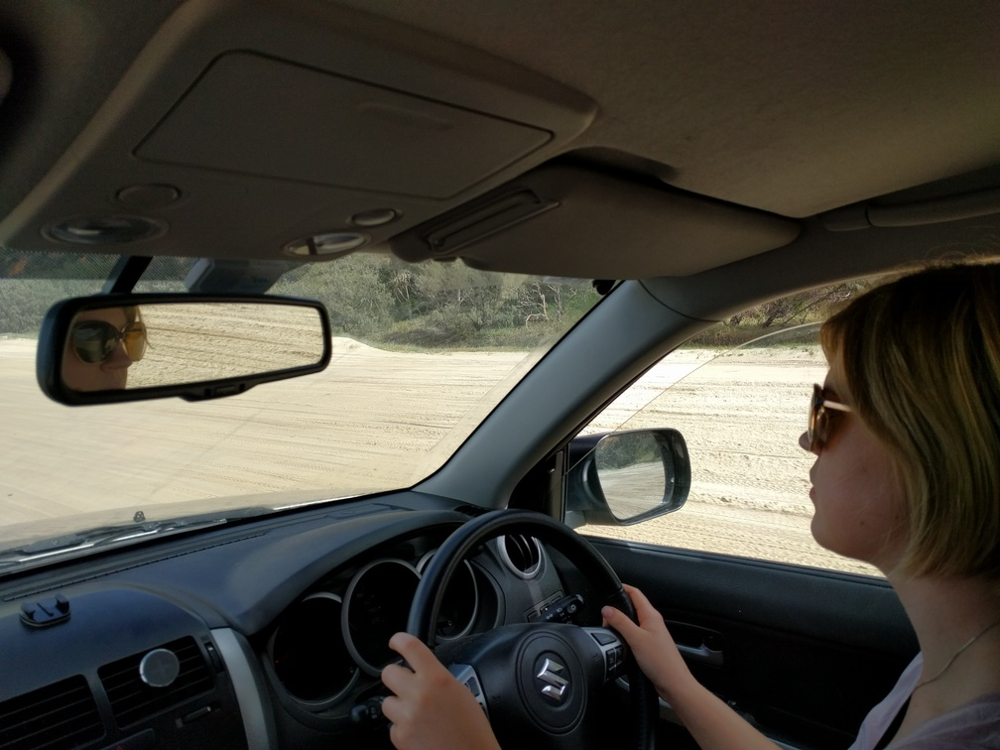

The next day we went to see the Freshwater Lake for which the camp site got it's name, which was nice but not super exciting. Rachael had a go driving back and had a great (if sometimes terrified) time driving in the soft sand and getting off the beach. After getting the ferry back to Noosa we went through the automatic car wash twice and there was still sand pouring out of the car. The car's still shedding sand a week later.

It was a pretty spectacular part of the world, reminds me of five rocks but with lots more people. And at least the extra people mean you get fancy camp grounds. Oh and at night we saw a huge centipede, which was really cool because I've never seen on before.