+++
title = "Granite Belt - Take 2"
date = "2016-01-30"
slug = "granite-belt-take-2"
type = "post"

[taxonomies]
categories = [ "Travel",]
tags = [ "Queensland",]

[extra]
image = "posts/2016/granite-belt-take-2/feature.jpg"

+++

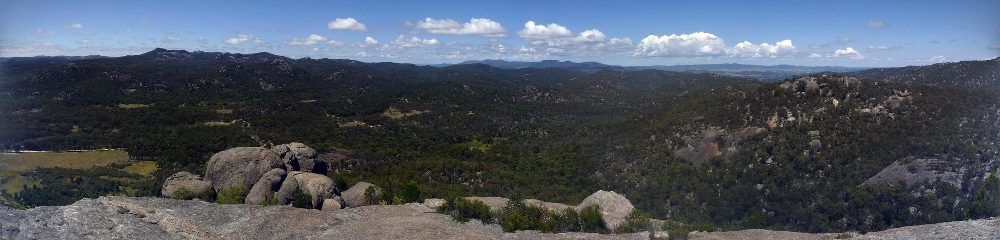

Last weekend we went down to the Granite Belt area [again](/posts/2014/2014-05-17-granite-belt/), this time camping and prepared for the hike up Pyramid Rock. Last time was just before winter, we didn't prepare for it and Rachael was wearing jeans, so she didn't make it to the top.

There was severe weather warnings forecast for the weekend, but when we left Saturday lunch time the skies were clear and it looked like while there was some big storms closer to the coast we should just get some patchy rain.

We arrived and checked-in just in time to see this storm cloud approaching...

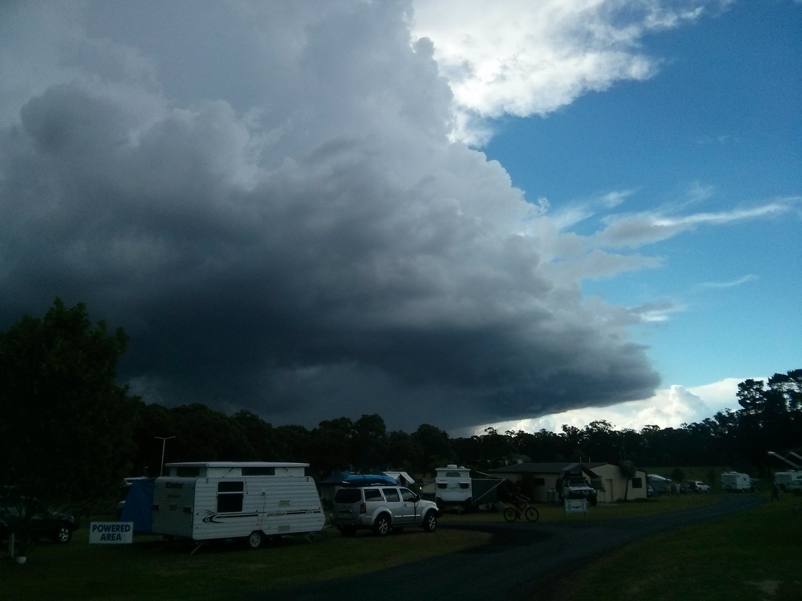

We bought a new (bigger) tent for the trip and I got it set up before the rain came, only for one of the corners to rip and it all came crashing down. Then it started pouring rain and Rachael sought cover in the tent so she could "hold it up" while I ran around trying to put in more tent pegs to counter the fact that one of the corners was missing. I was soaking wet but got it set up, only for Christian and Jaimee to arrive about 15 minutes later about when the rain stopped and easily put up theirs.

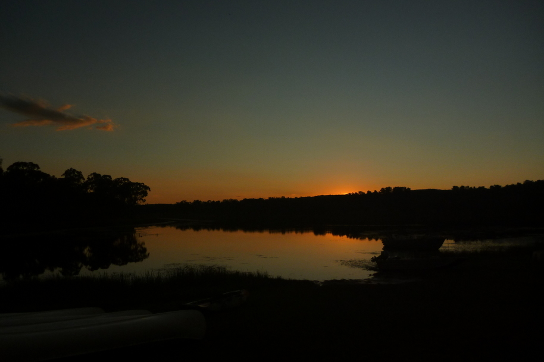

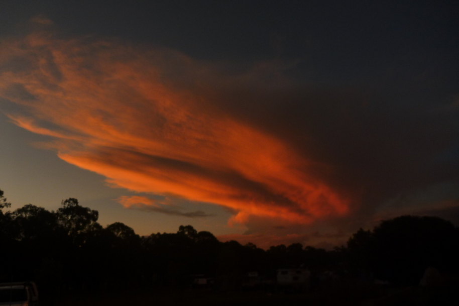

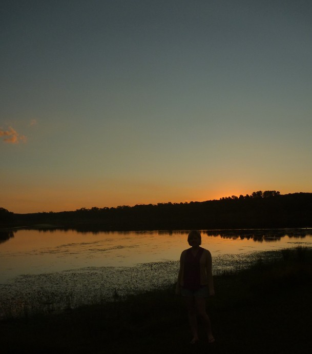

The next morning the weather was great, and so we hiked up Pyramid Rock.

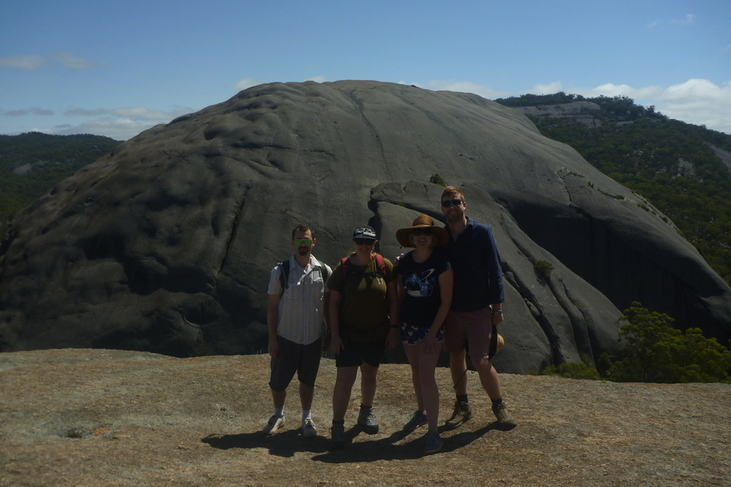

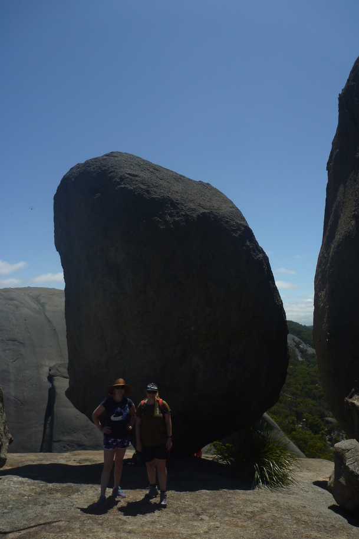

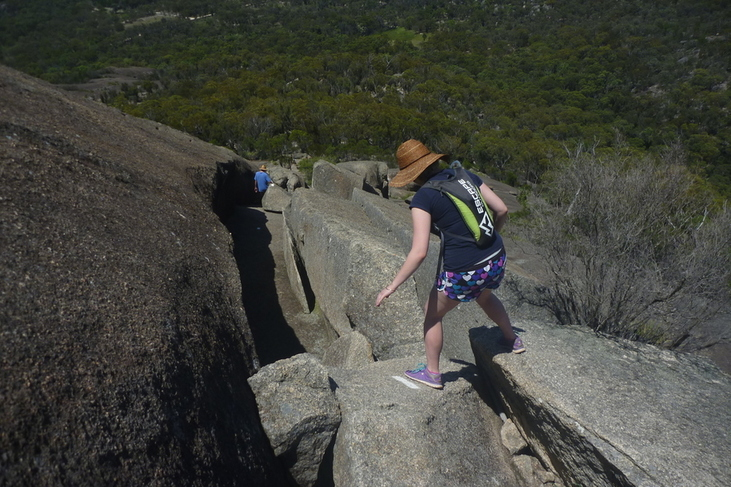

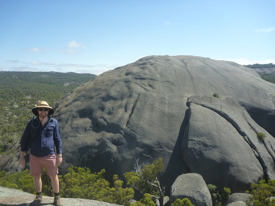

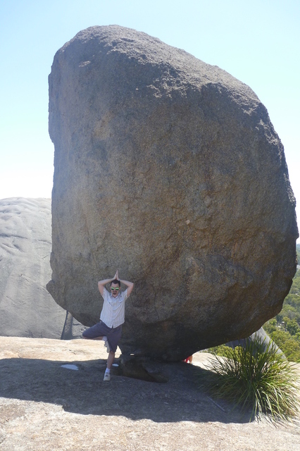

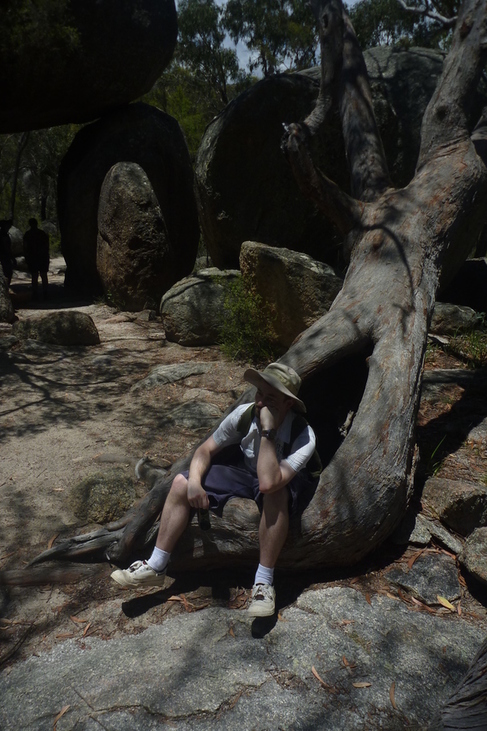

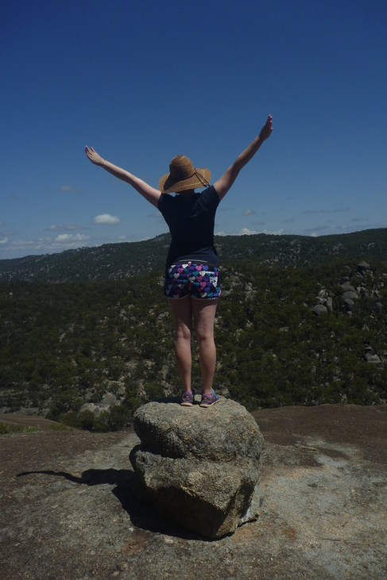

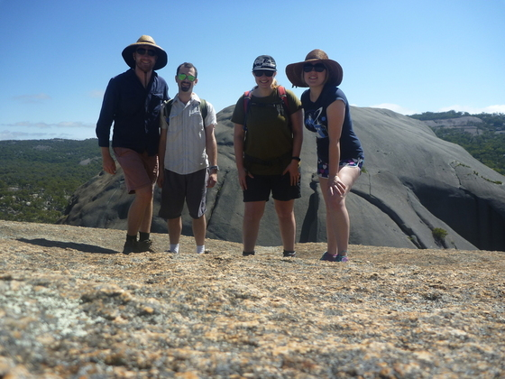

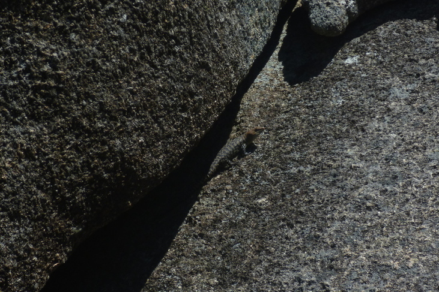

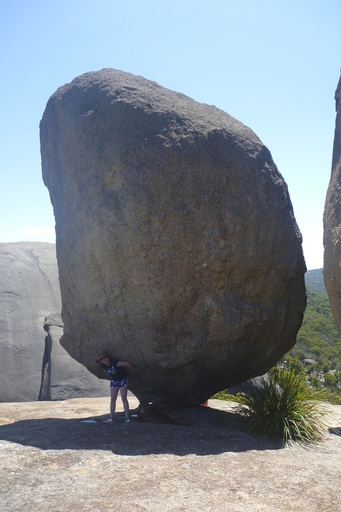

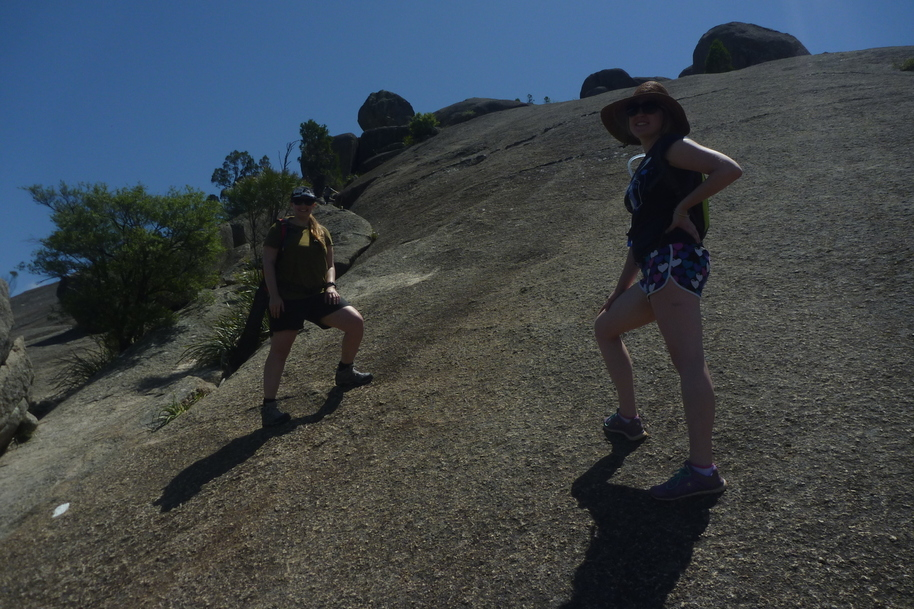

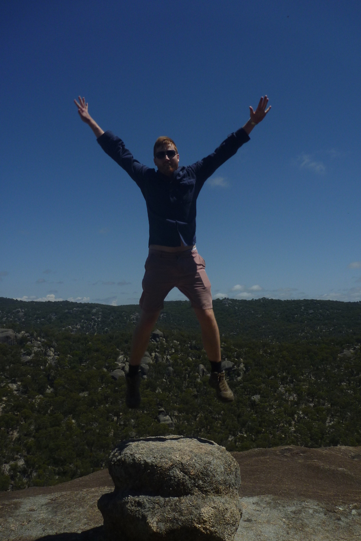

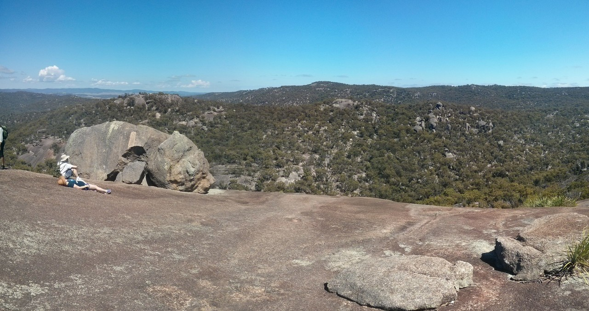

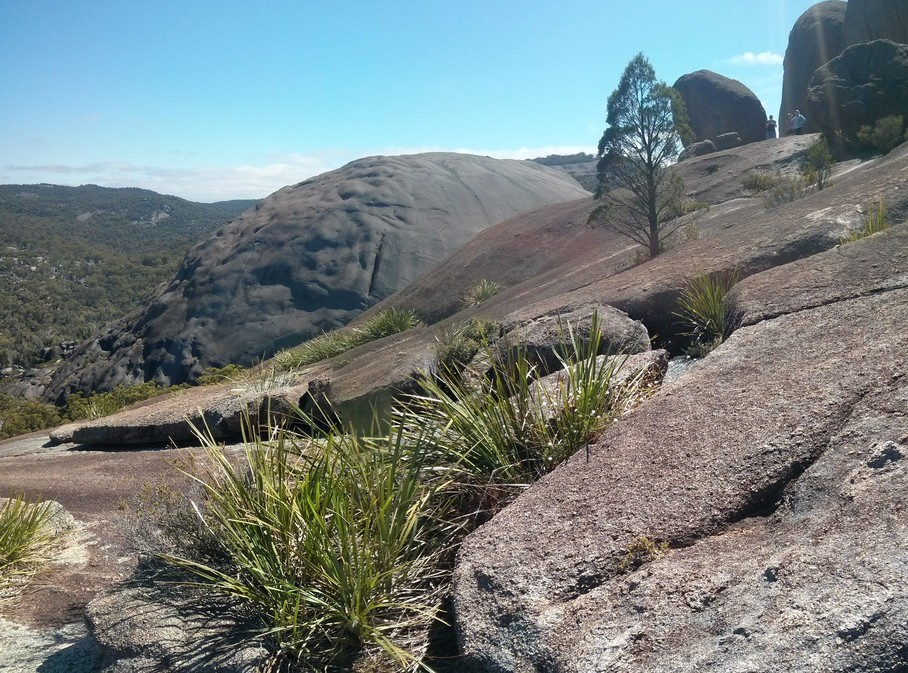

And since it was warmer this time, we hired some canoes in the afternoon.

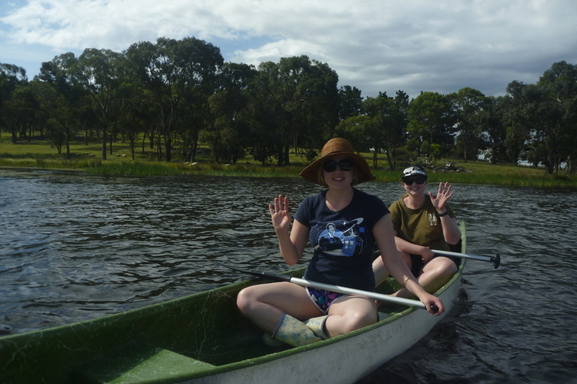

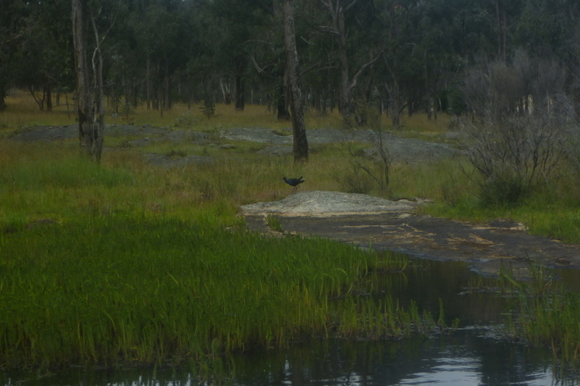

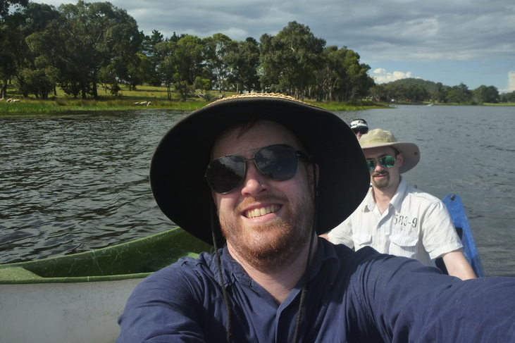

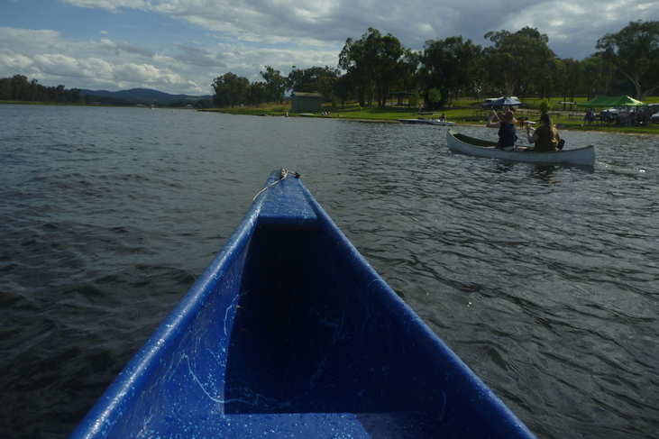

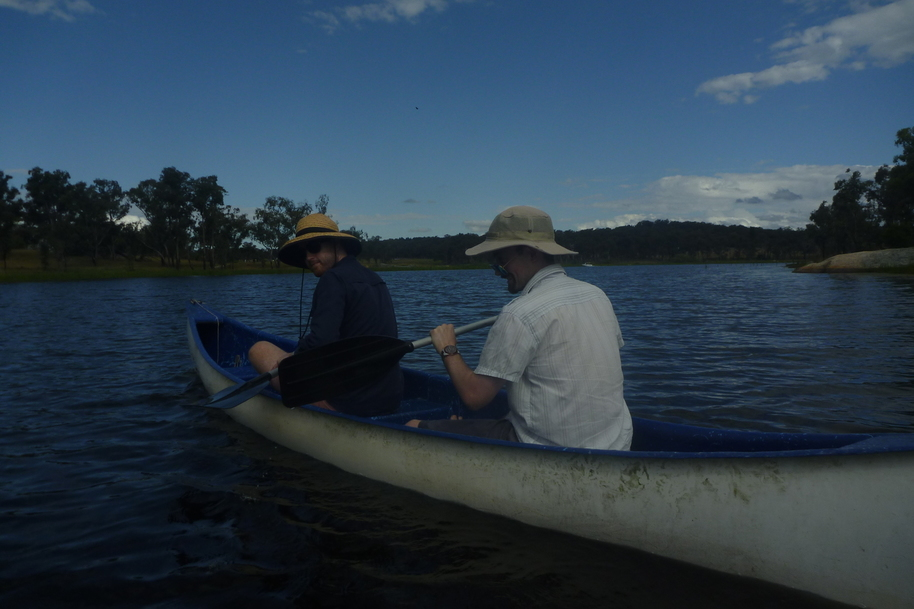

We had planned to take a bit of a scenic drive the next day on the way back, but woke to some thunder in the distance. This time we managed to pack everything up before the rain started, but pretty much drove straight home after that.