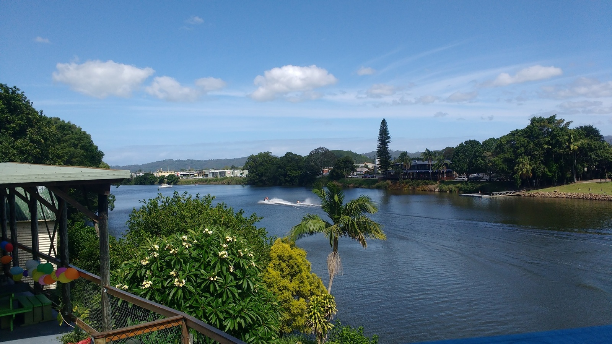
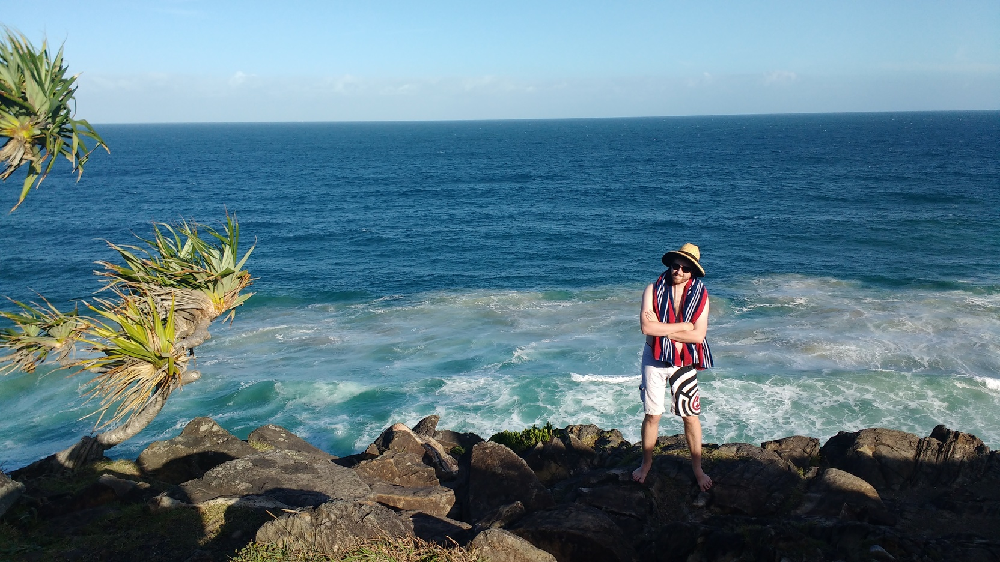
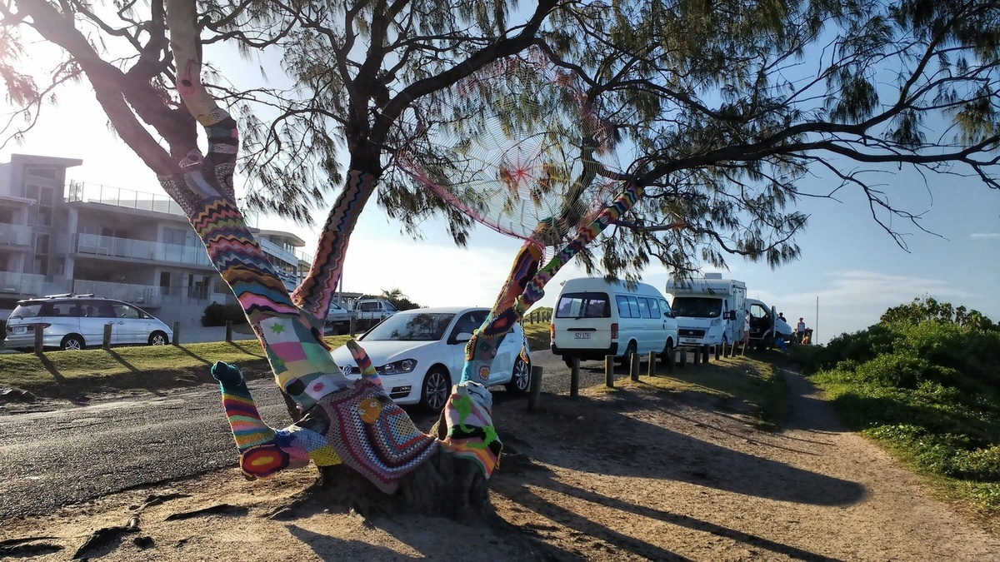
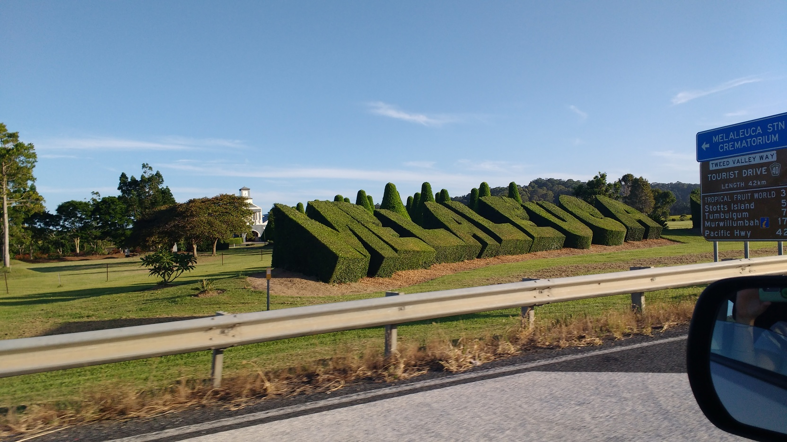
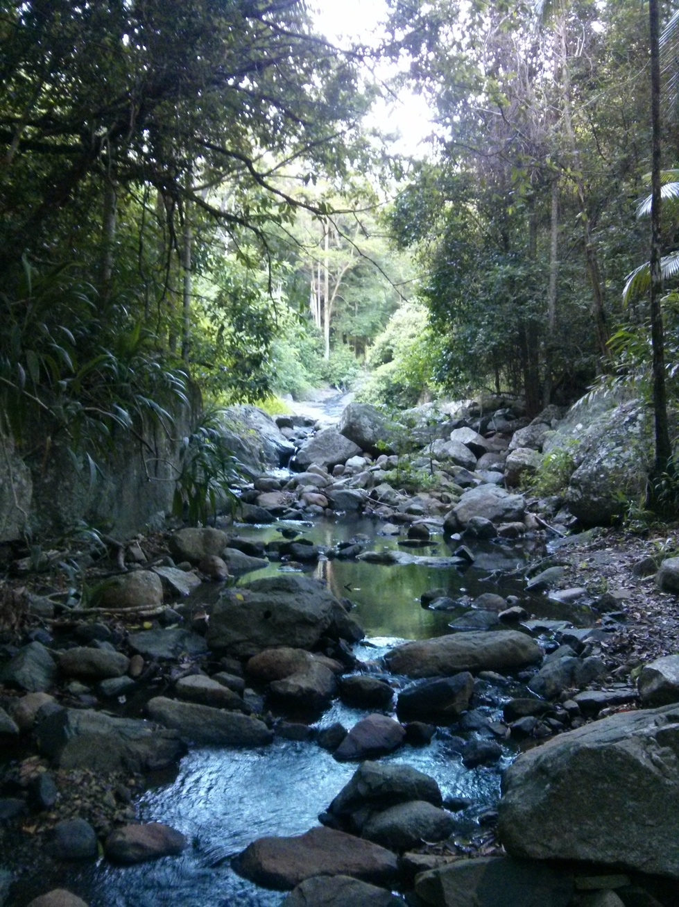
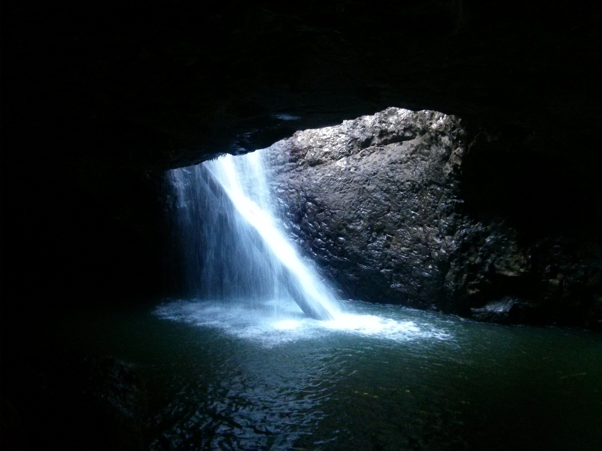
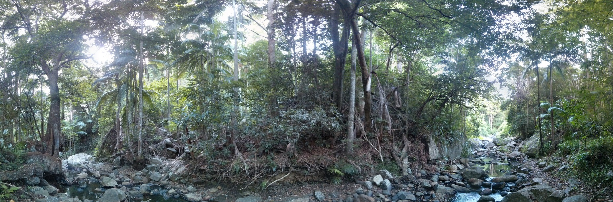

+++
categories = ['Travel']
date = '2016-01-30'
thumbnail = 'posts/2016/murwillumbah/tweed-river.jpg'
slug = 'murwillumbah'
tags = ['Queensland', 'NSW']
title = 'Murwillumbah'
type = 'post'

+++

Since we spent Christmas in Toowoomba this year, Rachael wanted to head to the beach for New Years. Given we tried booking about a day before, almost everywhere at Sunshine Coast and Gold Coast were booked, and so we decided to stay inland a bit at [Murwillumbah YHA](https://www.google.com.au/maps/place/Murwillumbah+YHA).  The area around there was great and there was awesome views from the deck of the Tweed River and Mt Warning.

On the drive down we stopped around the Palm Beach area and it was busy as. Across the border a bit Cabarita Beach was reasonably quiet and much more pleasant. We had dinner at a pub in Murwillumbah overlooking the river and watched heaps of fish jumping out of the water at sunset. This put Rachael off swimming (Bull Sharks?) but there was plenty of people water skiing.

The main attraction is to climb Mt Warning, but it's quite a long hike so we just went for a drive to have a look around and ended up going to Natural Bridge as it is nearby and on the way back home. The other two times we went there was lots of people but because we got there about 9am we were the first car there and the walk was way better. A group of motorbikes arrived as we were leaving to ruin the peaceful forest sounds.

We also decided to go to the spit at South Port on the way home which was a good reminder why we would never want to live at the Gold Coast because the traffic was horrendous. It was interesting to see the new tram lines though, and the water itself was nice.