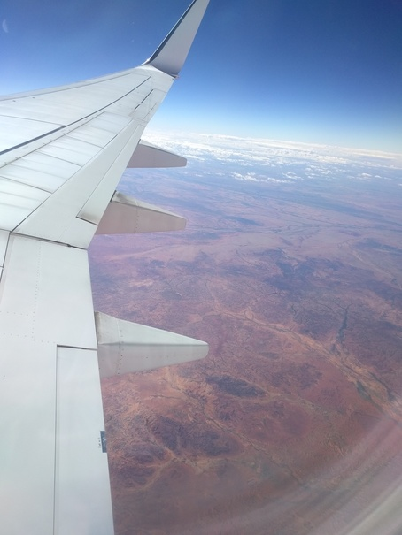
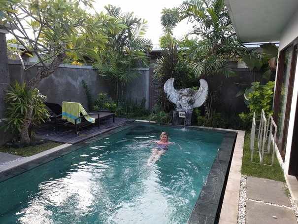
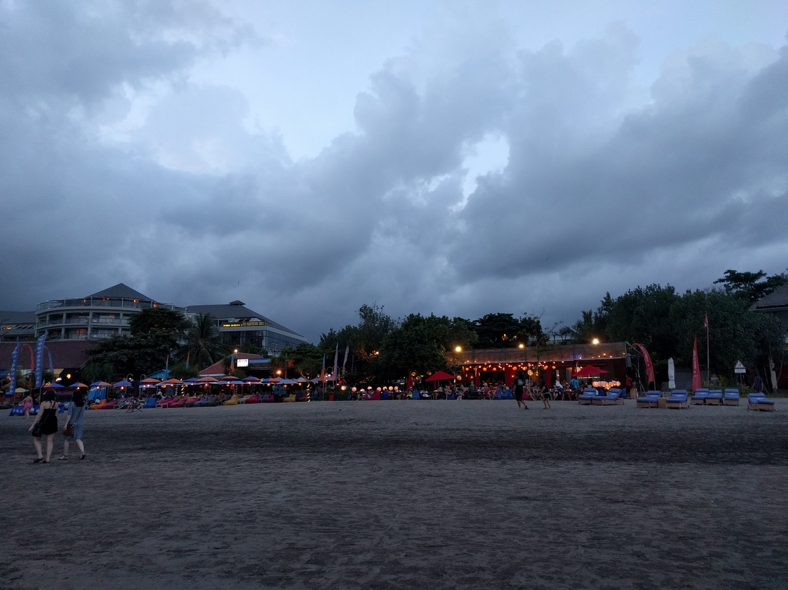
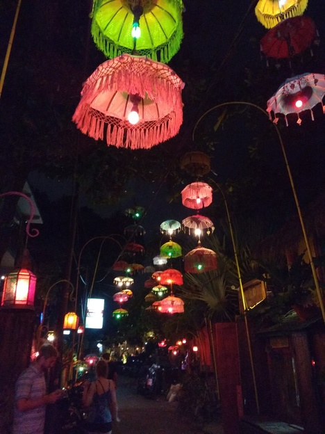
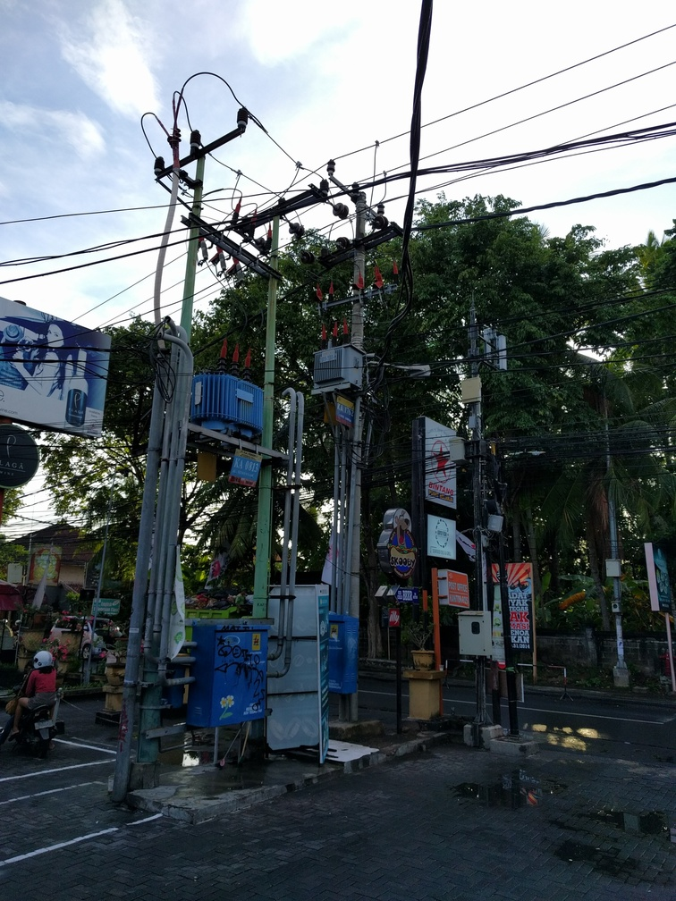
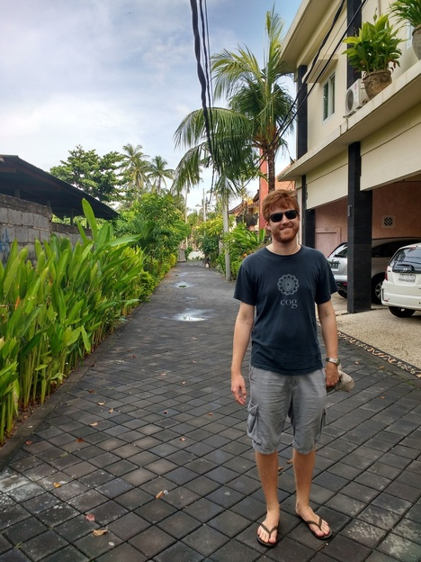
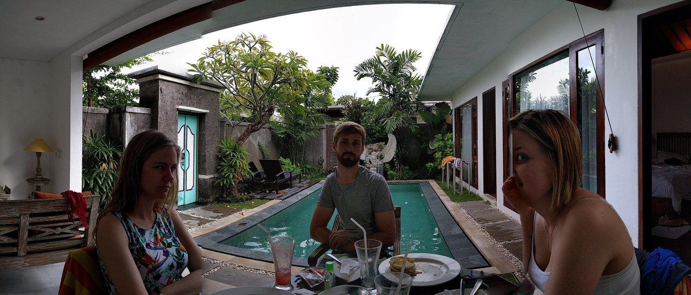

+++
categories = ['Travel']
date = '2016-07-11'
featured_image = 'posts/2016/seminyak/img_20160613_124037.jpg'
slug = 'seminyak'
tags = ['Bali', 'Indonesia', 'Seminyak']
title = 'Seminyak'
type = 'post'

+++

Our flight to Bali was interesting because I think it's my first flight over mainland Australia in daytime. Just hours and hours of nothing.

Rachael was a little overwhelmed when we landed by all the drivers asking if we wanted a taxi, and the intense traffic to get to Seminyak and meet Tom and Bec. We stayed in a private villa with a pool near Double Six beach and the rooms were pretty awesome. Double Six beach was pretty good, lots of bands playing in the sand at night for the restaurants which was awesome. Less awesome was the creeks running into the ocean that smelt of sewerage. Tom and I went for a surf one morning and the water was mostly clean but a little bit of rubbish would float past now and again.

It was a nice place but super touristy and busy, so (Rachael and I at least) were pretty keen to get out to see the rest of Bali.