+++
categories = ['Travel']
date = '2016-08-13'
featured_image = 'posts/2016/tegenungan-waterfall-and-goa-gajah/img_20160617_100924.jpg'
slug = 'tegenungan-waterfall-and-goa-gajah'
tags = ['Bali', 'Indonesia', 'Goa Gajah', 'Tengenungan', 'Waterfall']
title = 'Tegenungan Waterfall and Goa Gajah'
type = 'post'

+++

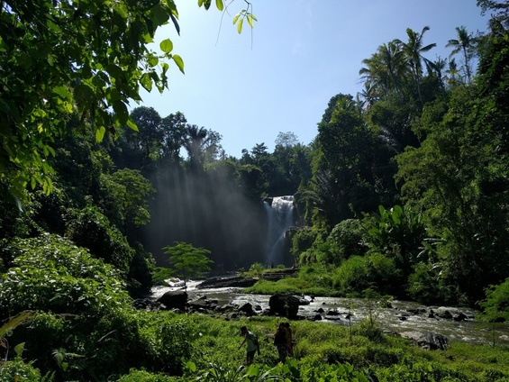

We had a free day in Keramas, so thought we would head back to Ubud to see some of the places we didn't have time for. The videographer for the wedding, James, was staying next door and suggested Tegenungan Waterfall and came along for a drive. There was barely anyone there when we got there. You are allowed to swim and so we jumped in and stood under the falls. The power of the water coming down was incredible, and literally took your breath away when you were standing directly underneath the torrent of water. There was also a cool little hike to the top where we saw some wild monkeys.

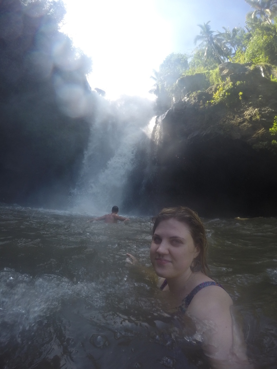

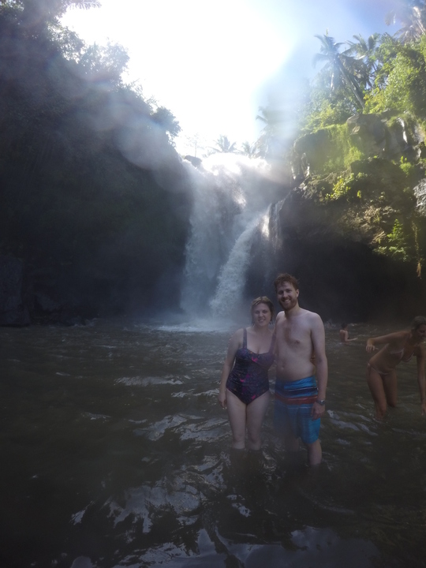

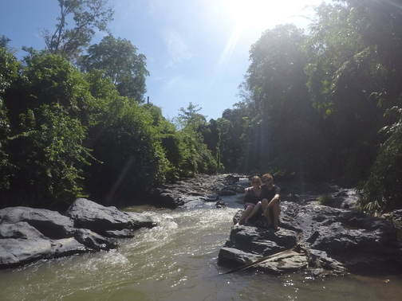

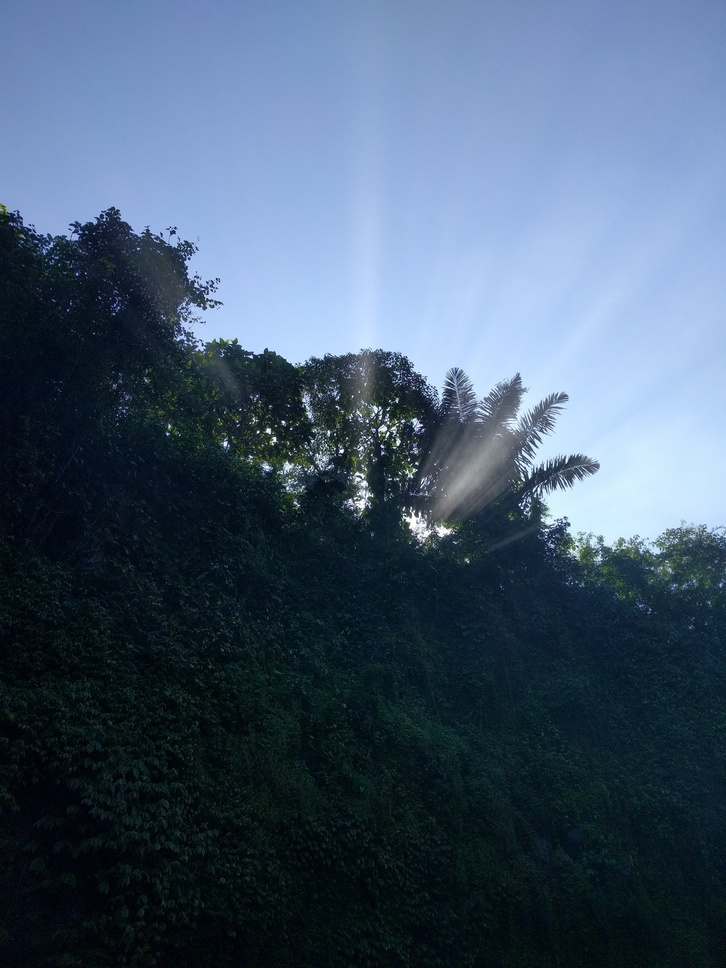

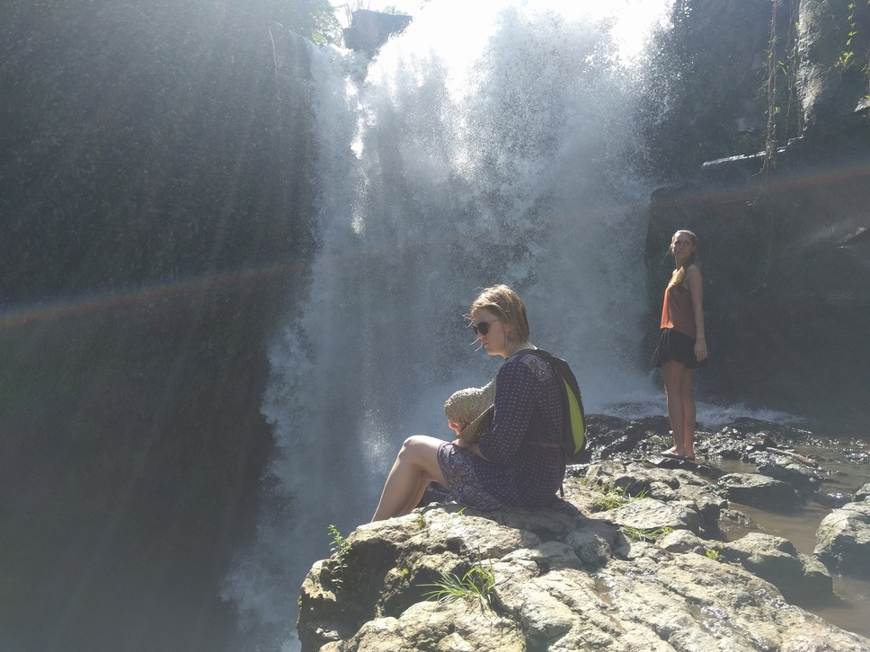

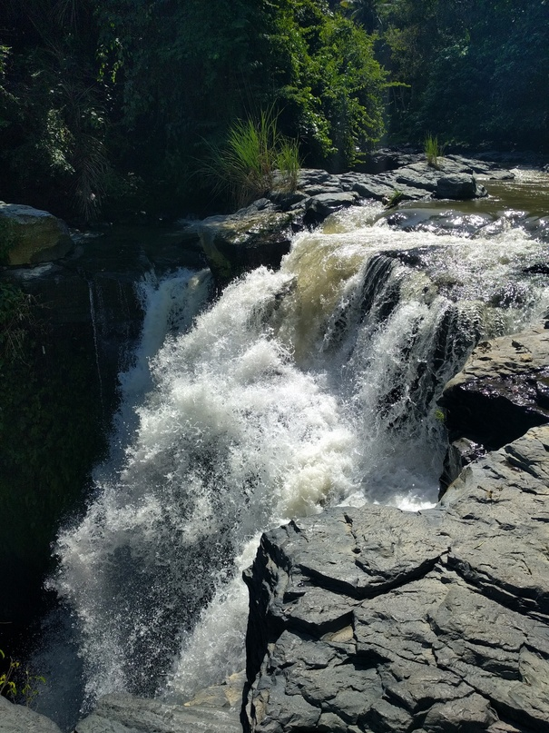

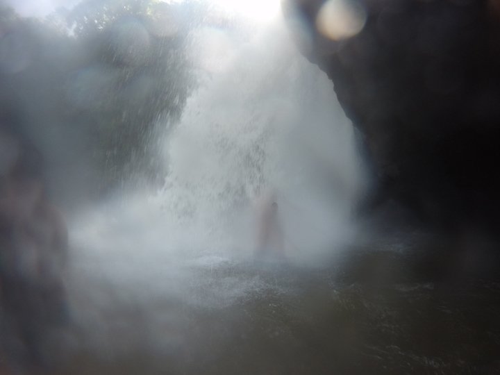

We then headed into town to go to the markets, but Rachael spotted [Kemenuh Butterfly Park](http://www.kemenuhbutterflypark.com/gallery.php) on the way so we stopped there. Was similar to the one in Changi Airport but much bigger, and they had sections with larvae and caterpillars so you could see all the different stages.

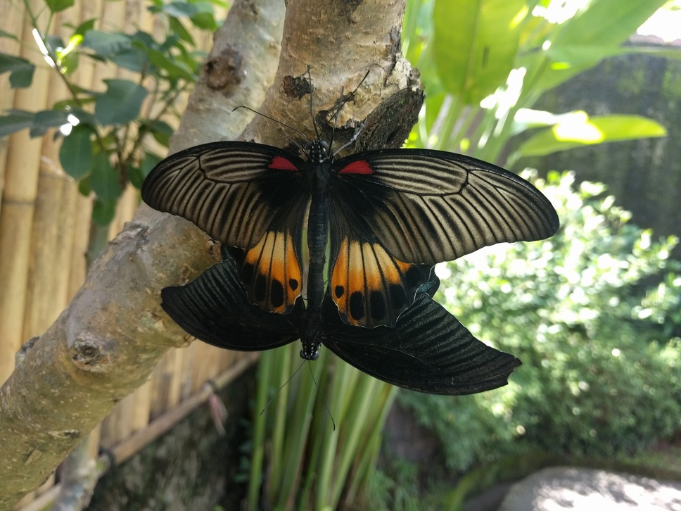

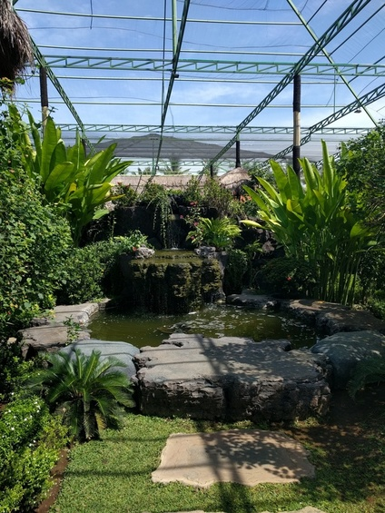

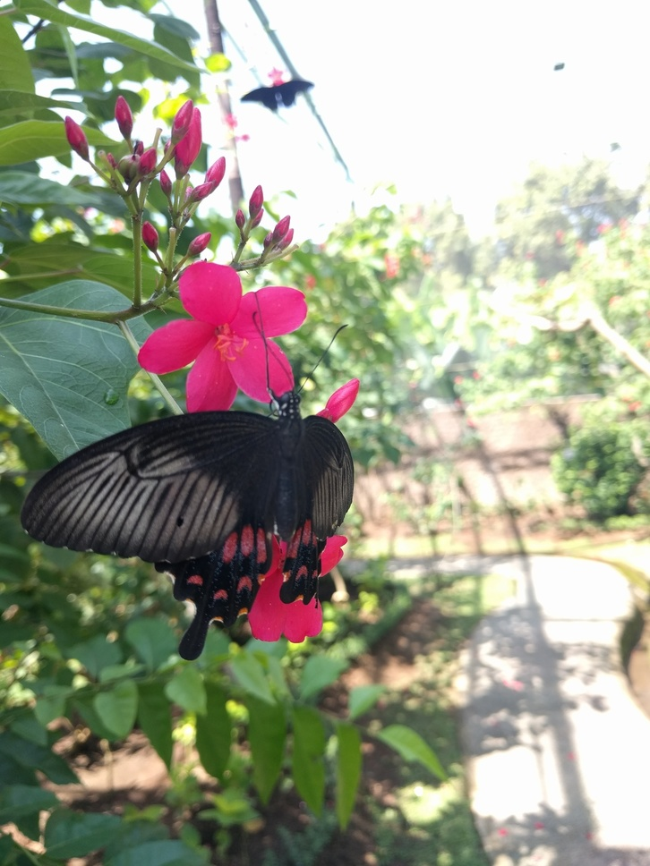

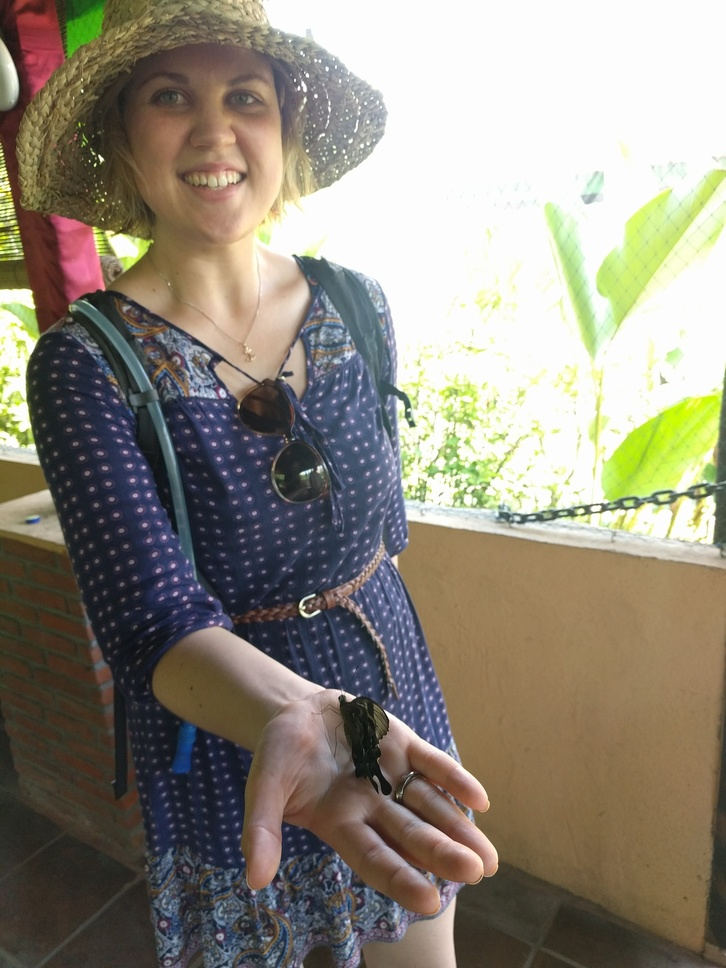

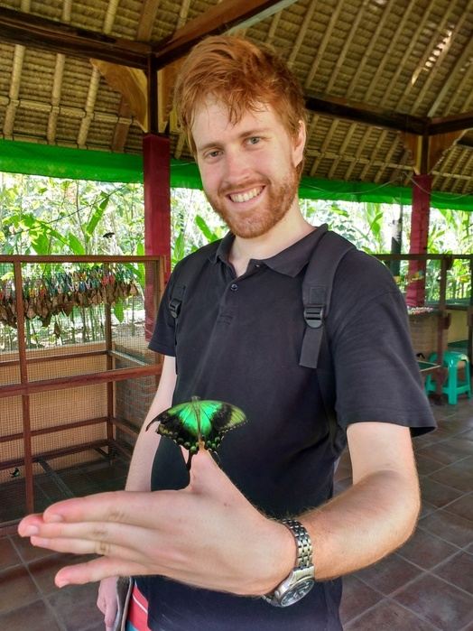

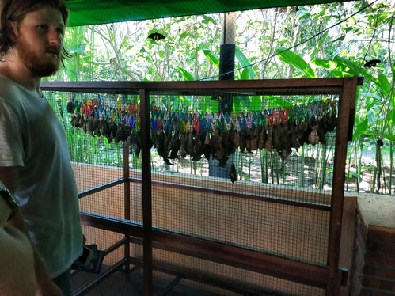

After looking at some shops and getting a massage, we headed to Goa Gajah which was a cool little cave temple.

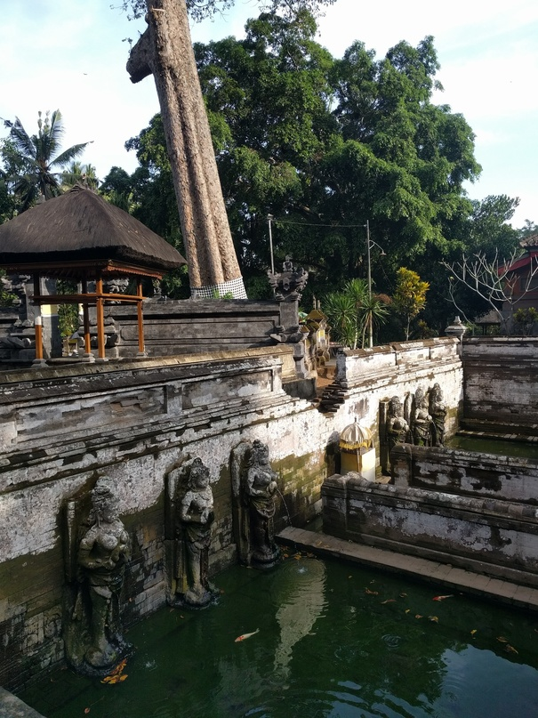

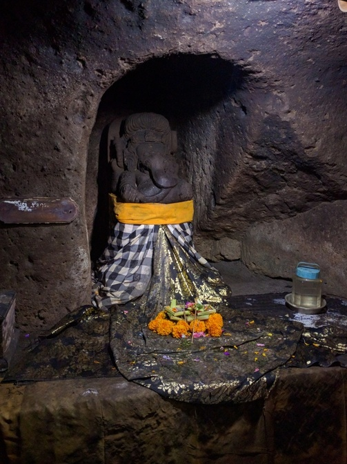

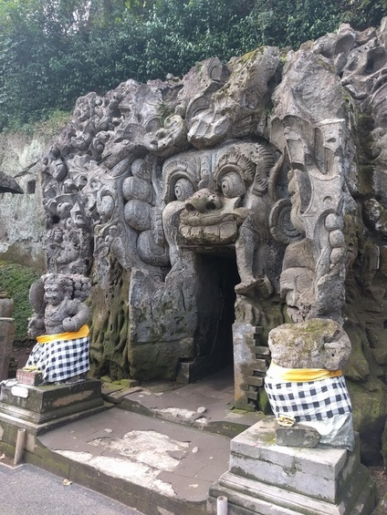

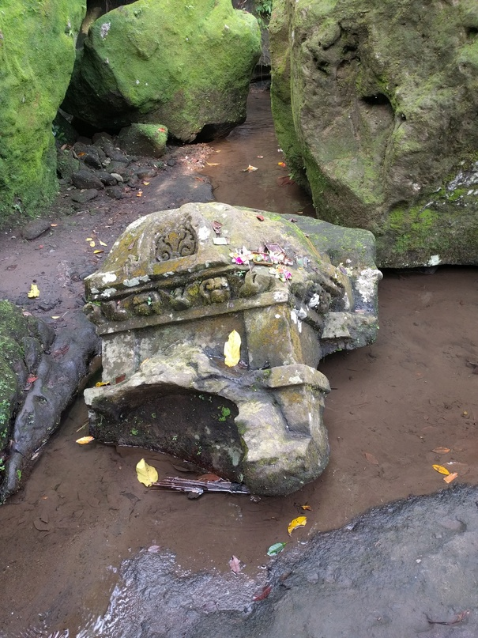

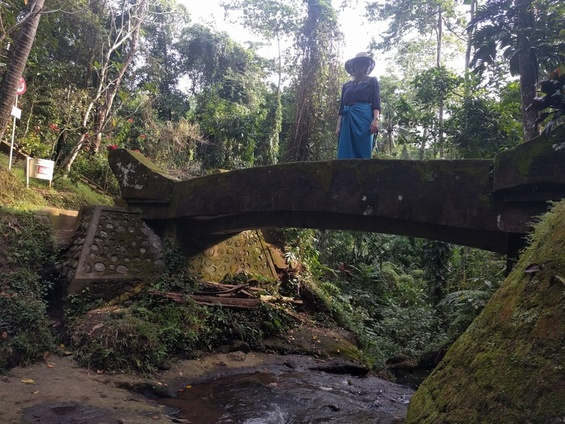

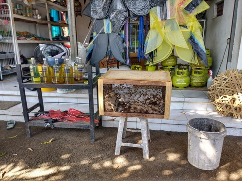

Was a great day. The highlight of which, beside standing under the waterfall, was Rachael accidentally eating a whole chilli at lunch! She had to yell for a glass of milk and was still struggling.