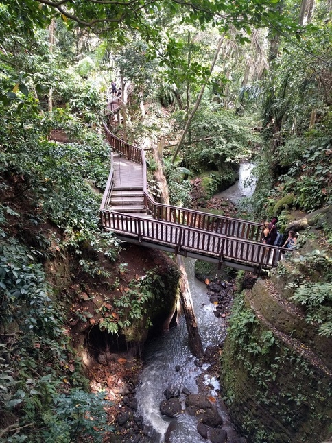

After driving from Seminyak to Ubud, we checked in at our hotel which had great rooms and a nice pool. Just up the road was the Ubud Monkey Forest so after our welcome drink we headed straight there.

The monkeys themselves were okay, but the forest had an awesome walk through a stream and a temple so it was well worth the visit. As we were leaving we noticed that there were heaps of Monkeys' running on the roofs of the buildings in the town and climbing down the power poles which was a pretty crazy sight. In the forest, there were heaps of people selling food that you could give to the monkey's which we thought was a bit weird but made sense in that it keeps them from going into the town and stealing food.

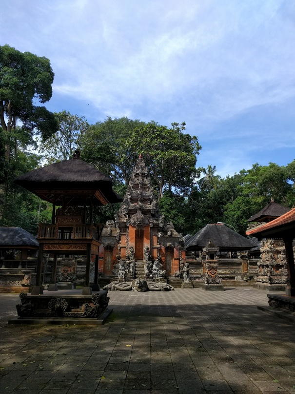

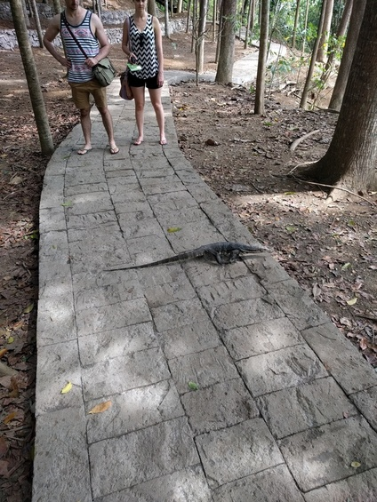

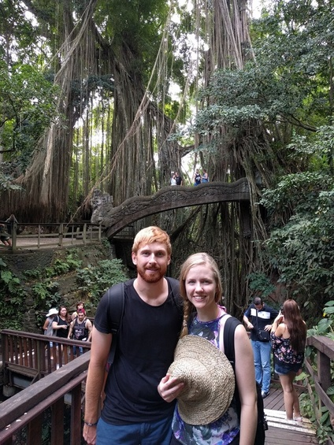

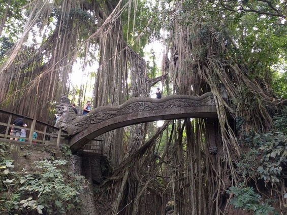

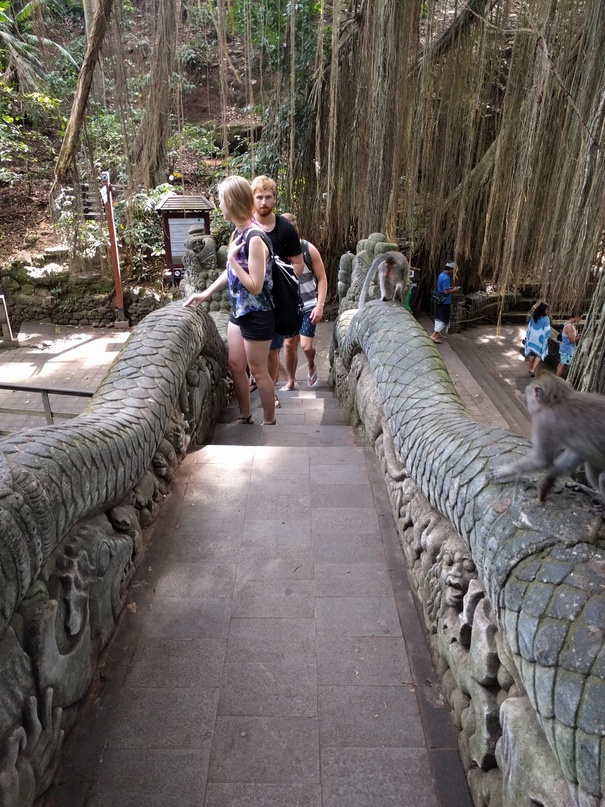

Everyone else wanted to get massages so Rachael and I went into town and had lunch at an awesome [Italian place](https://goo.gl/maps/ny58PV1JYKE2) that made an amazing pizza. We then went to the [Agung Rai Museum of Art](http://www.armabali.com/) (ARMA) which cost a fair bit to get in for Bali ($10AUD) but was awesome. There were some incredible paintings but even cooler since we didn't expect it was the grounds of the museum itself which had all kinds of cool gardens and even some rice fields. Rachael in particular loved it which was great because she wasn't a huge fan of the hustle and bustle of Seminyak.

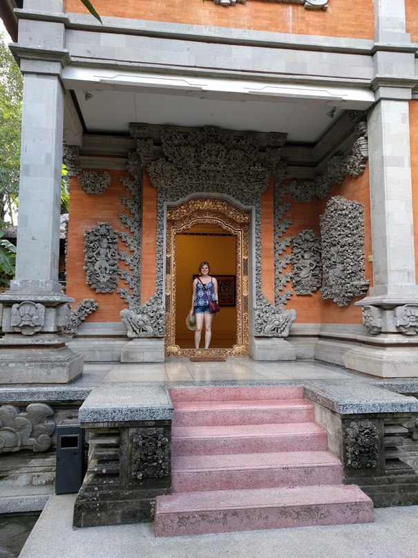

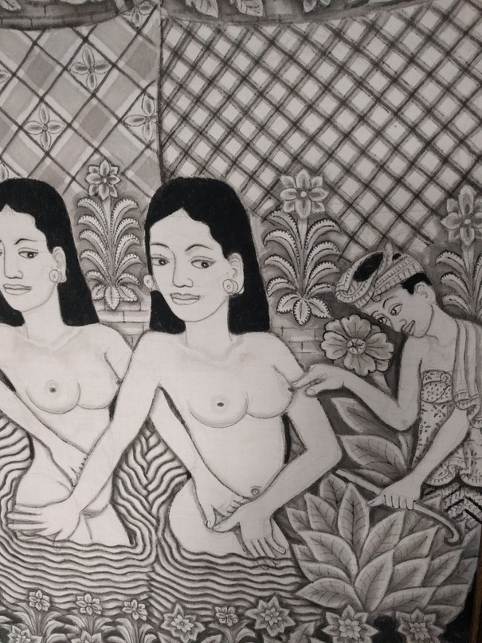

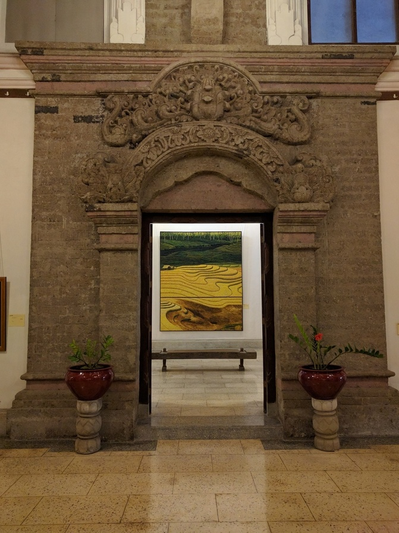

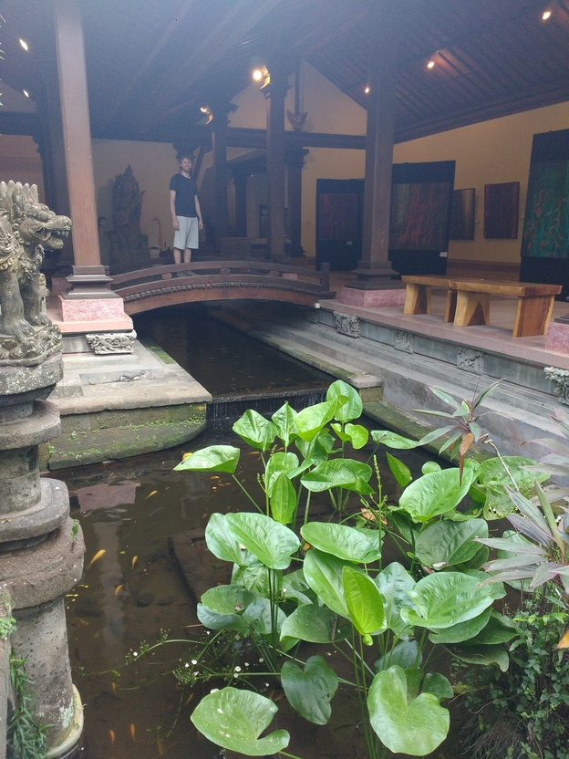

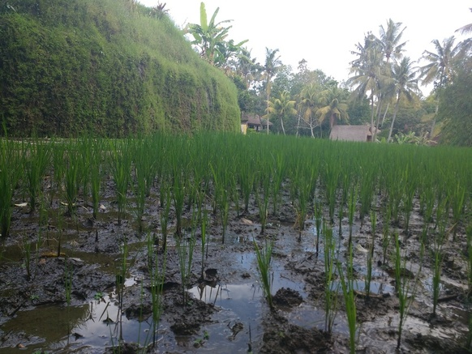

Finally we headed back to the hotel to make used to the pool before our volcano hike the next day. Rachael ended up buying a painting from one of the shops across the road which she really liked.

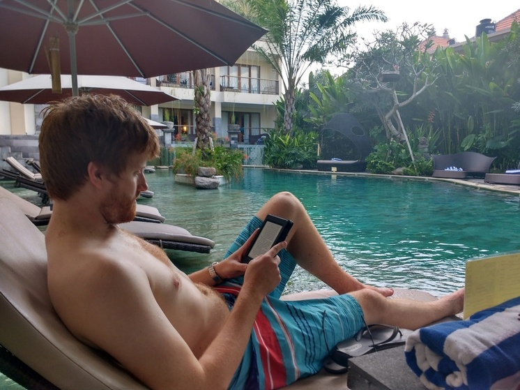

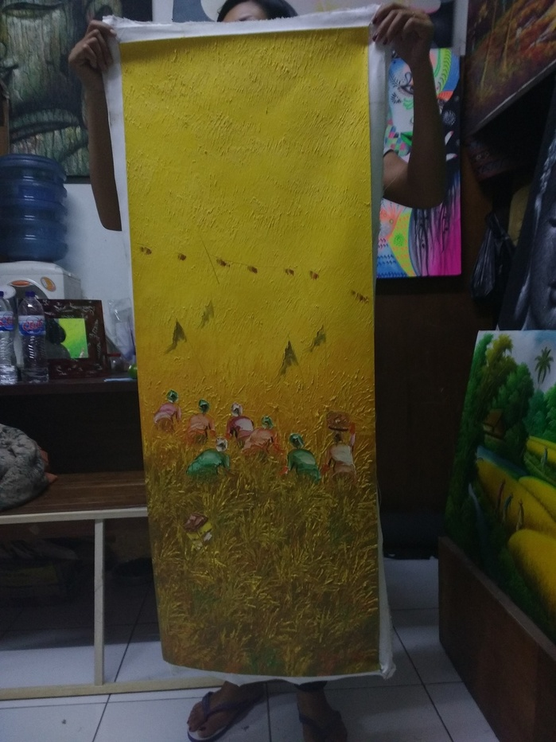

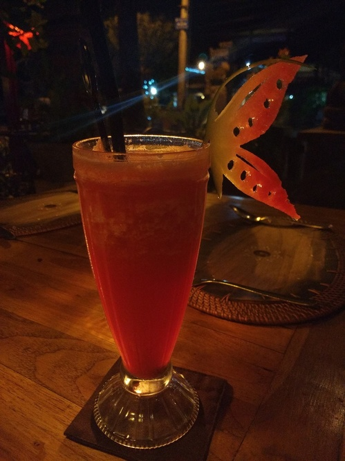
