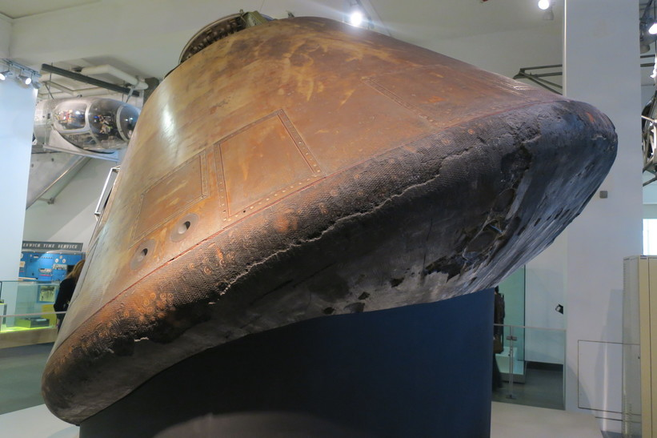
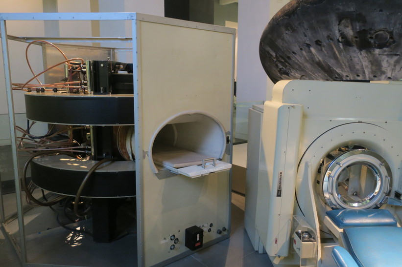
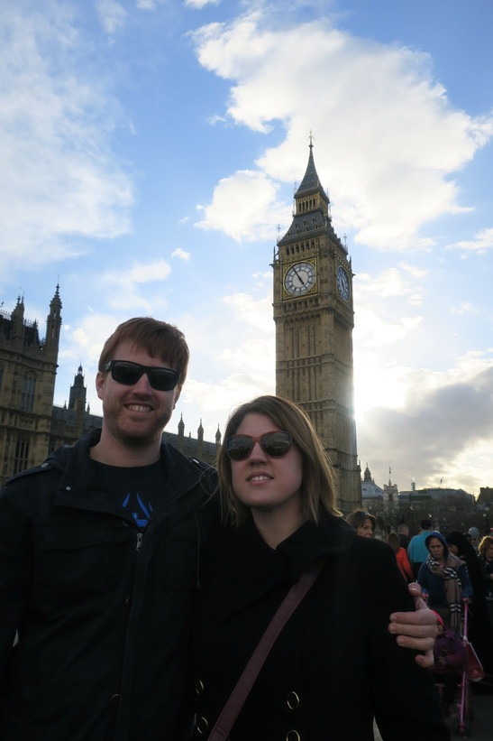

---

date: "2017-03-21 12:00:00+00:00"
slug: first-day-in-london
title: First Day in London
categories: ["Travel"]
# tags: [""]
---Europe, UK, England, London, Museum
Image: 2017-03-21-first-day-in-london/laurens3.jpg

Our first stop in our Europe trip was to London to visit Rachael's sister Lauren.
So after a Uber to the bus station, a bus to Brisbane, a long flight to Bangkok, a long boring layover and then an even longer flight to London, we arrived at Heathrow.

Lauren met us at arrivals and then we got our first tube ride to Hammersmith and then a bus to her place. Her place was pretty cool and very stereotypical of what you would expect in London, with a very steep staircase and a cupboard under the stairs. It was a lovely day and all the trees in her street were in flower also.

After we had unpacked and had a chance to catch up, Rachael and I got the tube to Kensington to find a Three Store and get a cheap SIM so we would have data on our trip (the plan had free roaming in the other countries we were going to). From there we were headed to the museums but walked through Hyde Park on the way (looking at a map now it was technically Kensington Gardens).

We were not expecting to seen anything like the [Albert Memorial](https://en.wikipedia.org/wiki/Albert_Memorial), which was enormous and the gold was extremely bright in the sun. And it was opposite the awesome-looking Royal Albert Hall, which I had heard of but didn't realise it was opposite a park or a giant gold statue.

From here we walked past lots of embassy buildings to go see the Natural History Museum. This is actually a building that we knew looked awesome, except the front entrance was blocked off and under renovations and so we couldn't actually see it. Inside was pretty cool, although we had higher expectations and it wasn't that different to other museums really, just a lot larger.

Next we wanted to go to the science museum, but between the two we quickly popped into the Victoria museum which had Raphael posters which were 'on loan from Her Majesty the Queen'. You would think it would just be donated to the museum, but good you could seem the for free. Rachael liked all the old clothes which were the majority of the displays.

My favourite place was the Science museum. It had heaps of cool displays especially the space exhibits and large projected globe with various satellite imagery.

After the museums we met back up with Lauren at Hyde Park. From there it was a short walk to Buckingham palace and Trafalgar square. It was really crazy how close all the main sights are to each other, and how close Lauren was staying to the city also.

We had lunch and then walked to Westminster to see Big Ben and parliament.

Once we got home I was wrecked from not sleeping in about 2 days, so Rachael and Lauren want to get some fish and chips for dinner but I fell asleep.
