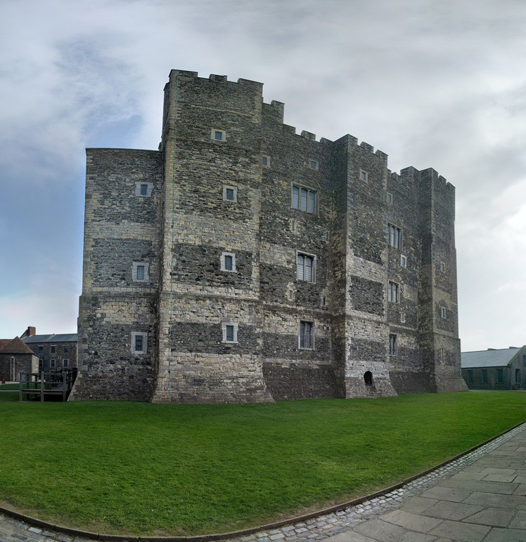

---

date: "2017-03-24 12:00:00+00:00"
slug: dover
title: Dover
categories: ["Travel"]
# tags: [""]
---Europe, UK, England, Dover, Castle

Lauren has a car so we thought we would take advantage of it and do a day trip somewhere she hadn't been yet, so headed to see the White Cliffs of Dover and Dover Castle. I was surprised how quickly we got to more rural areas, as I was expecting heaps of urban sprawl like Brisbane, but London is actually pretty contained.

We decided to ignore the National Trust tourist part and headed further up towards the St Margaret's Bay end where we hoped there would be less people. The cliffs were really awesome, they looked like they were made of chalk and where we went there was no fences just walking tracks and then edge. The walk from the road where we parked was also nice with a bit of forest with wildflowers and some abandoned buildings. It was also cool driving in and seeing the harbor which had lots of massive ships coming and going.

Next we went to look at [Dover Castle](http://www.english-heritage.org.uk/visit/places/dover-castle/), which was even a cool drive in as we had to drive under a medieval archway. The ticket price was pretty expensive but it was a massive grounds and had heaps of things to see.

First we did a tour of underground war hospital. The small amount of the tunnels we saw was pretty extensive and hard to imagine from above. Living down there during the war would have been pretty horrible.

There was a display about some of the various wars between France and how the ownership of the castle had changed, but the highlight by far was the actual castle itself. It was massive and had heaps of little side tunnels and staircases which were almost all open to walk through. They had some displays set up to show how it would have been furnished in the day also. It was interesting how small the beds were because they slept sitting up due to the smoke making it hard to breathe lying down.

Also cool was the medieval tunnels, which went pretty deep into the ground and were impressive fortifications for the time. We had not expected to stay long but there was so many things to see we were there for hours. The 2,000 year old [Roman Lighthouse](https://en.wikipedia.org/wiki/Dubris#Lighthouses) was crazy to think it was still standing, and the Roman Church was also pretty cool.

We went into town to get some lunch, but the town itself wasn't that great. It was a bit smelly and nothing particularly interesting to see.
