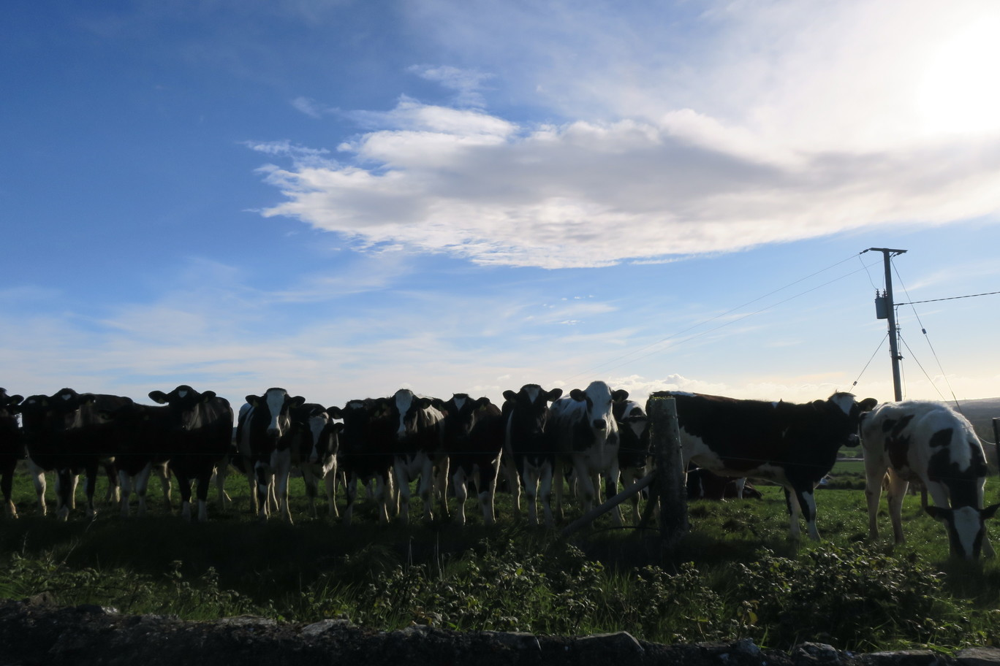
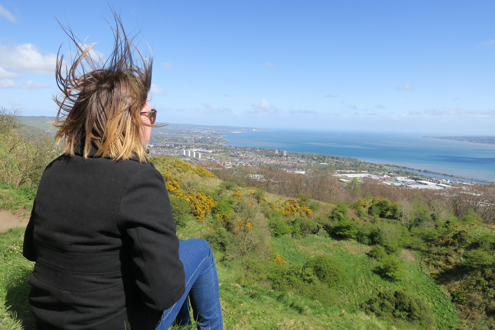

---

date: "2017-04-26 12:00:00+00:00"
slug: channel
title: Last Day in Ireland
categories: ["Travel"]
# tags: [""]
---Europe, UK, Ireland, Northern Ireland, Slane, Belfast

So we left Dublin early in the morning to avoid the traffic and made our way up north again to visit Slane.

We were told by Matt and Angela to visit a hill with a view of the countryside and was a perfect sunny day so the views were spectacular.
There was a freezing cold wind though, so we didn't stay long.

We went past Slane Castle but it was closed for renovations.
Nearby is the site of Newgrange, but we got there really early and it didn't open until 9:30 so we just looked over the hedge.

We made a quick detour to drive along the ocean and then we were back across the Northern Ireland border.
There is no real signage other then the speed limits suddenly change from km/h to miles/h.

We still had a few hours with the car before we had to return it, so we went up to look at Cavehill which is a mountain that inspired Gullivers Travels as apparently it looks like a giant and people hiking up its face inspired the author. Belfast Castle is up the top, so we stopped there for lunch.

We then hiked up the giant's face and there was a great view of Belfast harbour. It was crazy windy.

We returned the car then went to our AirBnB. The next morning we got the ferry across the channel.
It was more like a cruise ship then a ferry, with several restaurants, games rooms and a cinema. But it was only a short trip so we just read and went on top to look at Scotland as we came in.

