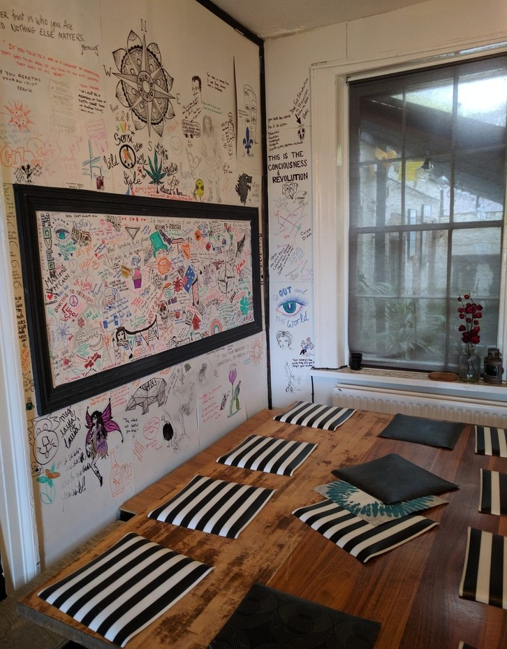
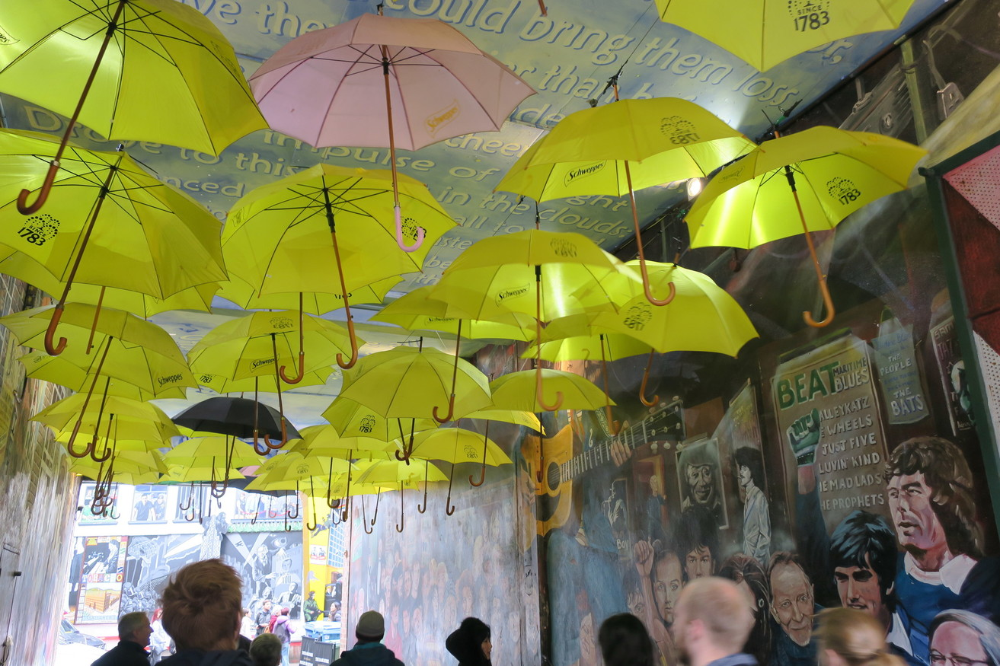
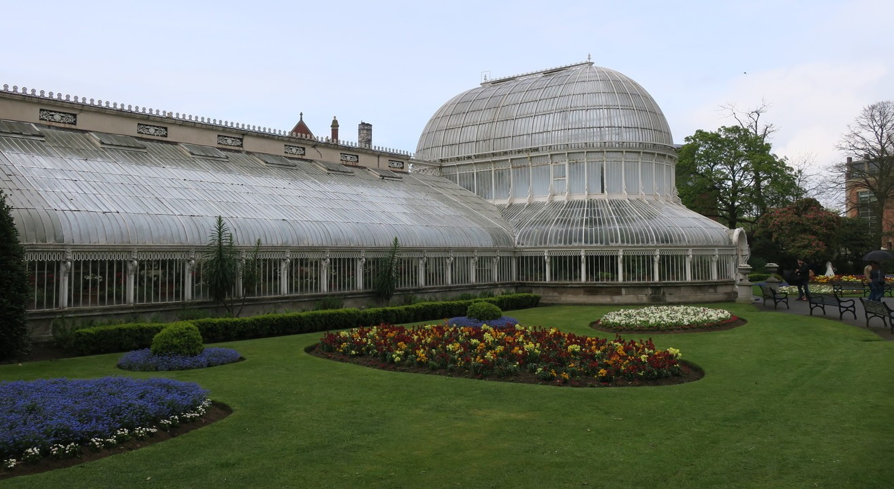
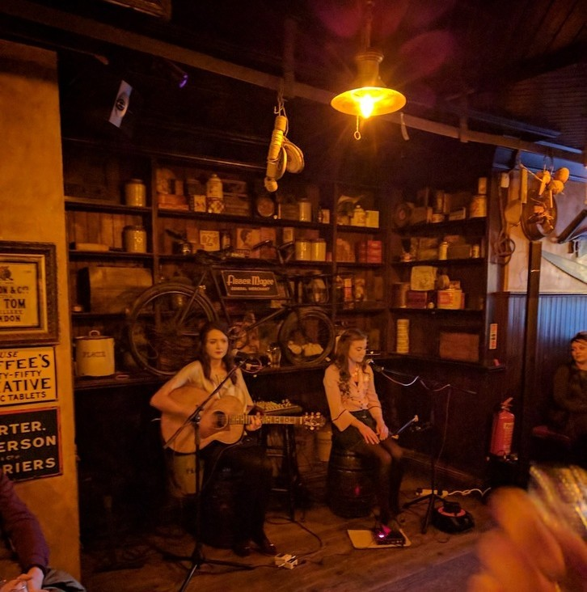

---
categories:
- Travel
date: '2017-04-22'
featured_image: posts/2017/belfast/alley.jpg
slug: belfast
tags:
- Europe
- UK
- Northern Ireland
- Belfast
title: Belfast
---

We flew into Belfast and got a bus in to the city and then to check into our hostel. Everywhere was really booked out in Belfast, and we were only able to book a 10 person dorm at [Vagabonds](http://www.vagabondsbelfast.com/). We found an awesome burrito place for lunch that was a cross between subway and GyG. It was good being back in an English speaking country again, although Rachael still really struggled to understand what we were ordering with the accent which was pretty funny.

The hostel was really cool, but hopefully we never have to book a 10 bed dorm again. Luckily we went to bed pretty early before everyone else got back, because apparently one guy was snoring so loud that one of the other girls didn't sleep (and told us at breakfast she wanted to murder him). I woke up in the morning and heard him, and probably wouldn't have been able to sleep hearing it.

The living area was really cool, and we spoke to some other people in the hostel about where to visit while we were in Ireland. We didn't think we would have time to get to the Cliffs of Moher but were persuaded it was worth the drive.

My phone plan had expired, but since we were back in the UK we could head into the city to renew it. The shopping centre had a really cool viewing platform where you could see the city, although the weather wasn't great for visibility.

We did a free walking tour later on in the morning, starting at City Hall. They had a display of all the people who died on the titanic, including two people that were under stolen identities. I didn't actually realise the Titanic was built there and they also had a whole 'Titanic Experience' which is a apparently great visit (similar to the Vasa Museum I guess) but we didn't have time to visit.

Next on the tour, we went to the Europa hotel, which was bombed repeatedly by the IRA. It was opposite a really fancy bar, which joined on to another bar called Fibber's McGee (like in Toowoomba).

We saw the [leaning clock](https://en.wikipedia.org/wiki/Albert_Memorial_Clock,_Belfast), [wise salmon](https://en.wikipedia.org/wiki/Salmon_of_Knowledge), and I think four 'oldest bar in Belfast'. There was a really cool part of town with lots of pubs and restaurants that was a bit hipster with lots of cool graffiti.

It was a really good tour, and Belfast was a surprisingly cool city and a shame we didn't more time there.

For lunch we had some amazing burgers, they like their make your own takeaway and this was like a Grill'd crossed with subway. They tasted amazing and were really cheap.

There was a free Ulster museum and botanical gardens near(ish) our hostel so we went there in the afternoon. The museum had a display of the period table with all the actual elements (stable ones at least). And we learnt a bit about 'the troubles' and the IRA as this wasn't covered in the tour we did. The gardens were nice too.

A lot of the pubs in town had cool names, like Filthy McNasty and The Dirty Onion. Our tour guide talked up going to see some Irish Music at Fitzy's, and there was a local duo of girls playing that were really good, but it was more American/Pop/Country then Irish.

The next morning we picked up a hire car to explore the country side.