---
categories:
- Travel
date: '2017-04-09'
featured_image: posts/2017/berlin/roomview.jpg
slug: berlin
tags:
- Europe
- Germany
- Berlin
title: Berlin
---

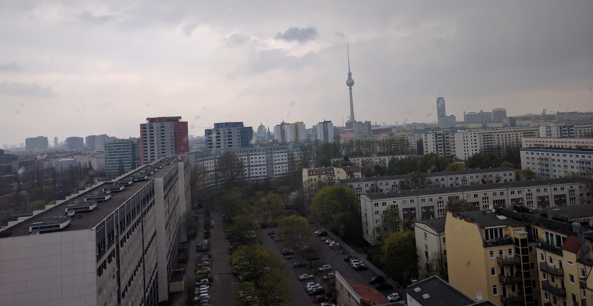

We got in to Berlin quite late, but got up early the next day to do the free walking tour.
We learnt heaps of history about the war, and the berlin wall and cold war.
One of the first stops was the [Jew Memorial](https://en.wikipedia.org/wiki/Memorial_to_the_Murdered_Jews_of_Europe) which when we saw it was really familiar as I'd seen it on TV and the internet. The designer did a great job, as when you walk through it, it's nothing like what you expect. All the blocks are slightly different and in the middle it goes really deep and some are really tall. The guide said the designer refused to explain what it represented, and it was up to everyone that visited to interpret it for themselves. Reading the wiki article though, it says it was "designed to produce an uneasy, confusing atmosphere, and the whole sculpture aims to represent a supposedly ordered system that has lost touch with human reason" which actually describes it really well. Each of the minorities that were persecuted got their own memorial, rather then grouping them all together, which is a nice thought. Our guide also pointed out how great it is that the Germans are so open about the past, to ensure it doesn't happen again with the memorials in the middle of the city on prime real estate. Pretty much all the ex-colonies (like Australia) have a terrible history where they invaded, but that's mostly ignored so I think it's really great that they acknowledge it. The German parliament was also a cool building, with a see through viewing platform above it so you can look down on the politicians and they can always look up to see who they represent (the tour guide pointed out mostly tourists). You need to book an appointment ages in advance though, so unfortunately we couldn't go up. Thinking about it also reminded me of a comment Jan said to me when he visited on Australia Day, and about how great he thought it was to have a day where we could celebrate your nationality and that they can't really have that.

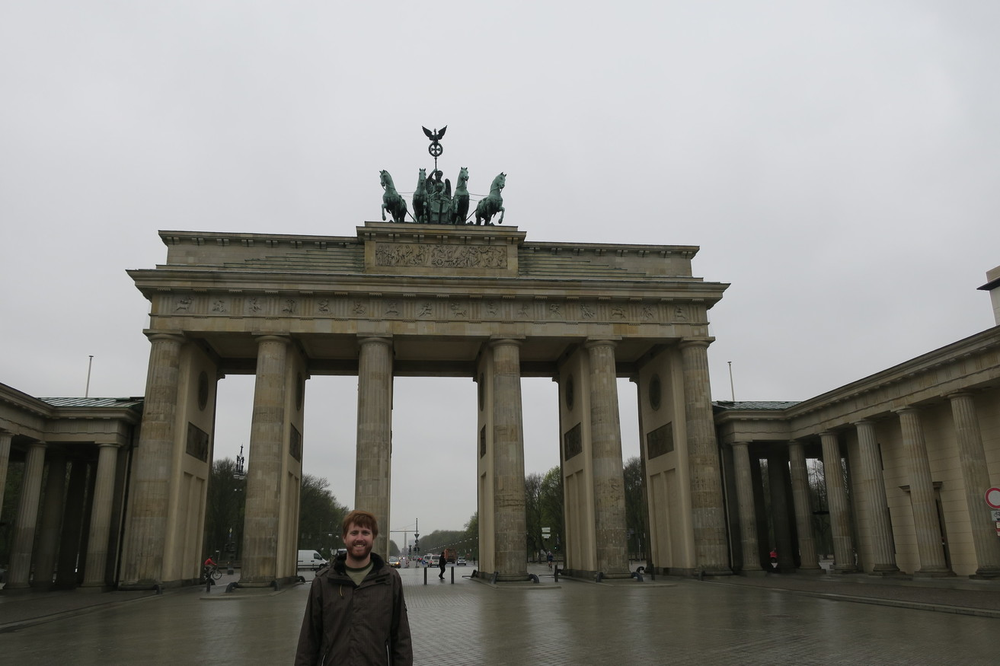

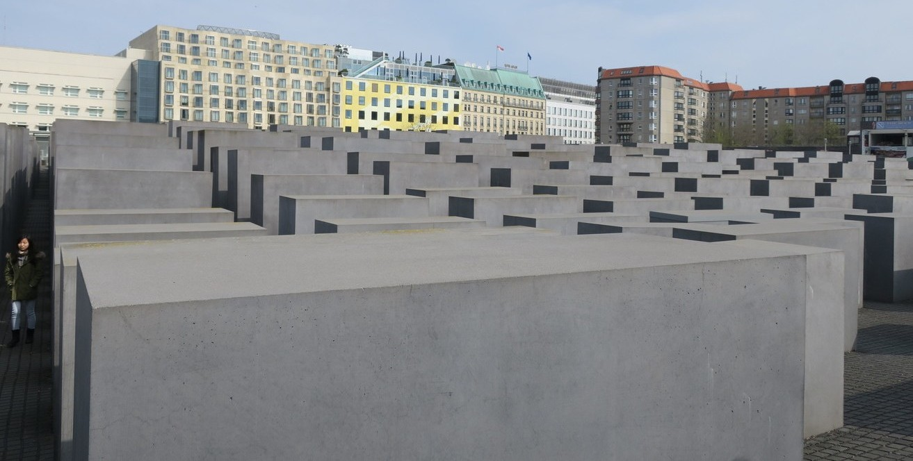

We also visited the car park which was built on top of the bunker where Hitler shot himself, and saw parts of the Berlin Wall and Checkpoint Charlie. The tour stopped at a cafe for lunch which actually had cheap but amazing chicken schnitzel bagels. The final stop was wear a large book burning took place, and the square had an underground room which you could look down into, that had bookshelves with no books on them.

After the tour, we walked to museum island, and there appeared to be some sort of political rally going on. When we got closer we saw that they were filming movie. All the museums had awesome architecture, but were expensive so we didn't go in.

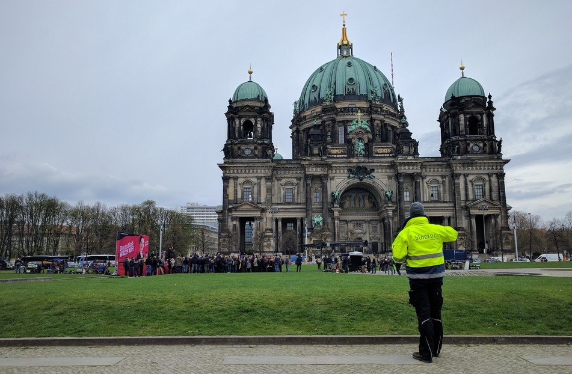

The next day we went to the [Menschen Museum](http://www.memu.berlin/en/exhibition/menschen-museum/) which was the thing that Rachael was most looking forward to in Berlin. It was okay, I was expecting it to be more about science but it was presented more like an art gallery. Seeing a real spinal cord and the tiny bone in your ear were pretty cool though. Afterwards we had lunch at an amazing Vietnamese restaurant. Germany was great for having amazing cheap food after being in the Scandinavian countries.

In the afternoon we walked along the [East Side Gallery](https://en.wikipedia.org/wiki/East_Side_Gallery) which is a section of the Berlin Wall near where we were staying with murals. Apparently it's the hipster part of town and their are clubs that are open 24/7 (haven't closed in like 7 years) and a club that you have to wait in line for like 4 hours only to probably get told that you are dressed wrong and can't come in. it was weird to think about something like that happening so recently in history (when I was a baby as opposed to before I was born anyway). On the other side of the river there were definitely lots of hipster restaurants and we went to a park that actually seemed like American parks you see in the movies.

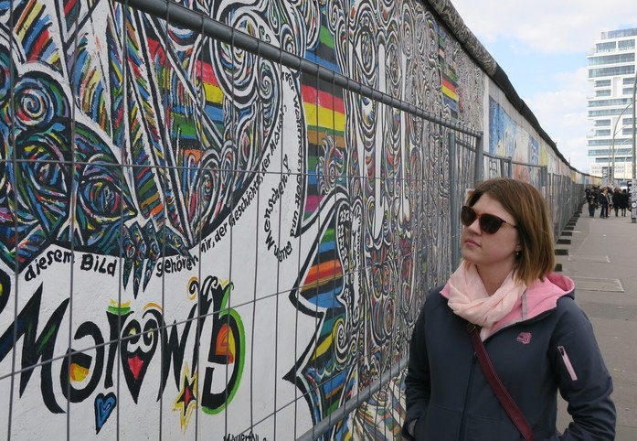

We decided to visit [Sachsenhausen Concentration Camp](https://en.wikipedia.org/wiki/Sachsenhausen_concentration_camp) which was as miserable as you would imagine but worth the visit. The weather was very appropriate with a bitter cold wind making it horrible to stand outside in our jackets (in Spring), while we were told that prisoners had to stand out basically wearing nothing for hours on end in the middle of winter. Given the prisoners were essentially worked to death in -20, we couldn't complain too much.

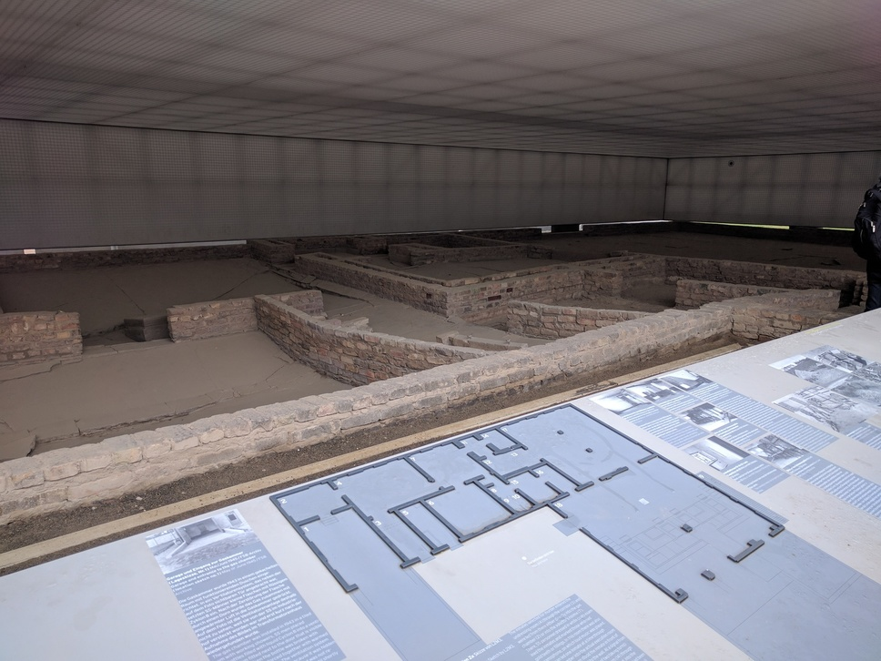

We decided to go to a a German pub for dinner to lighten the mood and had some good beer, and okay food. Afterwards we popped in for a drink at Hofbraü Berlin so Rachael could get a small taste of what Oktoberfest was like.

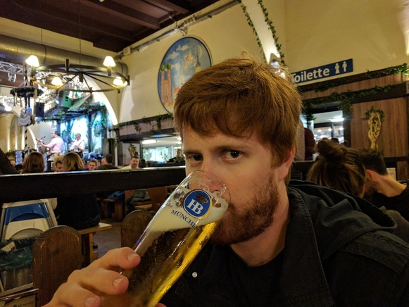

Next day we caught a train to [a church](https://en.wikipedia.org/wiki/Kaiser_Wilhelm_Memorial_Church) that was destroyed in the war and left up as a memorial. Was pretty crazy seeing all the artillery holes in the side of the walls, and the damage inside.

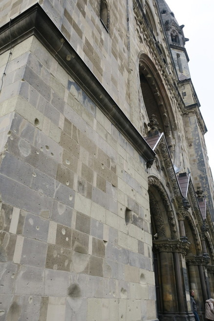

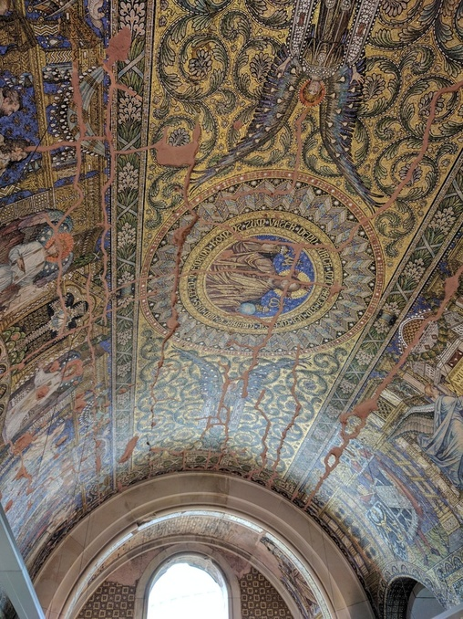

We then got a bus to the Tiergarten and climb up the victory column (which I had never heard of). It also had bullet holes on it, was a good view from the top but very crowded. They should limit number of people at a time, as it ruined the experience a bit and we wouldn't have minded a small wait. It was a very long staircase climb to the top. There was a cool underpass system under the roundabout, and there was a busker playing guitar that found the perfect spot to play so that it echoed all over the square and sounded awesome.

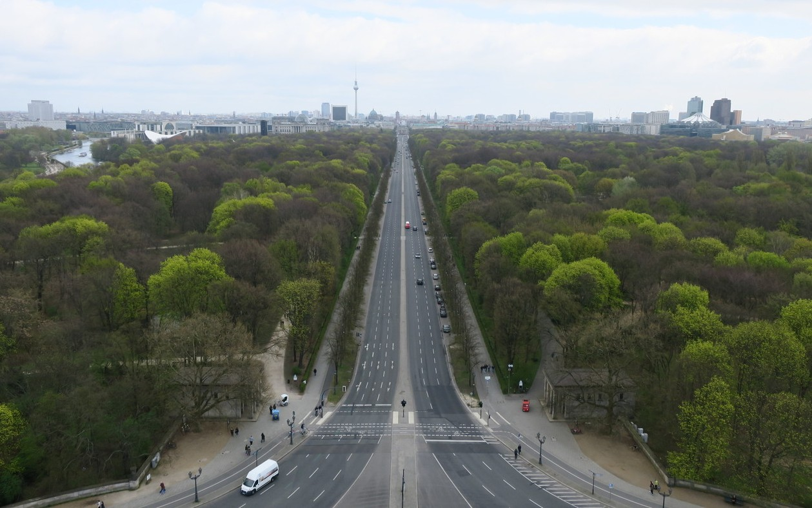

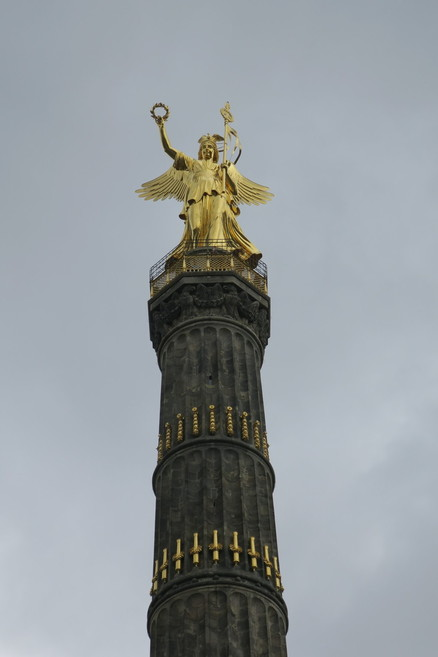

For lunch we got amazing kebabs that had chips in them, and Rachael had a Halloumi one which was equally awesome. Berlin really does have great street food.

Finally, we went to the gardens at Schloss Charlottenburg, which were good but not super amazing.
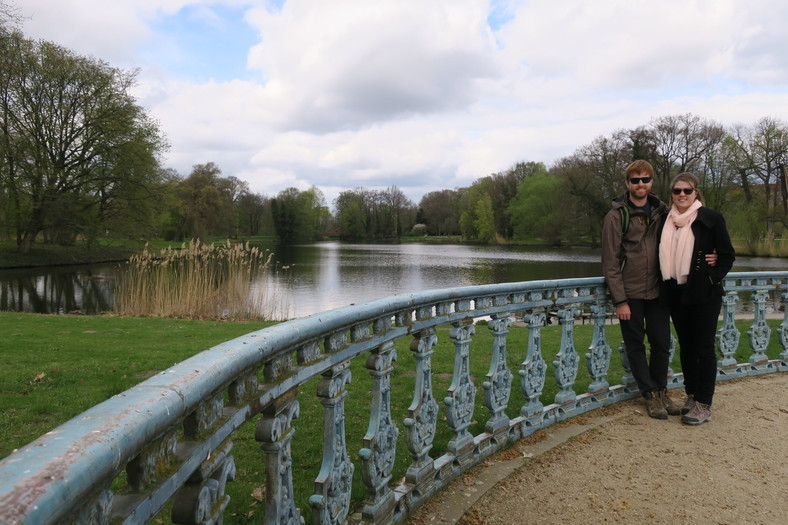

We had to get up really early for our flight, and then when we got there it was closed until 2 hours before our flight. When they did eventually open there was huge lines and security was super tedious and badly organised, it seemed very un-german compared to their rail system.