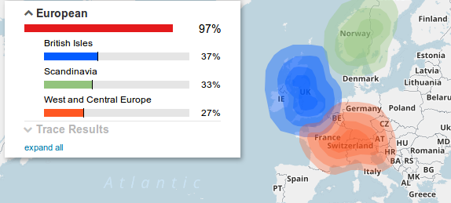
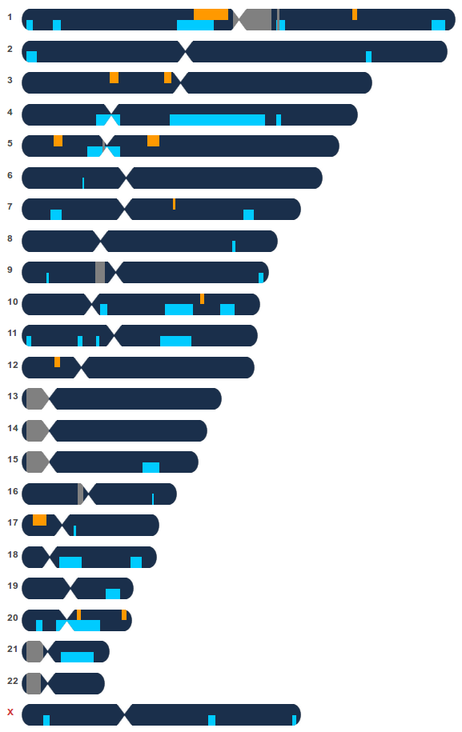
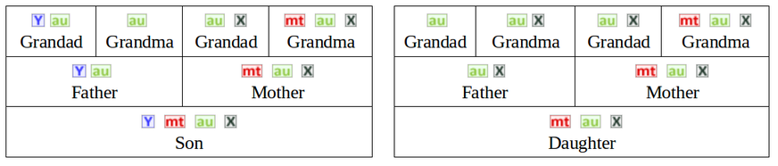

---
categories:
- Misc
date: '2017-09-21'
featured_image: posts/2017/dna-family-tree/ancestry.png
slug: dna-family-tree
tags:
- DNA
- Genealogy
title: DNA Genealogy
---

While we were mostly interested in the health aspect, the main selling point on ads for DNA tests is seeing your ancestry.
I was expecting the results for that part to be pretty underwhelming, and they were - confirming I am indeed descended from European immigrants.

The matching is really interesting though, it finds sections of your DNA that match that of others, and sums the shared segments which are measured in centimorgans.

")

I knew the relationship to a match on Mum's side (blue) and one on dad's (blue), so you can see the parts of the DNA that come from which side when comparing to those peoples results.

The one on mum's side was an X-Match, which makes sense because you get the X from your mum's side.
You can do Y and mt tests to see direct lines, but that's not part of the cheaper autosomal tests we got, which only tests small segments not your full genome.

If you don't actually know how you are related (like 99% of my matches) you can make a rough guess about how closely related you are [based on the cM's](https://thegeneticgenealogist.com/2017/08/26/august-2017-update-to-the-shared-cm-project/), which is how paternity tests work.

Considering the first DNA tests were only done in the 80s, I thought it was pretty cool to be able to see how DNA is passed on with your own results, and the detail you can match people to with a bit of spit.