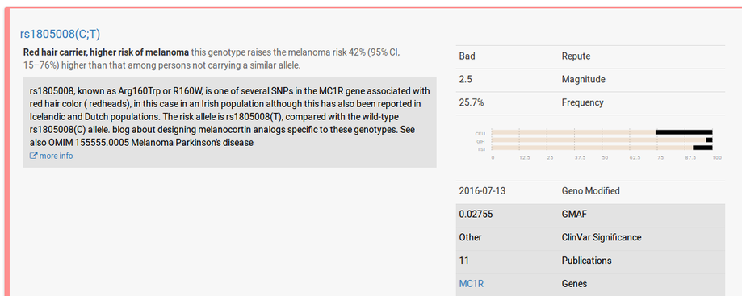
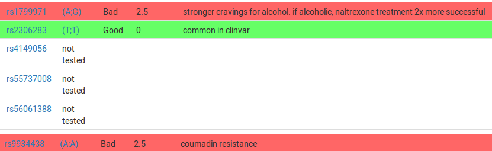

Last year I was listening to a [Podcast on 23andMe](https://www.recode.net/2016/4/4/11585828/) where they talked up what the benefits to health care would be if everyone did DNA testing. Different drugs affect people differently, and apparently DNA is a good way of isolating how they will impact different groups. Also if you know you are more suspeptible to certain diseases you can potentially make lifestyle changes to reduce them, and it can also tell you what you are a carrier of if you are planning to have children.

Unfortunately, they don't offer the health component in Australia as interpreting the results [is a bit controversial](https://www.nytimes.com/2015/10/21/business/23andme-will-resume-giving-users-health-data.html). They do offer ancestry tests though as do lots of other companies. I found that their is an external site
[Promethease](https://www.promethease.com) that lets you upload the raw data from other sites, and it will give you health info (although in a much more academic format).

It sounded interesting, so I was going to order the $99USD test but they charged a massive $100USD in shipping so would have been about ~$365AUD all up for 2 kits. [FamilyTreeDNA](https://www.familytreedna.com/products/family-finder) ended up being $205 AUD all up for two (on special) so we went with them. The companies do actually all test different parts of your DNA (not the whole thing) so they aren't the same but figured they'd all be good enough. Smarter Every Day has a simple video (ad) on [what the difference is](https://www.youtube.com/watch?v=U3EEmVfbKNs).

So once we sent our saliva over to the US and waited for a few weeks, we got our raw results and then the health ones.
Not surprisingly I have the gene for red hair.

The other results were also pretty expected, some increased risks of cancers which we already had family history of. Neither of us are likely to be lactose intolerant (we aren't), although Rachael apparently carries a gene that makes her more likely to be allergic to peanuts (she isn't).

Most of it is to do with drug resistances and effectiveness, which was the whole point made in the podcast in favour of DNA testing for health. If doctors are aware of your results they can make more informed drug prescriptions.

I hadn't heard of most of them but Rachael had, might prove useful information to know if we ever get sick in the future.