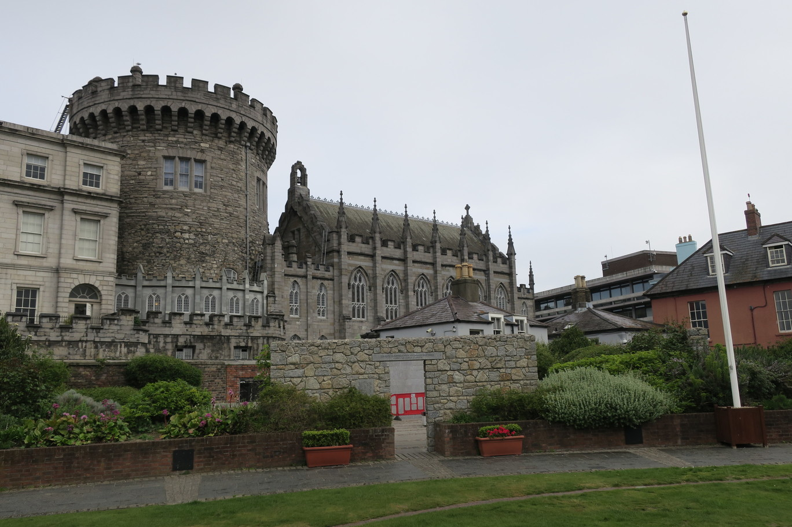
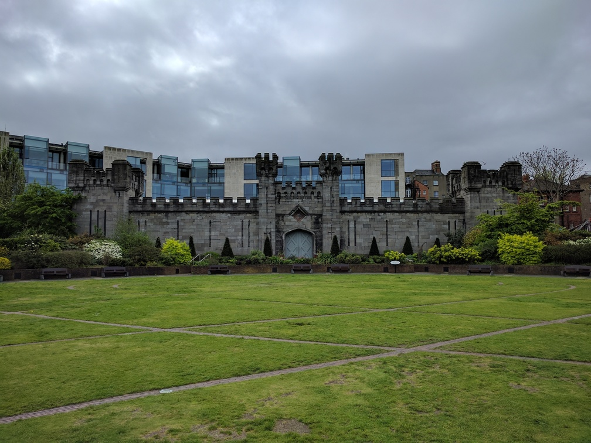
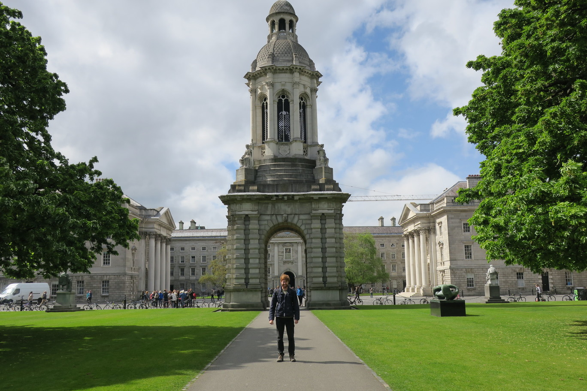
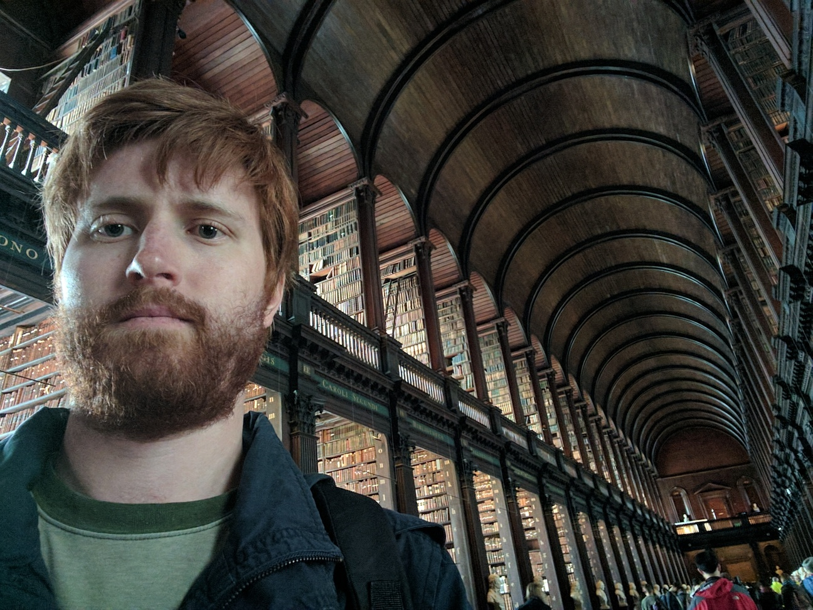
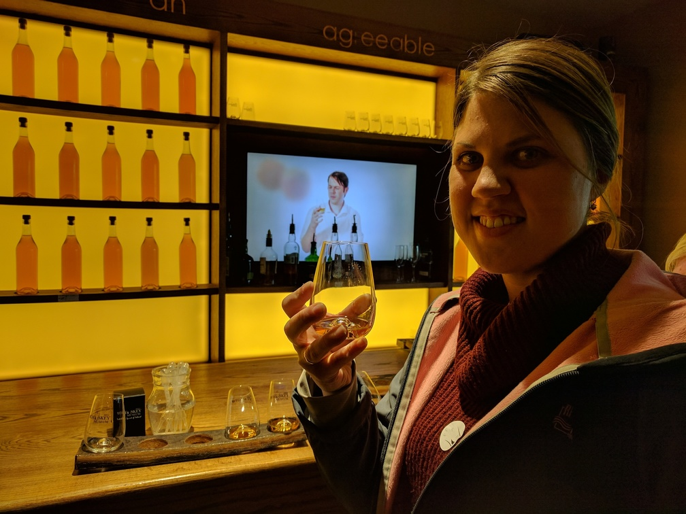
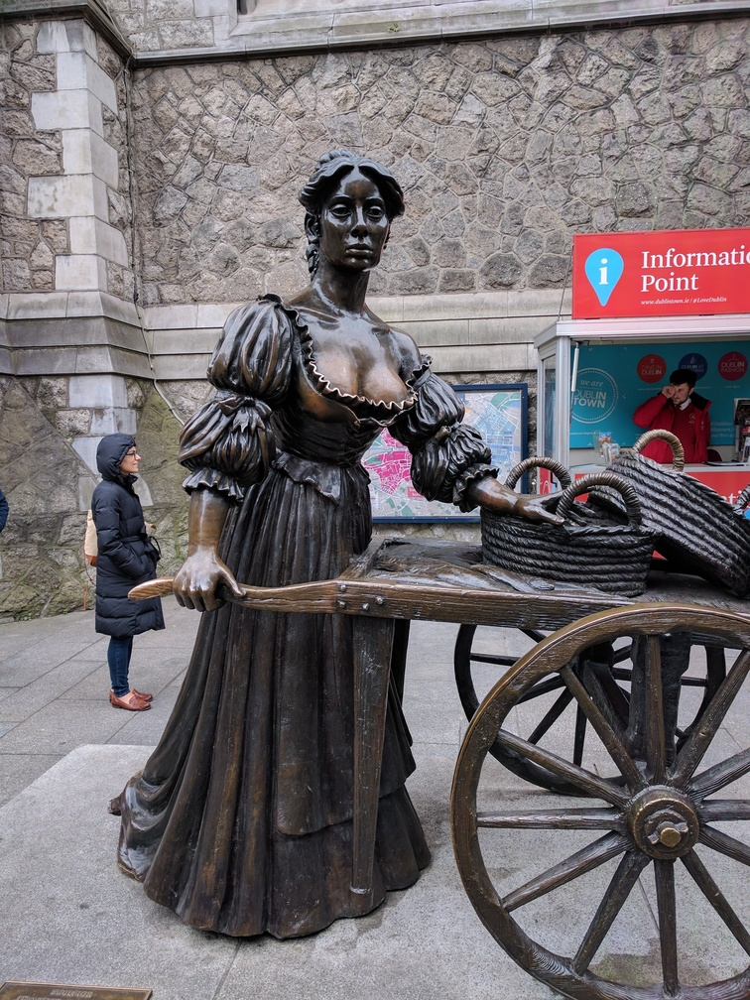
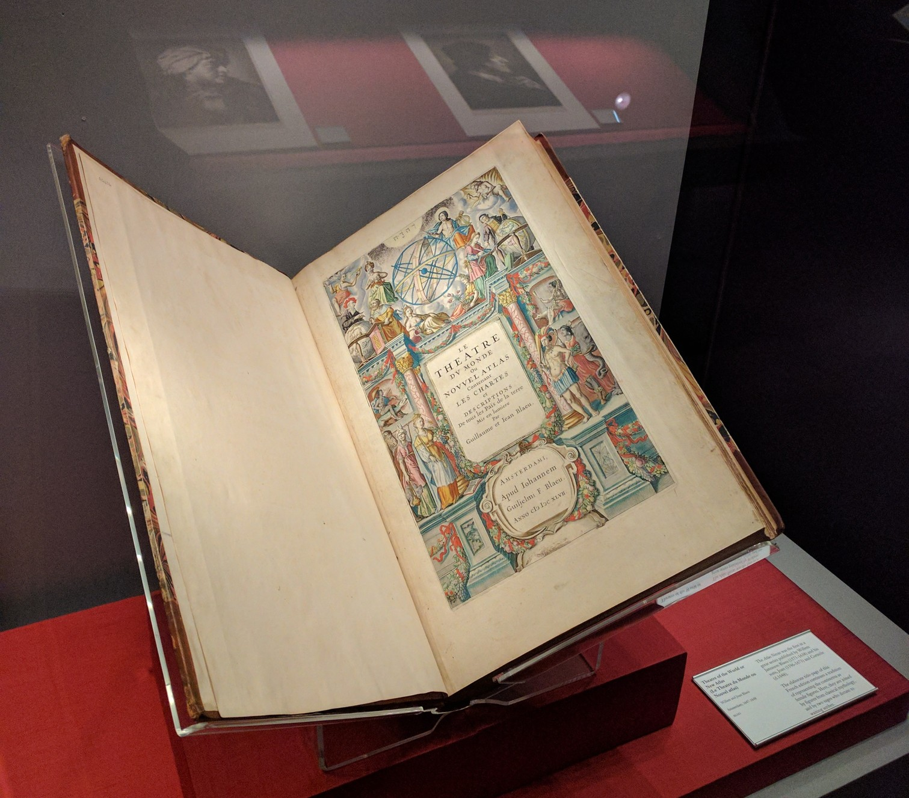
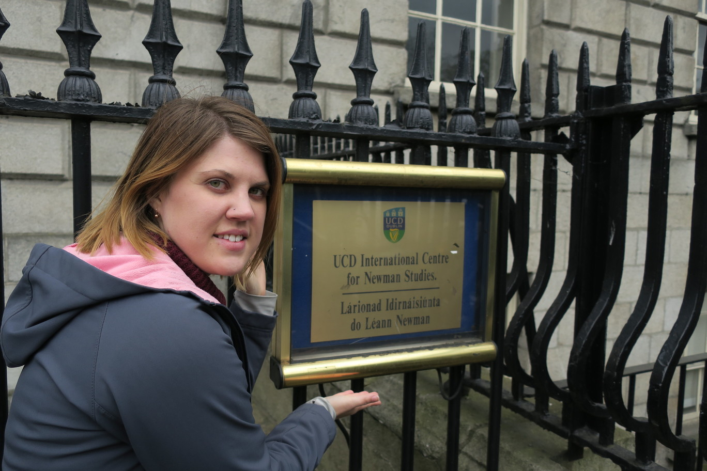
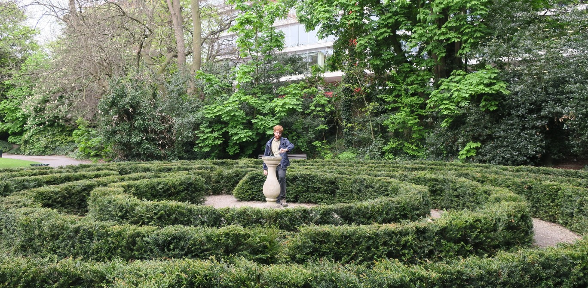

We got in from our drive in the afternoon, and parked at our airBnB which was hosted by a really lovely guy that made us a cuppa, gave us a map and helped us plan out what we wanted to see the next day. It was a bit of a dodgy suburb but lots of good student food places nearby, and we had some amazing Moroccan wraps.

The next morning we did a walking tour, and in more stereotypical Irish weather it was raining and cold.

Our guide was great and started with a history of Ireland, which was the first I really had properly learnt about the backstory to the potato famine and conflict with the English.

The first main stop was [Dublin Castle](https://en.wikipedia.org/wiki/Dublin_Castle) and the The Dubhlinn (Black pool) Gardens.

We went to a church that became a pub, and the Temple Bar area. Finally we finished up at Trinity college, which was a beautiful university.

Our guide showed us the incredible [old library](https://en.wikipedia.org/wiki/Trinity_College_Library), and the ugly arts building directly opposite. He told us how it was meant to be a recreation of the Hanging Gardens of Babylon but the concrete they used didn't support plants ([turns out this isn't true](http://www.universitytimes.ie/2017/01/trinitys-arts-building-often-condemned-and-surrounded-by-myth/)).

After talking up the [Book of Kells](https://en.wikipedia.org/wiki/Book_of_Kells) and how it was once the most valuable item in the world, and how the library is like being in harry potter, we had to visit. Rachael loved the exhibit on the Book of Kells, but I was less impressed as I had seen something similar at the [Abbey library of St. Gallen](/posts/2010/sankt-gallen), although I remember being super impressed back then.

The upstairs library itself was crazy impressive though, and they also had the original Brian Boru's Harp that often represents Ireland as a logo.

Rachael doesn't like beer so instead of visiting Guinness we went to the Irish Whiskey museum. There was a bit of a history about how it was invented and how Scotland stole their glory with their 'inferior Scotch Whiskey'. And then we got to sample a few different styles. The most crazy thing I learnt was that some whiskey tastes better with water and some not. There was one in particular that just completely changed in flavour when you added the tinniest drop of water.

Matt told us that we had to track down Molly Malone, and that when we saw her we'd know where to rub for good luck.

Our guide pointed out when we were at the castle another great free library, the [Chester Beatty Library](https://en.wikipedia.org/wiki/Chester_Beatty_Library) so we went there as well. It had lots of religious history and I learnt about a few religions I hadn't heard of and about some of the specific differences between Islam/Judaism/Christianity.

We went to a nice park on the way home (St Stephen's Green), and found a University for Newman Studies.

Then we found an even nicer park, the Iveagh Gardens.

We went to an asian place for dinner called Neon noodles which was delicious, and you got a free soft serve with your noodles which was a bit unusual.
