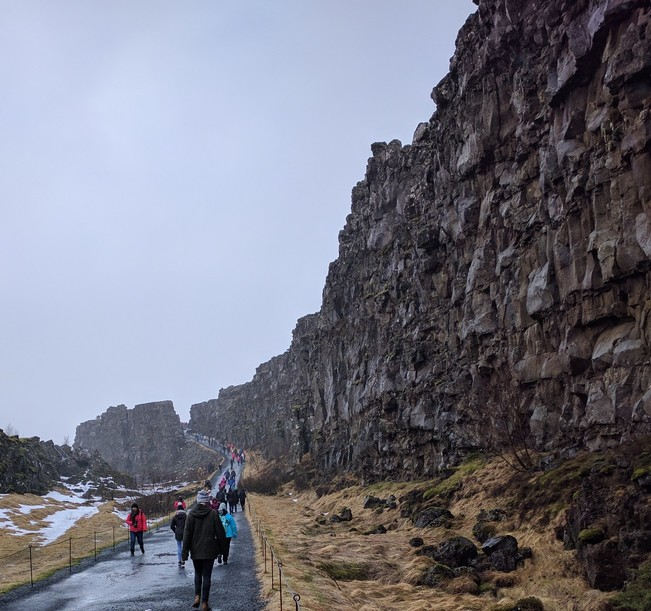
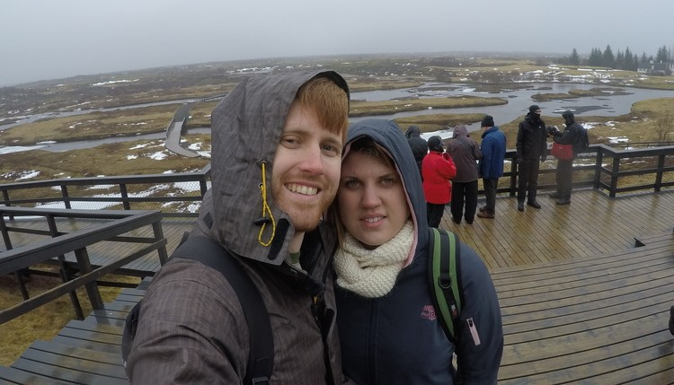
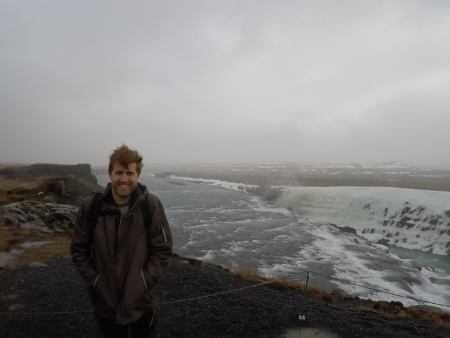
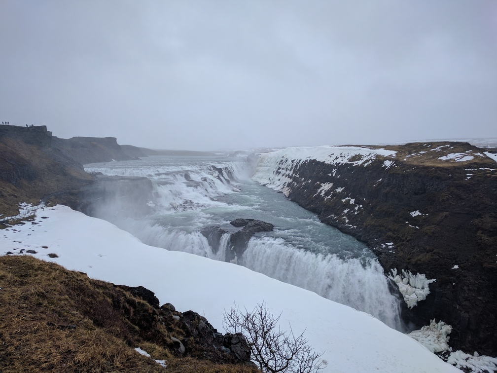
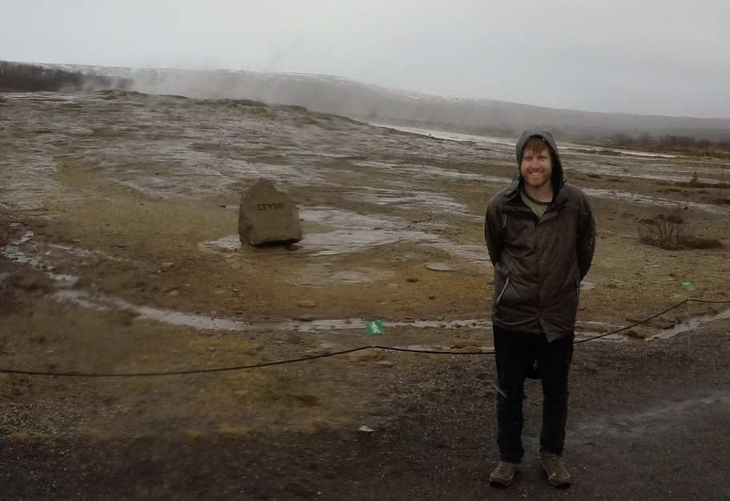
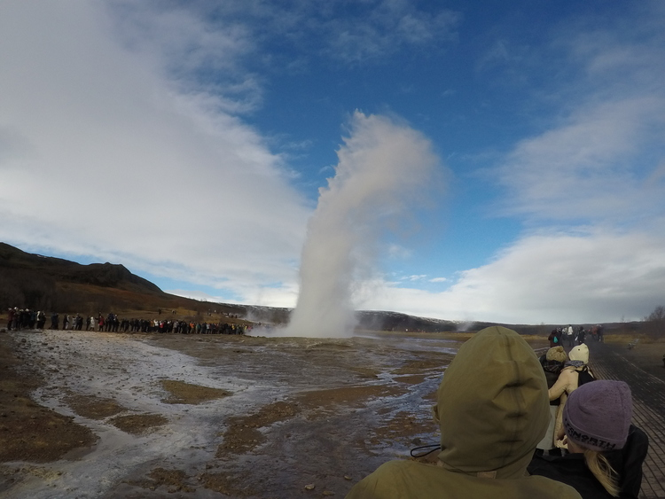
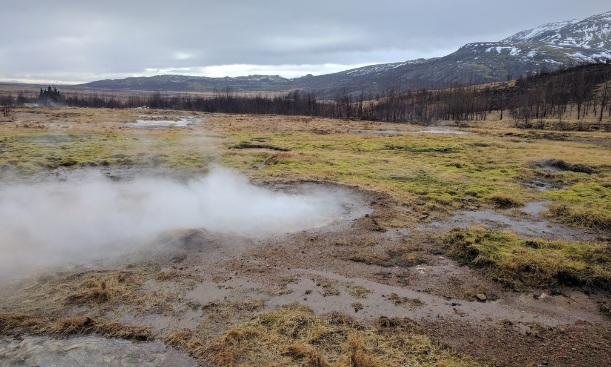
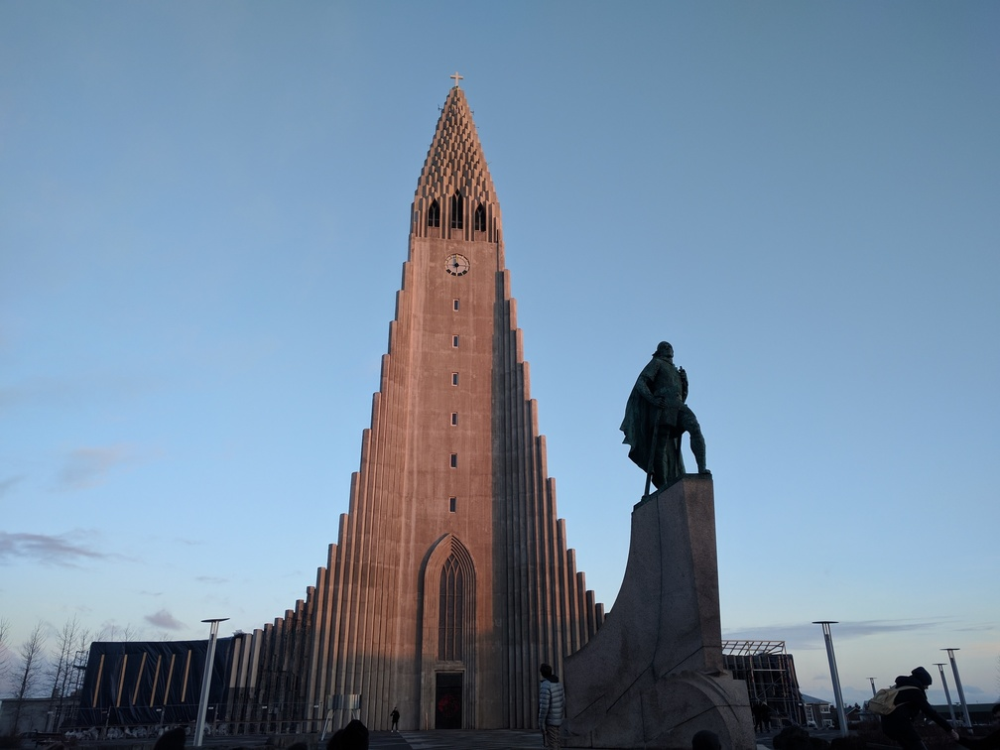
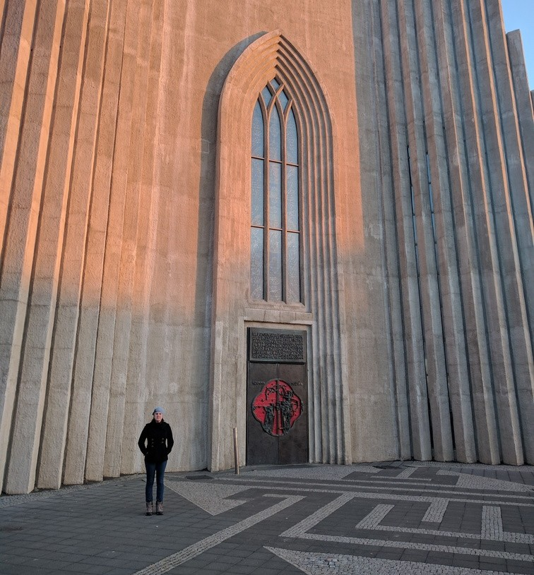
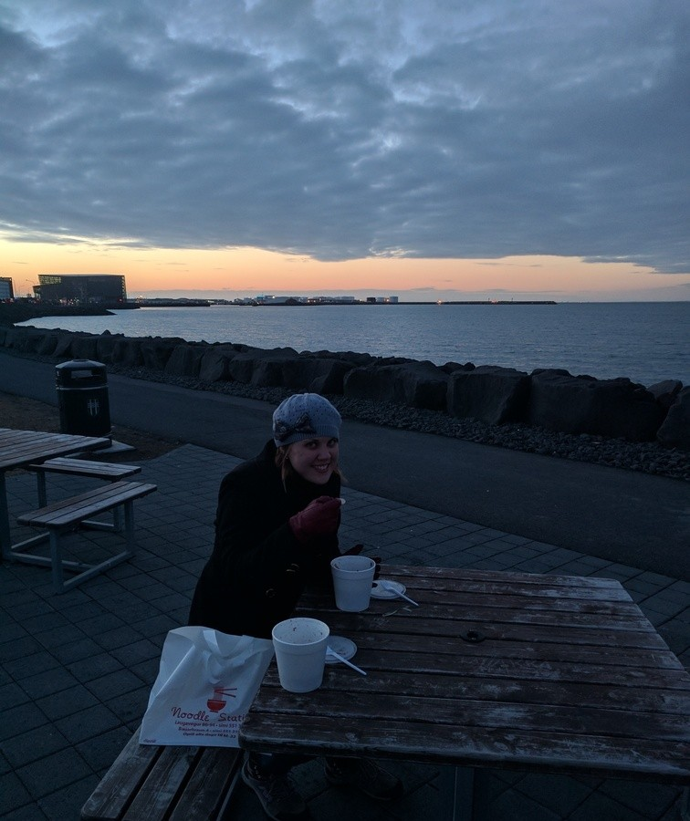

---
categories:
- Travel
date: '2017-03-26'
featured_image: posts/2017/iceland-golden-circle/Pingvellir2.jpg
slug: iceland-golden-circle
tags:
- Europe
- Iceland
- Golden Circle
title: Iceland Golden Circle
---

We flew in to Iceland in the afternoon and the area just looked bleak, with no trees in sight.
When we originally booked, we thought the airport was in Reykjavík itself (there is a domestic one), but Keflavik International Airport is actually about an hour bus trip from the city. The bus trip was pretty unreal, it was just a dead straight well-maintained highway with no trees and barely any other cars. Once you get closer to Reykjavík there starts to be buildings and trees, but the first part is just the middle of nowhere.

We stayed at KEX Hostel, which has a cool bar area and there was band playing when we arrived. The food in Iceland is crazy expensive and so we just bought some snacks for dinner at an expensive convenience store. We booked a Golden Circle bus tour for the next day.

First stop on the tour was [Þingvellir](https://en.wikipedia.org/wiki/%C3%9Eingvellir) where you can see the tectonic places. It wasn't much of a tour as they didn't tell you that much, pretty much dropped you off and said be back on the bus in an hour (they did give a tiny bit of backstory on the drive to each stop). It was a pretty cool area but was freezing cold and starting to rain. It's a rift valley and you can see where the tectonic plates have been pushed up out of the ground. Some scenes from Game of Thrones were filmed there also.

The next stop was [Gullfloss Waterfall](https://en.wikipedia.org/wiki/Gullfoss) which reminded me of
[Rheinfall](/posts/2010/neuhausen-am-rheinfall) in Switzerland. The weather was absolutely terrible, with icy cold wind and rain. So we had a very quick look then went into the restaurant, and got what was probably the most expensive toasted ham and cheese sandwich in the world. After warming up we went out again for another quick look. If the weather had been better I'm sure I would have enjoyed it a lot more.

For the last stop on the "circle", we went to see [Geysir](https://en.wikipedia.org/wiki/Geysir) which is the geyser that geysers are named after. We didn't see Geysir errupt, but the Strokkur geysir errupted pretty regularly. There was also a couple of small one's that bubbled away that were cool. The whole place smelled of sulphur of course, and it was still raining off and on and freezing cold. Again, would have been much better if the weather was better, although it did start to clear up a bit at the end before we had to leave.

Of course once we had seen all the main sites, the sun came out and the weather became lovely. Pretty annoying, but it did make for an epic bus trip back and the views were incredible (couldn't see anything on the way there really due to the rain). We also stopped at an [earthquake exhibit](https://www.south.is/en/services/the-quake-2008) at a Shopping Centre in Hveragerði which was pretty cool, the ground had literally split in half at the shopping centre in 2008, so they made a tourist attraction out of it. It also gave us a chance to buy some food at a supermarket as they have really short opening hours in Iceland and would have been closed by the time we got back.

Once we got back to Reykjavík we went for a walk around the city and went to the see the church on the top of the hill (Hallgrímskirkja).

We found a place that had hot soup noodles for dinner, they didn't have any tables free, so we got takeaway and ate them on the oceanfront. Was still pretty cold, but was nice with the sky cleared up and the noodles were boiling hot and tasty.

