---
categories:
- Travel
type: post
date: '2017-03-27'
featured_image: posts/2017/iceland-silfra/drysuit-alex.jpg
slug: iceland-silfra
tags:
- Europe
- Iceland
- Silfra
- Lava
- Aurora
title: Iceland Silfra and Northern Lights
---

Monday we had much nicer weather, and it was the day Rachael was most looking forward to. I showed her this [Smarter Everyday Video](https://youtu.be/5adC3nc0MHI?t=2m36s) when we were planning our trip and since then snorkeling at [Silfra](https://en.wikipedia.org/wiki/Silfra) was what she was most looking forward to.

It's actually part of the Þingvellir fields, so we got the bus back again. The drive and views were so much better with the sun out. We then put on our drysuits, which were pretty much like putting on a wetsuit. Rachael really struggled to get hers on, but she hadn't used a wetsuit before either. The water actually felt really warm when you got in, the suits do an amazing job of keeping the water out (one guy in our group didn't have a good seal and got a bit wet and had to go back to fix it though). We also bumped into Lauren and her work friends, who were diving after us.

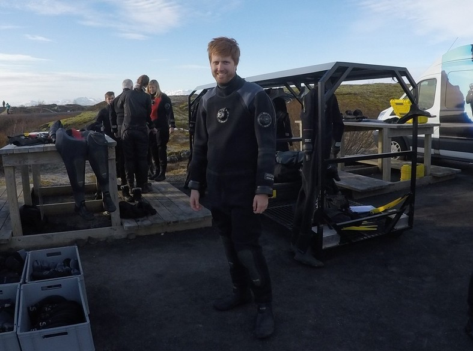

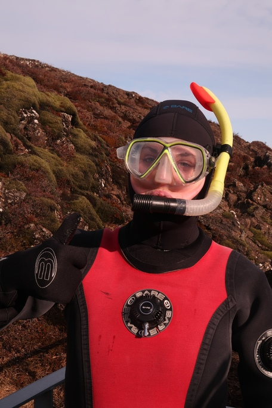

The snorkel was incredible, the water was incredibly clear and there was a slight current from the glacial melt that pushed you along. The water was the most vivid blue, and you could see tiny algae floating in the water.
Towards the end the cold really started to seep in, my feet, hands and face eventually went numb from the cold.
At the end of the snorkel was a small open sandy bit with ducks swimming around with us.

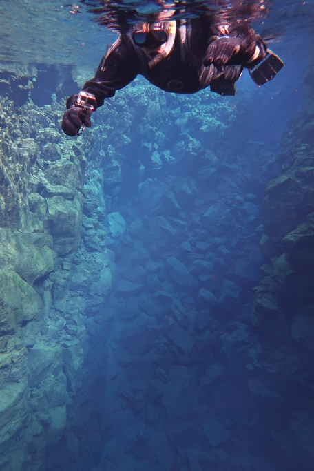

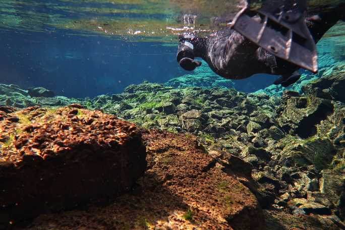

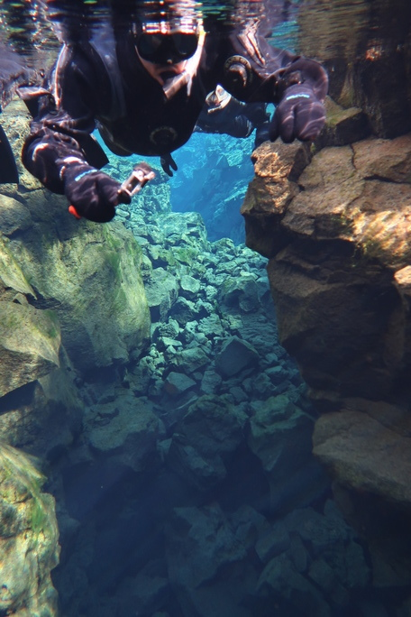

It hurt to walk back to the car park because my toes felt like they were about to fall off.

We got a joint package to also go see a lava cave. We weren't expecting much I thought it would be a bit touristy, but it was in the middle of nowhere at [Lavacave Leiđarendi](https://goo.gl/maps/fxEiqh7T9qS2). Even from above the cave was incredible views, just lava as far as you could see in one direction and snow capped mountains behind us in the other.

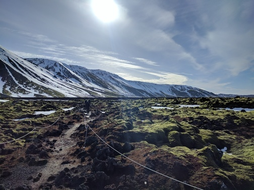

The cave tour was more adventurous then I was expecting too, with some narrow places where you had to crawl.
At one point Rachael thought she saw a finger and freaked out, but it was just a rock. The tour guide said that she  will now be part of the stories that he tells other visitors. We turned off all our lights at one point to experience the absolute darkness which was also a cool experience. There was also heaps of giant icicles.

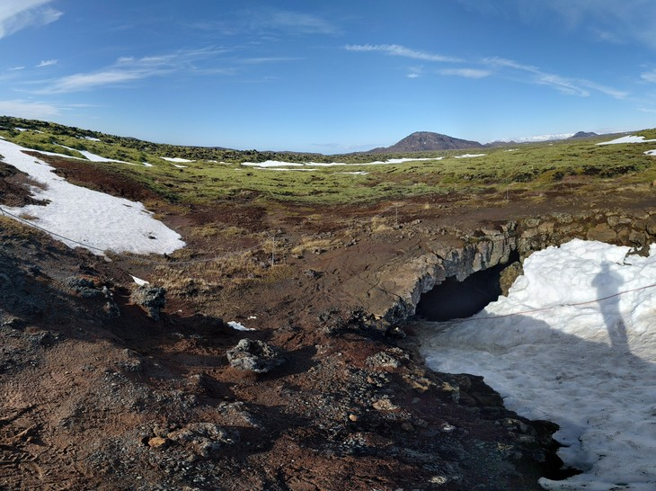

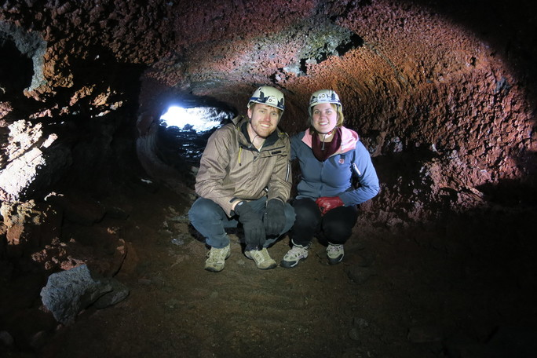

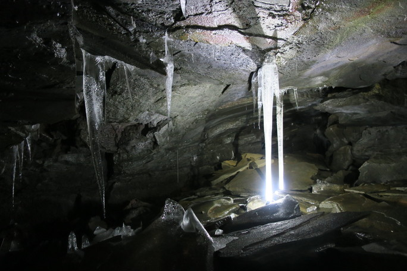

So far we had an absolutely incredible day, and I looked up the aurora forecast which said there would be activity that night so we booked a Northern Lights tour as well. The tour itself was a bit of a rort, the bus picked us up at 7 and then we waited just 5mins down the road for about an hour for it to get dark. They then took us about 20mins out of town but there was still a fair bit of light pollution.

Issues with the tour didn't matter too much because as soon as you hopped off the bus, you could see the lights faintly. Because you can't see colours well at night, they don't look like the photos. It just looked like a normal thin greyish cloud, but the way it danced across the sky was what made it impressive. I got a photo on my phone that captured pretty well what it looked like to the naked eye. It's actually one time where it's better to look through your camera...

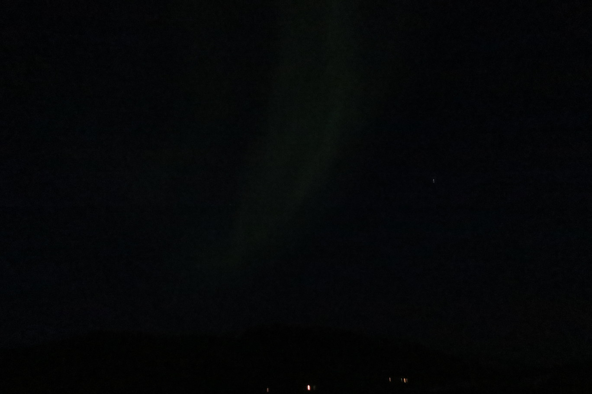

At one point early on, it came over really bright and vivid for about 60 seconds. I could actually make out pink and green colours and the way it moved across the sky looked incredible. It was extremely impressive and the guide so it was the best that it had been in about a month. It wasn't as good for the rest of the night but still visible.

Since Lauren was also in Iceland that night, they text us to say they could see it from the hottub of their AirBnB. If we'd had a car we would have gone further from the city and it would have been way better, but we were still pretty lucky to see it as good as we did in the short time we had in the country.

I got some better photos with the camera using a long exposure (didn't have a tripod so not great).

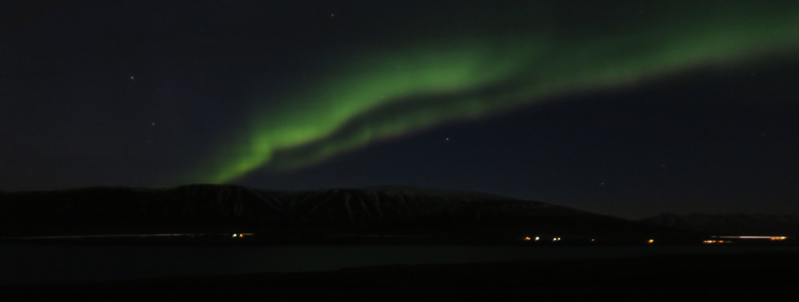

Was an excellent day, probably the best of our trip.