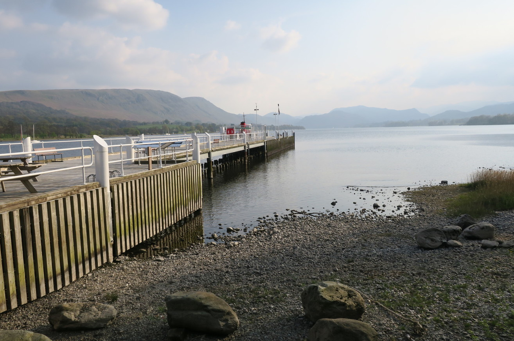
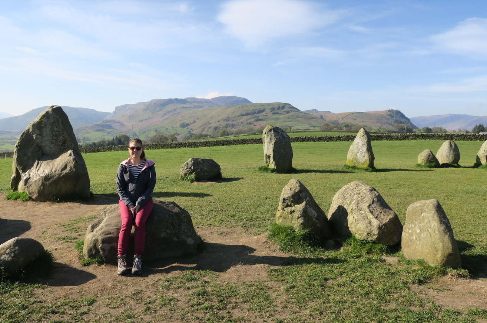
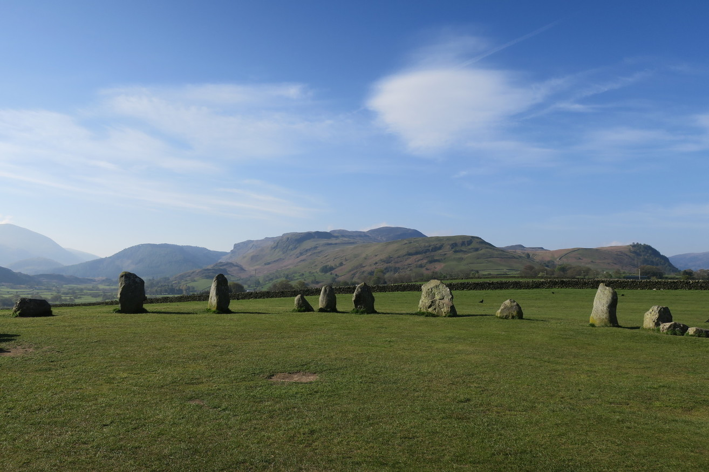
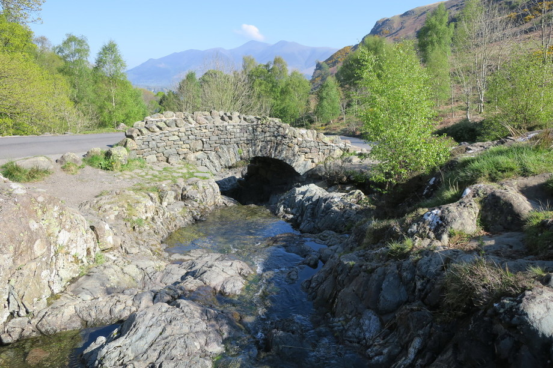

+++
title = "Lakes District"
date = "2017-05-03"
slug = "lakes-district"
type = "post"

[taxonomies]
categories = [ "Travel",]
tags = [ "Europe", "England",]

[extra]
image = "posts/2017/lakes-district/lake.jpg"

+++

After driving along the wall, we stopped at our next accommodation which was in Penrith.
We went to the lake in afternoon for dinner. The pubs would be nice in summer, with lots of outdoor beer gardens along the lake.
The lake itself was okay, nothing particularly exciting, although again would be packed in summer.

The next morning we drove back to the Lakes District. On the way we saw a sign to something called Castlerigg Stone Circle, which we went through a extremely tight lane (barely fit one car) to get to.
Was a nice little spot like Stonehenge (and free with no other people).

We drove along the Lake trying to find somewhere to stop, but there wasn't parking anywhere.

We drove through Honister Pass which had crazy views in the valley, but again was single lane and nowhere to stop.

Once through the pass we thought we might as well go see the west coast, and went to St Bees Beach but we couldn't find anywhere that sold fish and chips and the tide was way out. We stopped for chips at Ulverston, but it wasn't a very interesting town, and we couldn't even find anywhere to sit and eat lunch.
We then drove through another scenic pass back inland.

It was basically a full day of driving, straight past Manchester and Liverpool on our way to our next stop, which was Bala in Wales.