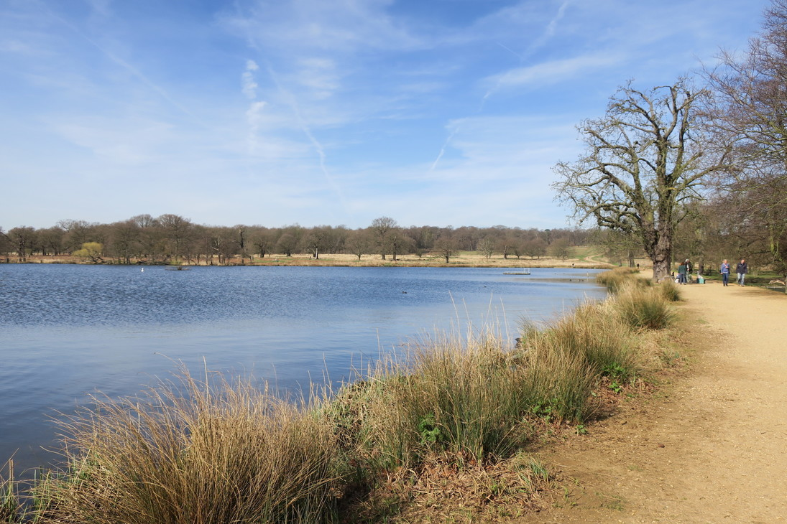
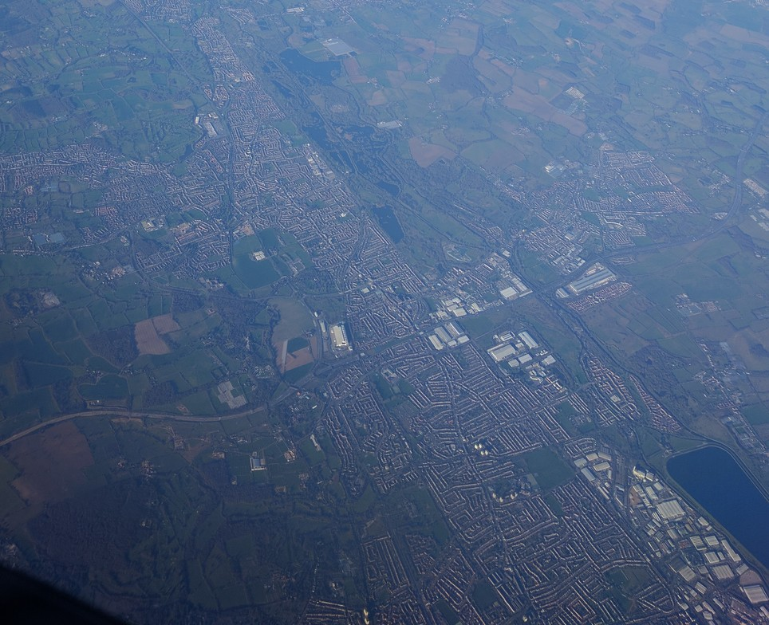
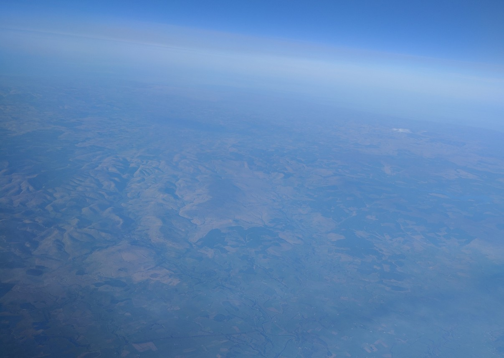

+++
title = "Leaving London"
date = "2017-03-25"
slug = "leaving-london"
type = "post"

[taxonomies]
categories = [ "Travel",]
tags = [ "Europe", "England",]

[extra]
image = "posts/2017/leaving-london/lake.jpg"

+++

We went to Richmond Park in the morning, and the girls had breakfast at a cafe which was packed with cyclists.
The park was huge, and it was great weather so we went for a walk. We'd heard there was deer but it's a huge park and we couldn't see any. So we went for a drive to look at the lake in the middle and the deer just happened to be there. They were pretty passive compared to the few other deer I have seen in the wild, so must be pretty used to people.

We were a little bit rushed for time, as we were flying to Iceland that afternoon so went back to Lauren's for lunch.
Lauren let us know that she thought daylight savings was coming in that day, so we checked to make sure we weren't going to be an hour late for our flight, but it actually changed 3am the following morning. Daylight savings is [a stupid system](https://www.youtube.com/watch?v=br0NW9ufUUw), I don't get why people like it.

We got a bus to Clapham Junction, and got our first normal train to Gatwick airport.
The flight was actually really cool, I had a window seat and we got to see some cool cities from above.
Flying over Scotland and Isle of Skye was also cool, we could see all the rolling hills of the highlands, some of  which still had snow on them.

