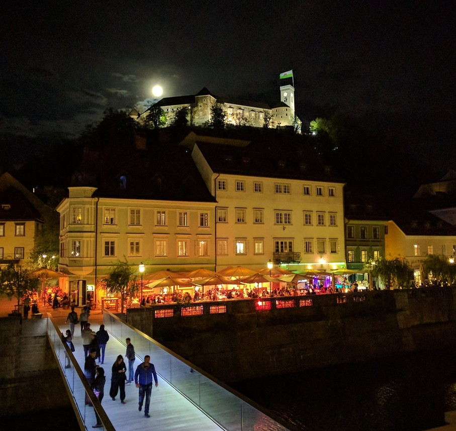
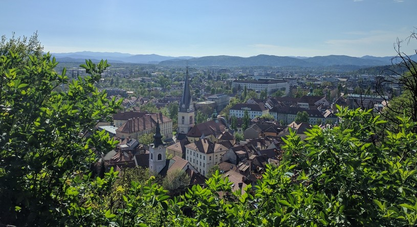
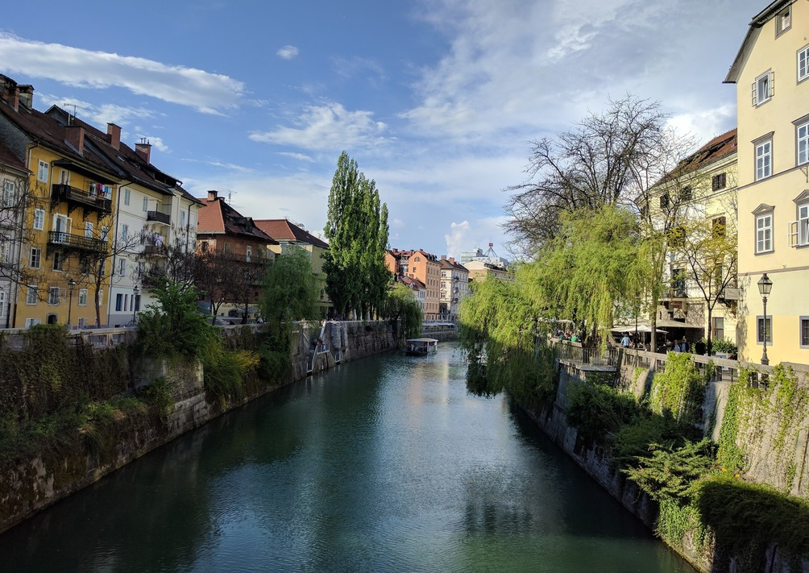
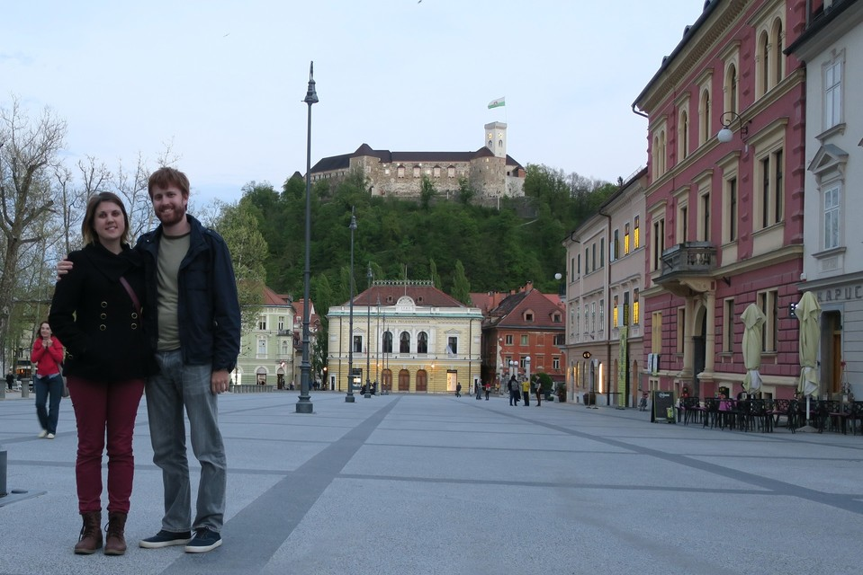

---
categories:
- Travel
date: '2017-04-11'
featured_image: posts/2017/ljubljana/castle_night.jpg
slug: ljubljana
tags:
- Europe
- Slovenia
- Ljubljana
title: Ljubljana
---

We just visited Ljublana as a stopover on our way to Bled, but it ended up being a super pretty city with nice canals and streets. The bus trip had really nice scenery on the way in also. The hostel we stayed out was in the middle of a busy street in the old town and was a bit bizarre really, as it was really quiet inside and they you step out the front door in the middle of a super busy lane-way with a view up to the castle.

First up, we got a funicular up to the castle which had nice views. Then walked back down and just walked around the old town and canals.
For dinner we had a really nice blue vein cheese pizza out the front of the canal.

