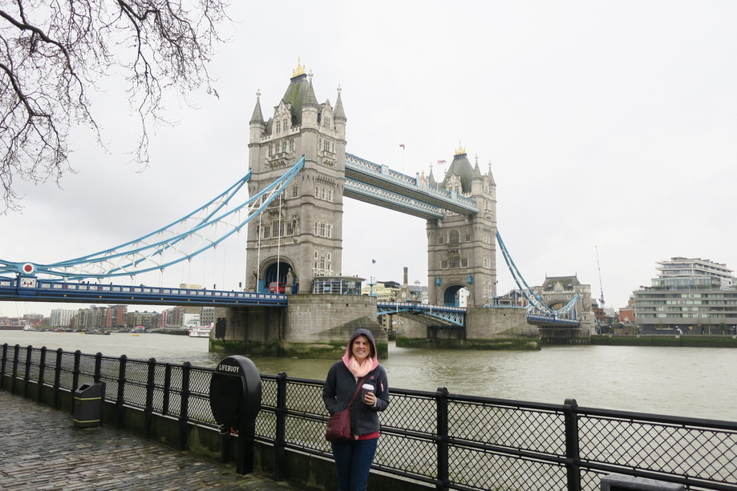
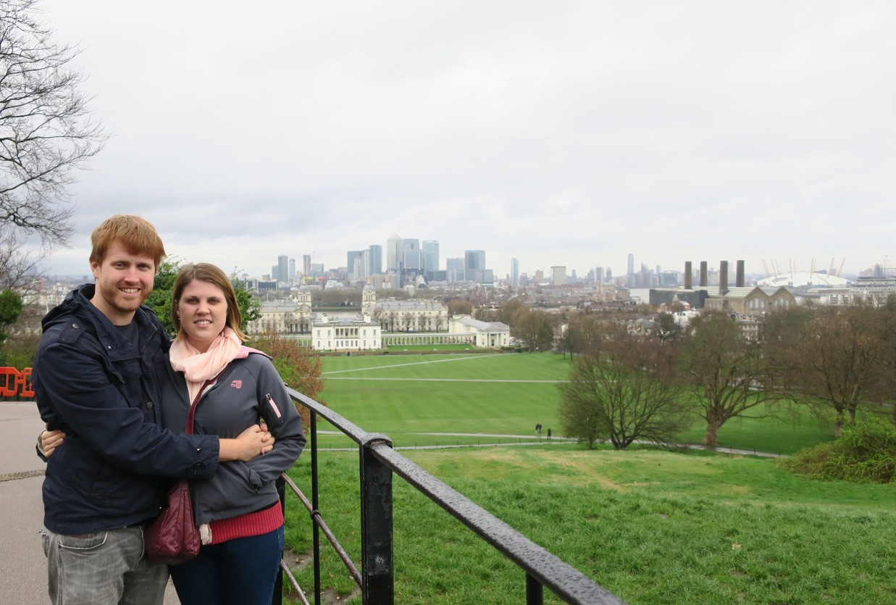
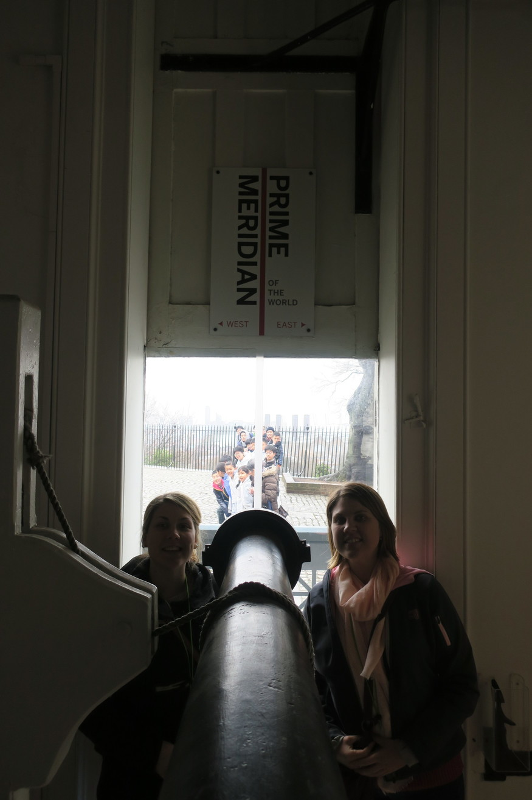
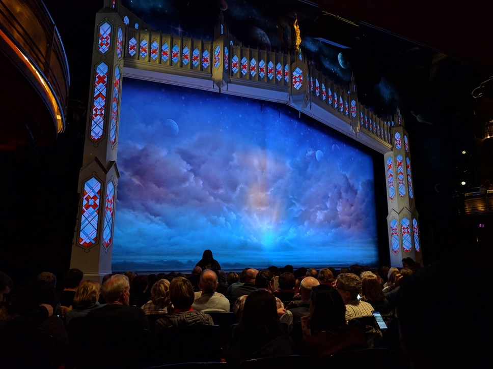
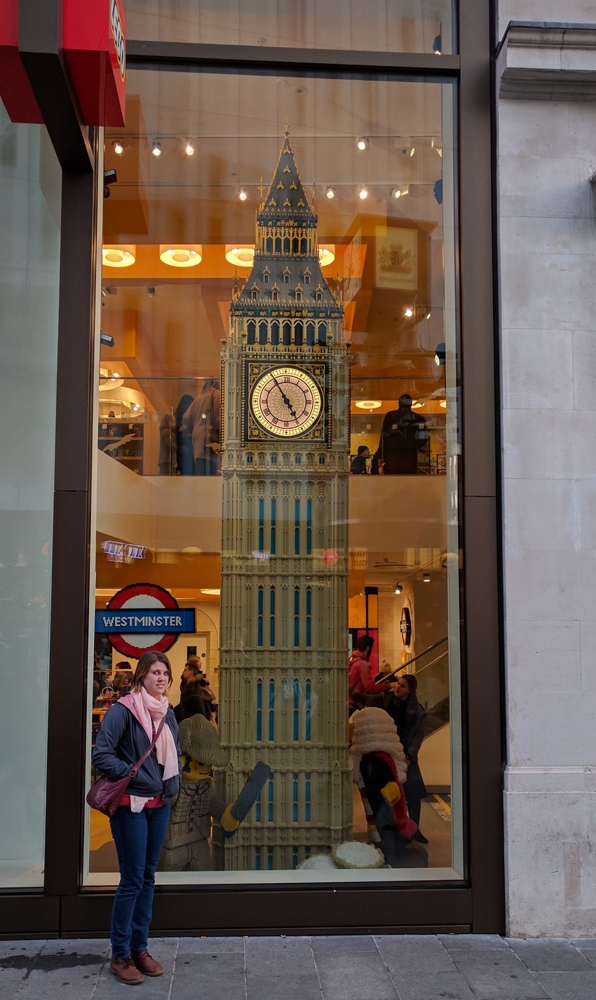
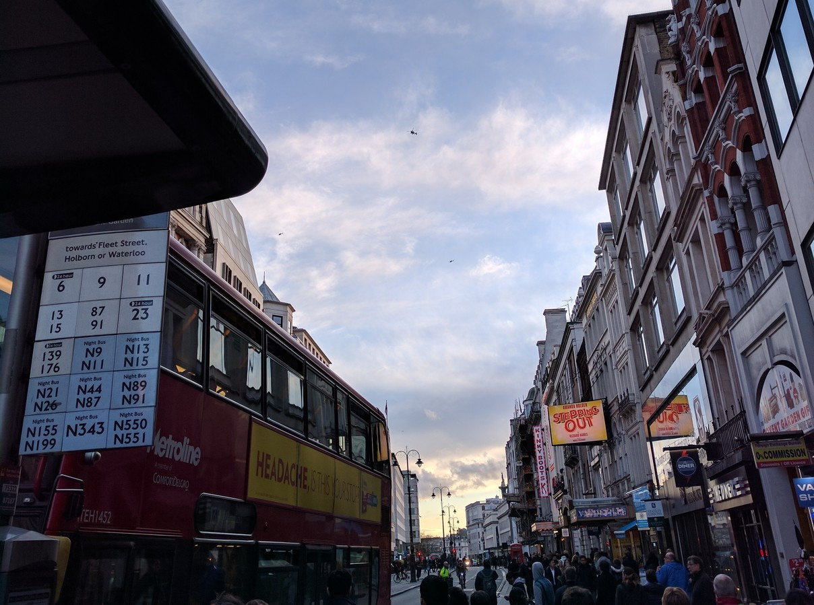
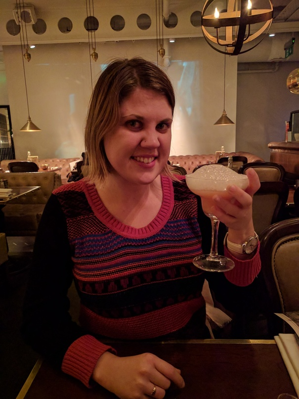
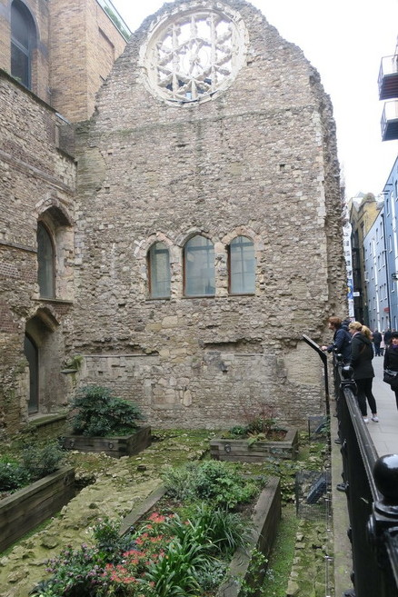
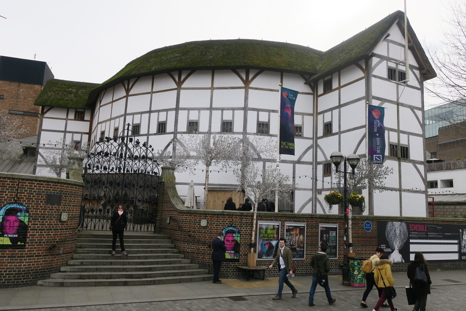
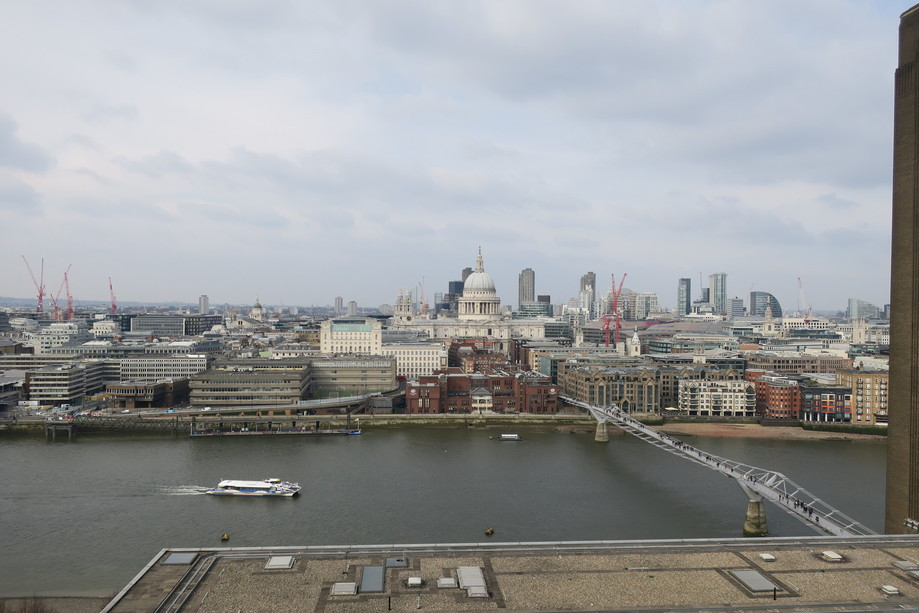

After some sleep, we headed back out to explore some more of London.
The beautiful weather from the previous day had ended and we got some of the London weather we were expecting in the form of cold miserable light rain.

First up we went to see Tower of London and Tower Bridge. We were planning to go inside but the tickets were about $50 AUD each, so we thought we'd find something a bit cheaper to do.

I really wanted to go check out Greenwich, so we tried to get a boat up the River Thames, but we didn't have enough credit on our oyster cards and you couldn't top them up at the ferry terminal. So we got a train there instead. We quickly stopped by the [Cutty Sark](https://en.wikipedia.org/wiki/Cutty_Sark) ship on the way also.

It was a beautiful area (despite the weather) and we really enjoyed the tour of the [Royal Observatory](https://en.wikipedia.org/wiki/Royal_Observatory,_Greenwich). They had lots of old clock designs and talked about the history of improving navigation on the seas and ways to calculate latitude and longitude.

From Greenwich we headed to Leicester Square and had a very rushed lunch at Chinatown before Rachael and I went to go see the Book of Mormon (which was awesome).

After the show we had a look around some of the shops while we waited for Lauren to come meet us again, particularly cool was the Lego Store.

We noticed that there were a heap of choppers flying around so looked on the news that there had been [an attack](https://en.wikipedia.org/wiki/2017_Westminster_attack) at Westminster (lucky for us that we had gone the day before).

For dinner we were meeting Rachael's cousin and his partner at [The Alchemist](http://thealchemist.uk.com/) in the [City of London](http://www.cgpgrey.com/blog/the-secret-city-of-london.html), which took a while to get to as the traffic was pretty crazy. It wasn't so bad for Rachael and I though as it gave us more time to sightsee on the bus. After dinner, we went up to the Sky Bar which had a free lift to the top and had great views of the city and a band.

The next day we went in for lunch at the Borough Markets, which was like any international food market, except with a few different ones to what we are used to in Australia (such as Ethopian).

From here we made our way along the river towards Shakespeare's Globe, which wasn't super exciting from the outside. Along the way I thought the ruins of [Winchester Palace](http://www.english-heritage.org.uk/visit/places/winchester-palace) were pretty cool.

We came across the TATE modern art museum, which was full of weird modern art. GOMA in Brisbane is
way better in my opinion. There was a nice view from the top of the building though.

That afternoon we just chilled at Lauren's and then went to one of her local pubs the Crab Tree. There was an open mic night with a few good bands, although I didn't think food was very good. They also had posters for [a boat race](https://en.wikipedia.org/wiki/The_Boat_Race) the next weekend between Oxford and Cambridge which apparently is a big deal.
