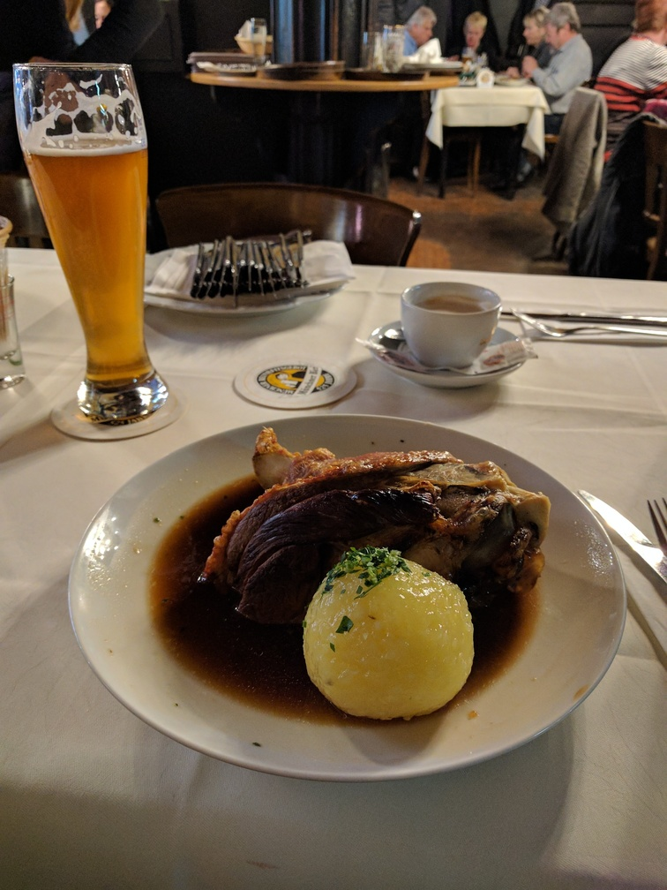
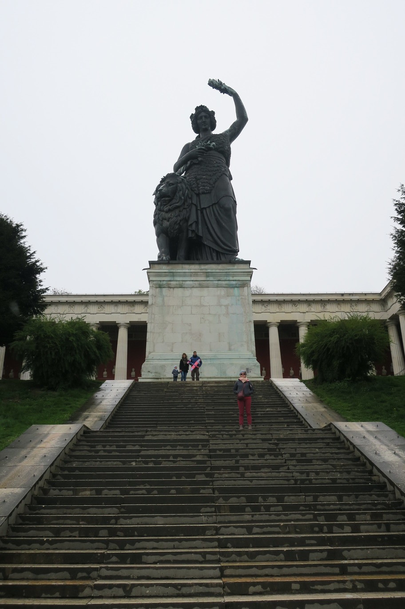
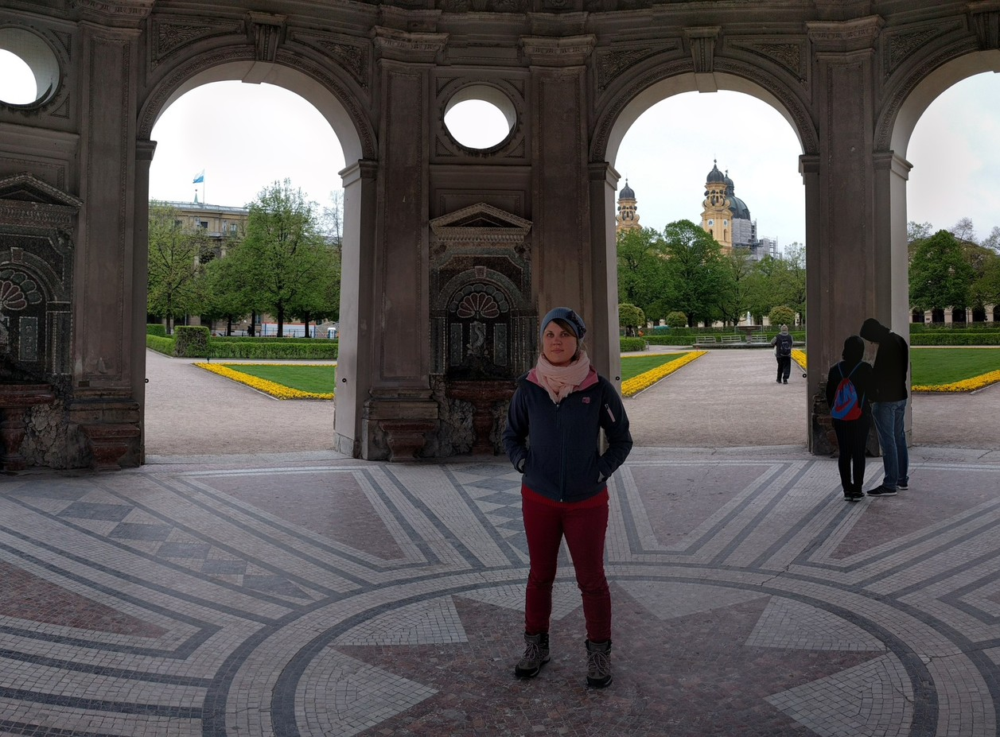
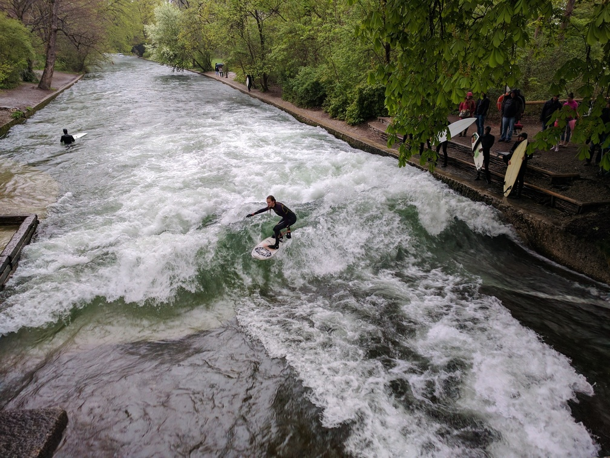
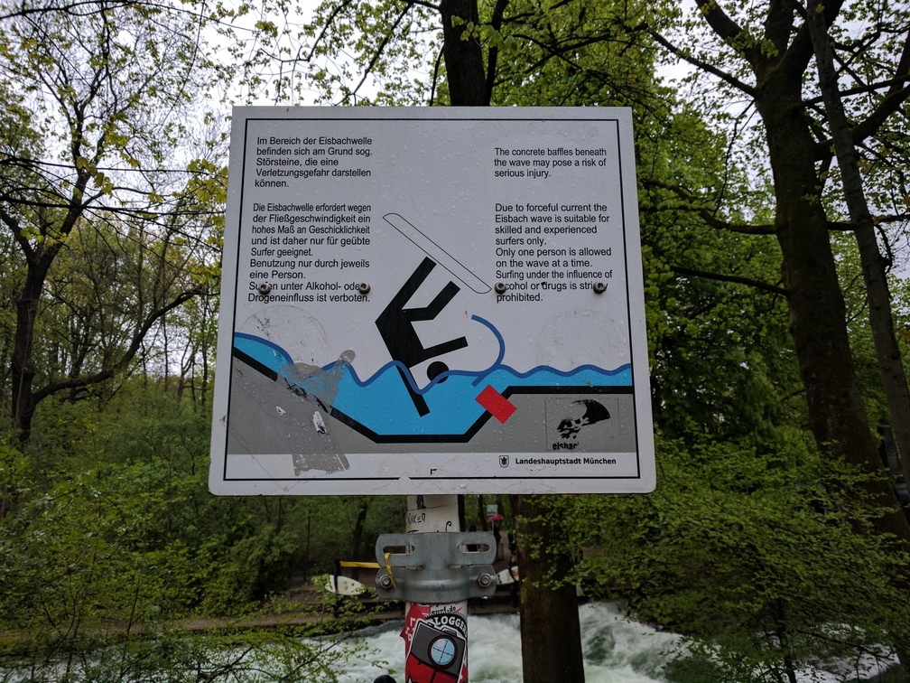
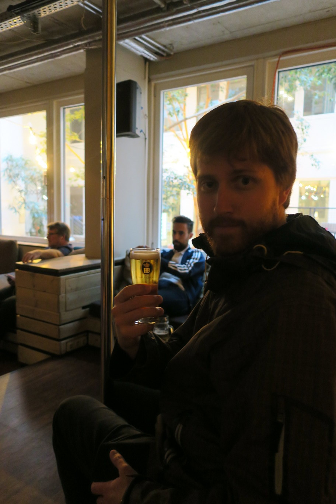
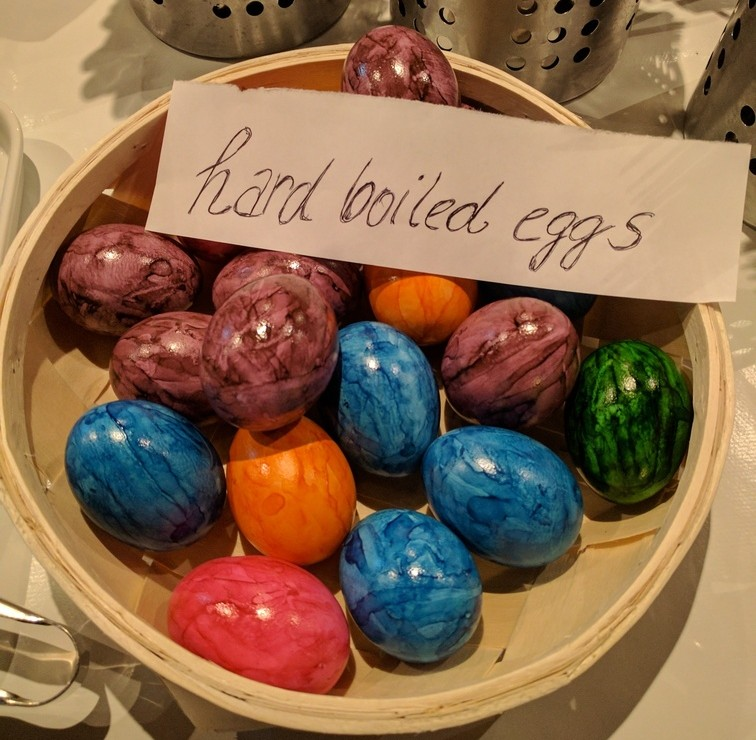
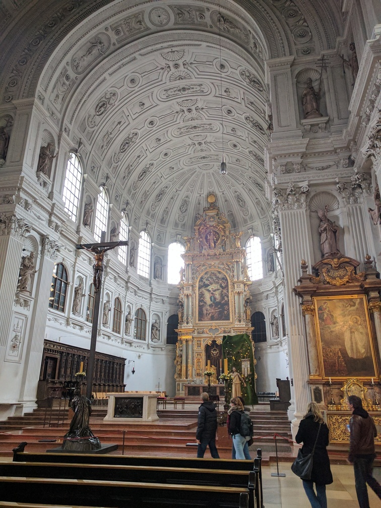

+++
categories = ['Travel']
date = '2017-04-17'
thumbnail = 'posts/2017/munich/Schweinshaxe.jpg'
slug = 'munich'
tags = ['Europe', 'Germany']
title = 'München'
type = 'post'

+++

We arrived and it was raining, so we quickly dropped out bags at the hostel and went to get lunch. We went to Augustine Keller and got pork knuckle since I had it last time I was in Munich and thought it was great. It was super fatty and wasn't as nice as last time, which I expect was mostly because I wasn't massively hungover from Oktoberfest. Rachael loved the building though and her spinach and mountain cheese soup.

We quickly visited Marienplatz and then back to hostel to check in. Next we went to Theresienwiese so I could show Rachael where Oktoberfest is held and the [Bavaria statue](https://en.wikipedia.org/wiki/Bavaria_statue). I had no idea you can go inside it (we didn't though) as I assume it was closed during Oktoberfest.

Next I tried to show Rachael a recreation of the walking tour I did [last time](/posts/2010/oktoberfest), which went okay except everything was closed for winter and it was raining. We went to see the May Pole but it was missing, and the churches were all closed for services. We went to Hofgarden, which would have been great if the weather was nicer.

Something that I really wished I'd seen last time was the Eisbachwelle surfing spot in the Englischer Garten, so we went there and despite Rachael saying nobody would be surfing in the freezing rain, there was heaps of people out. It was fun to watch, but eventually the cold rain got to use so we headed back to the hostel.

We got a free beer for checking in, it was massive!

For breakfast in the morning they coloured in the eggs though, which was cool. Also we ran into a girl in the lobby that Rachael and I both knew from Rocky who now lives in London.

Church bells rang like crazy the whole time we were there, was really strange as they weren't on the hour just at random times. Nearly all the shops were closed for Easter which combined with the cold rain meant the next day wasn't particularly great.

We walked in English garden in the morning but then it started to rain heavy again so we just hung out in the hostel lobby for the rest of the day.

I walked to church during a break in the rain at lunch time, and managed to get in between services.

Next we went to the bus station to wait for our overnight bus to Paris. We went to Vapianos for dinner, and had a really grumpy pizza maker and generally bad service compared to the one in Brisbane. We stayed there for a while as it was still pouring rain and freezing cold (I think it snowed later that night).

Our bus ended up getting delayed several times, and they had terrible signage and changed which bay we were meant to wait at repeatedly. Then when the bus arrived no one seemed to have any idea about how to queue and just rushed onto the bus to get good seats. Since we waited to ask where to put out luggage we ended up having to split up. Eventually the guy next to Rachael got off at at one of the stops and so we were able to sleep. I was expecting a night bus to have much comfier seats that reclined (like the different set up for night trains), but no such luck - it was just a normal bus. After the airport in Berlin, we were left with the impression that while Germany has a good train system, bus stops and airports are terrible.